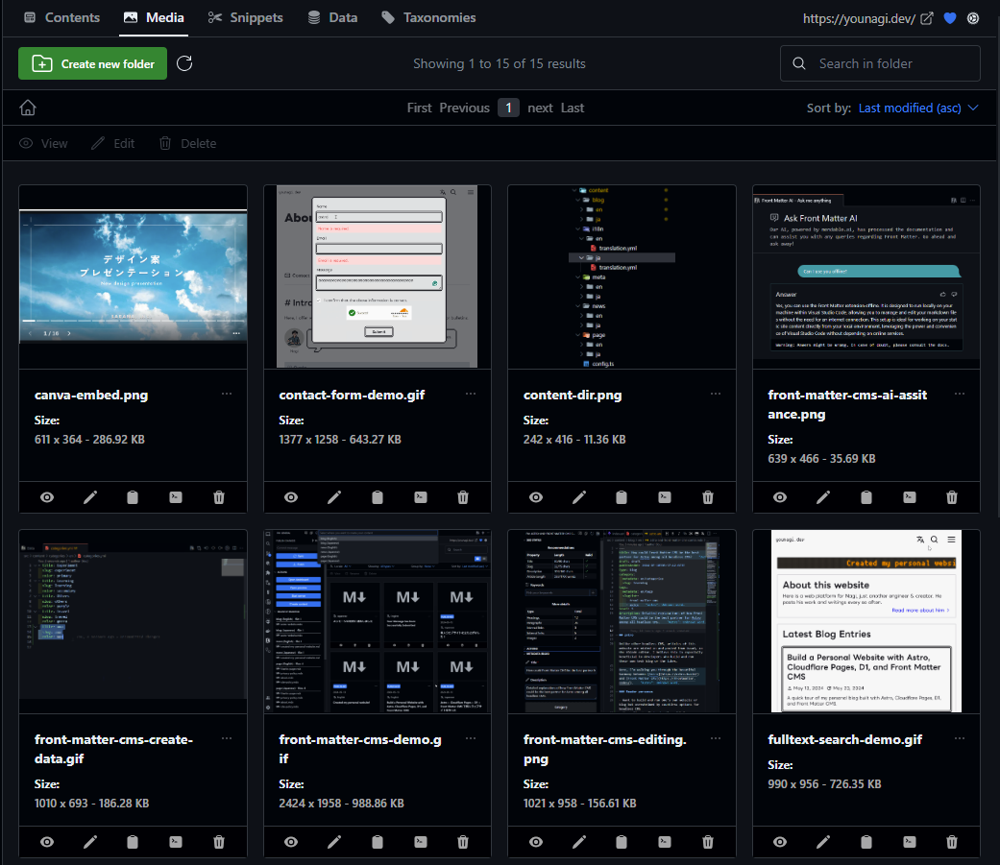

## Intro

> [!quote] One Phrase
> — My favorite words: "All-in-One".

Unlike other headless CMS, articles of this website are edited in and posted from local, in the VSCode editor. I believe this is especially beneficial to developers who build and run their own tech blog or the likes.

Here, I'm walking you through the beautiful harmony between [Astro](https://astro.build/) and [Front Matter CMS](https://frontmatter.codes/) taking my website's example. For more information about it, see this article.

https://younagi.dev/blog/astro-website/

### Reader personas

This article is written assuming readers are a front-end developer whether hobby or work.

- Want to build and run one's own website or blog but overwhelmed by countless options for headless CMS
- Struggling to find a headless CMS for a website built with Astro
- Want to see examples of Front Matter CMS in collaboration with Astro

### My proficiency level

As of the day when I'm writing this article, my proficiency level in this field is as follows:

- Have a three-year experience as a software engineer in total (Not in a row)
- Have never used Front Matter CMS
- Have built several websites using CMS like WordPress and MicroCMS

## Main

### Why Front Matter CMS?

There are three reasons:

- Writing and storing articles in local
- Markdown/MDX file format
- Compatible with directory-based internationalization(i18n)

Especially the first one is what makes it different from other headless CMS and makes me decide using it.

Plus, it also offers [an AI assistance feature](https://frontmatter.codes/docs/sponsor-features#front-matter-ai) where you can ask them whatever via the VSCode command. So you don't even have to have an internet connection to look up something, which is pretty cool coupled with the capability of editing articles offline.


### Downsides of Front Matter CMS

- Exclusive to VSCode users
- Available languages are limited
  - As of Jul 2024, `en`, `de`, and `ja` are supported
  - Of course you [can be a contributor](https://frontmatter.codes/docs/contributing#translating-the-extension) by translating the strings and sent a pull request!
- Hard to edit articles without your PC (e.g., on your smartphone)
  - Still possible with [the web version](https://vscode.dev/) though

### My Astro project's overview

Thanks to [the Astro Content Collections API](https://docs.astro.build/en/guides/content-collections/), content management is very easy. You can manage contents and data collections under the `src/content` directory.

Below is my project's structural overview. For brevity, most irrelevant parts are omitted from the directory tree.

{/* biome-ignore format: The directory tree should not be formatted */}
```markdown title=""
younagi.dev/
├── public
├── src/
│   ├── assets/
│   │   ├── font
│   │   └── images
│   └── content/
│       ├── blog/
│       │   ├── en
│       │   └── ja
│       ├── categories/
│       │   └── ...
│       ├── i18n/
│       │   └── ...
│       ├── meta/
│       │   └── ...
│       ├── news/
│       │   └── ...
│       ├── page/
│       │   └── ...
│       ├── tags/
│       │   └── ...
│       └── config.ts
├── frontmatter.json
└── astro.config.ts
```

As you can see, the Content Collections work with the `config.ts` file, in which all the contents' types & fields are defined.

```typescript title="src/content/config.ts"
import { defineCollection, reference, z } from "astro:content";
import {
  type TaxonomyColor,
  type TaxonomyColorEnum,
  taxonomyColors,
} from "@/components/Taxonomy";

const blog = defineCollection({
  type: "content",
  schema: z.object({
    title: z.string(),
    description: z.string().optional(),
    publishedAt: z.coerce.date(),
    modifiedAt: z.coerce.date().optional(),
    category: z.object({
      metadata: reference("categories"),
      slug: z.string(),
    }),
    tags: z.object({
      metadata: reference("tags"),
      slugList: z.array(z.string()).optional(),
    }),
    draft: z.enum(["draft", "in progress", "published"]),
    level: z
      .union([
        z.literal(1),
        z.literal(2),
        z.literal(3),
        z.literal(4),
        z.literal(5),
      ])
      .optional(),
  }),
});

const taxonomySchema = z.object({
  title: z.string(),
  slug: z.string(),
  color: z.enum<TaxonomyColor, TaxonomyColorEnum>(
    taxonomyColors as TaxonomyColorEnum,
  ),
});

const categories = defineCollection({
  type: "data",
  schema: z.array(taxonomySchema),
});

const tags = defineCollection({
  type: "data",
  schema: z.array(taxonomySchema),
});

// ...

export const collections = { blog, categories, tags /* ... */ };
```

In the `astro.config.ts`, within the scope of this article, I topped up the i18n feature. You're going to have to make Front Matter CMS settings consistent with this later.

```typescript title="astro.config.ts"
import { defineConfig /* ... */ } from "astro/config";
// ...

export default defineConfig({
  // ...
  i18n: {
    defaultLocale: "en",
    locales: ["en", "ja"],
  },
  // ...
});
```

### Configurations

When it comes to the setup, consult [the Front Matter official doc](https://frontmatter.codes/docs/getting-started). You cannot get lost with the doc and support of the AI assistance.

After the setup, you're supposed to tweak the `frontmatter.json` to make it consistent with your contents and data configurations.

In my case, the framework is Astro, but you can do this with other frameworks too as long as you have Markdown/MDX contents in it.
The thing is how correctly and accurately you can specify your contents' locations in the config file. Here is mine.

````json title="frontmatter.json"
{
  "$schema": "https://frontmatter.codes/frontmatter.schema.json",
  "frontMatter.framework.id": "astro",
  "frontMatter.preview.host": "http://localhost:4321",
  "frontMatter.content.publicFolder": "./src/assets/images/",
  "frontMatter.content.pageFolders": [
    {
      "title": "blog",
      "path": "[[workspace]]/src/content/blog",
      "contentTypes": ["blog"],
      "defaultLocale": "en"
    },
    {
      "title": "news",
      "path": "[[workspace]]/src/content/news",
      "contentTypes": ["news"],
      "defaultLocale": "en"
    },
    {
      "title": "page",
      "path": "[[workspace]]/src/content/page",
      "contentTypes": ["page"],
      "defaultLocale": "en"
    }
  ],
  "frontMatter.content.i18n": [
    {
      "title": "English",
      "locale": "en",
      "path": "en"
    },
    {
      "title": "Japanese",
      "locale": "ja",
      "path": "ja"
    }
  ],
  "frontMatter.content.draftField": {
    "name": "draft",
    "type": "choice",
    "choices": ["draft", "in progress", "published"]
  },
  "frontMatter.taxonomy.seoTitleLength": 90,
  "frontMatter.taxonomy.contentTypes": [
    {
      "name": "blog",
      "pageBundle": false,
      "previewPath": "'blog'",
      "filePrefix": null,
      "clearEmpty": true,
      "fileType": "mdx",
      "fields": [
        {
          "title": "Title",
          "name": "title",
          "type": "string",
          "single": true,
          "required": true
        },
        {
          "title": "Description",
          "name": "description",
          "type": "string"
        },
        {
          "title": "Category",
          "name": "category",
          "type": "fields",
          "fields": [
            {
              "title": "Category ID",
              "name": "metadata",
              "type": "categories",
              "required": true,
              "taxonomyLimit": 1,
              "singleValueAsString": true
            },
            {
              "title": "Category Slug",
              "name": "slug",
              "type": "dataFile",
              "dataFileId": "categories",
              "dataFileKey": "slug",
              "dataFileValue": "title",
              "required": true,
              "singleValueAsString": true
            }
          ]
        },
        {
          "title": "Tags",
          "name": "tags",
          "type": "fields",
          "fields": [
            {
              "title": "Tags ID",
              "name": "metadata",
              "type": "tags",
              "required": true,
              "taxonomyLimit": 1,
              "singleValueAsString": true
            },
            {
              "title": "Tag Slugs",
              "name": "slugList",
              "type": "dataFile",
              "dataFileId": "tags",
              "dataFileKey": "slug",
              "dataFileValue": "title",
              "multiple": true
            }
          ]
        },
        {
          "title": "Draft Status",
          "name": "draft",
          "type": "draft",
          "required": true,
          "default": "draft"
        },
        {
          "title": "Published At",
          "name": "publishedAt",
          "type": "datetime",
          "default": "{{now}}",
          "isPublishDate": true
        },
        {
          "title": "Modified At",
          "name": "modifiedAt",
          "type": "datetime",
          "isModifiedDate": true
        },
        {
          "title": "Level",
          "name": "level",
          "type": "number",
          "numberOptions": {
            "min": 1,
            "max": 5,
            "step": 1
          }
        },
        {
          "title": "type",
          "name": "type",
          "type": "string"
        }
      ]
    },
    {
      "name": "news",
      "pageBundle": false,
      "previewPath": "'news'",
      "filePrefix": null,
      "clearEmpty": true,
      "fileType": "md",
      "fields": [
        {
          "title": "Title",
          "name": "title",
          "type": "string",
          "single": true,
          "required": true
        },
        {
          "title": "Published At",
          "name": "publishedAt",
          "type": "datetime",
          "default": "{{now}}",
          "isPublishDate": true
        },
        {
          "title": "Modified At",
          "name": "modifiedAt",
          "type": "datetime",
          "isModifiedDate": true
        },
        {
          "title": "type",
          "name": "type",
          "type": "string"
        },
        {
          "title": "draft",
          "name": "draft",
          "type": "draft"
        }
      ]
    },
    {
      "name": "page",
      "previewPath": "'page'",
      "pageBundle": false,
      "clearEmpty": true,
      "filePrefix": null,
      "fileType": "mdx",
      "fields": [
        {
          "title": "Title",
          "name": "title",
          "type": "string",
          "single": true,
          "required": true
        },
        {
          "title": "Description",
          "name": "description",
          "type": "string"
        },
        {
          "title": "Modified At",
          "name": "modifiedAt",
          "type": "datetime",
          "isModifiedDate": true
        }
      ]
    }
  ],
  "frontMatter.data.types": [
    {
      "id": "categories",
      "schema": {
        "title": "Categories",
        "type": "object",
        "required": ["title", "slug", "color"],
        "properties": {
          "title": {
            "type": "string",
            "title": "Title"
          },
          "slug": {
            "type": "string",
            "title": "Slug"
          },
          "color": {
            "type": "string",
            "title": "Color"
          }
        }
      }
    },
    {
      "id": "tags",
      "schema": {
        "title": "Tags",
        "type": "object",
        "required": ["title", "slug", "color"],
        "properties": {
          "title": {
            "type": "string",
            "title": "Title"
          },
          "slug": {
            "type": "string",
            "title": "Slug"
          },
          "color": {
            "type": "string",
            "title": "Color"
          }
        }
      }
    }
  ],
  "frontMatter.data.files": [
    {
      "title": "En Categories",
      "id": "categories",
      "type": "categories",
      "file": "[[workspace]]/src/content/categories/en/categories.yml",
      "fileType": "yaml"
    },
    {
      "title": "Ja Categories",
      "id": "categories",
      "type": "categories",
      "file": "[[workspace]]/src/content/categories/ja/categories.yml",
      "fileType": "yaml"
    },
    {
      "title": "En Tags",
      "id": "tags",
      "type": "tags",
      "file": "[[workspace]]/src/content/tags/en/tags.yml",
      "fileType": "yaml"
    },
    {
      "title": "Ja Tags",
      "id": "tags",
      "type": "tags",
      "file": "[[workspace]]/src/content/tags/ja/tags.yml",
      "fileType": "yaml"
    }
  ],
  "frontMatter.snippets.wrapper.enabled": false,
  "frontMatter.content.snippets": {
    "Image with caption": {
      "description": "Insert image with caption",
      "body": "![ [[alt]] ](../../../assets/images/[[filename]])",
      "isMediaSnippet": true
    },
    "Code block with specified language": {
      "description": "Insert code block snippet",
      "body": ["```[[language]] title=\"[[filename]]\"", "", "```"],
      "fields": [
        {
          "name": "language",
          "title": "Language",
          "type": "choice",
          "choices": [
            "html",
            "css",
            "javascript",
            "typescript",
            "rust",
            "yml",
            "astro",
            "jsx",
            "tsx",
            "json",
            "markdown",
            "mdx",
            "bash",
            "txt"
          ],
          "single": true,
          "default": "markdown"
        },
        {
          "name": "filename",
          "title": "filename",
          "type": "string",
          "single": true,
          "default": ""
        }
      ]
    },
    "Callout": {
      "description": "Insert a callout",
      "body": ["> [![[type]] ][[symbol]][[title]]", "> [[content]]"],
      "fields": [
        {
          "name": "type",
          "title": "Type",
          "type": "choice",
          "choices": [
            "info",
            "note",
            "warning",
            "quote",
            "question",
            "failure",
            "check"
          ],
          "single": true,
          "default": "info"
        },
        {
          "name": "symbol",
          "title": "Symbol",
          "type": "choice",
          "choices": ["+", "-", " "],
          "single": true,
          "default": " "
        },
        {
          "name": "title",
          "title": "Title",
          "type": "string",
          "single": true,
          "default": ""
        },
        {
          "name": "content",
          "title": "Content",
          "type": "string",
          "single": true,
          "default": ""
        }
      ]
    }
  },
  "frontMatter.website.host": "https://younagi.dev/",
  "frontMatter.framework.startCommand": "bun dev",
  "frontMatter.dashboard.openOnStart": true
}
````

Some are automatically added during the setup process and some are not. Here are some important items that I manually added:

- `frontMatter.content.publicFolder`: Specify your assets directory if needed
  - In my case, I wanted to modify it for leveraging [the Astro's assets optimization](https://docs.astro.build/en/guides/images/#where-to-store-images). It's set to the `public` directory by default
- `frontMatter.content.pageFolders`: Specify your content collections here
  - In my case, there are three content types: `blog`, `news`, and `page`
- `frontMatter.content.i18n`: Specify as many languages as you use
  - This is fully compatible with every directory-based internationalization(i18n)
- `frontMatter.content.draftField`: Not necessary
  - I just wanted to have three article statuses rather than the default `true` or `false` flag.
- `frontMatter.data.types`: Specify your data collections here
  - In my case, there are two content types: `categories` and `tags`
- `frontMatter.data.files`: Associate your data collections with specific paths and file formats
  - In my case, each data is aggregated in one file. (e.g., "src/content/tags/en/tags.yml") Here, each one of file path is specified. By the same token as contents, there should be as many directories as languages you use
- `frontMatter.content.snippets`: Customize your snippets here
  - In my case, I had to customize the media snippet since I modify the assets directory.

> [!question]+
> **Why did I have to create the media snippet on my own?**
> The path specified in the `publicFolder` is automatically reflected on that of the media snippet.
> That said, the original media snippet has the image path like `/src/assets/images/image.png`, which is an invalid path. (Correctly, `../../../assets/images/image.png`)

### Usability

With all the configurations in mind, my dashboard looks like this.

#### Create a new article

Only a little time and effort needed till you start writing!

1. Open the command palette
2. Select the "Front Matter: Create new content"
3. Select a type and language for your content
4. Fill in the title
5. Now it's ready!

:::video[Demo: Create a new article]
/videos/front-matter-cms-demo.mp4
:::

#### Create a new data content

You no longer have to directly add them in the file. Just fill in the customized input fields from your dashboard.

:::video[Demo: Create a new data content]
/videos/front-matter-cms-create-data.mp4
:::

#### Edit an article

Notable points are:

- Frontmatter values can be inserted from the visual editor
  - on the left in the image
- The Markdown editor palette available
  - on the top right in the image


It feels comfortable that they are accessible from several ways. (e.g., the snippet feature callable from the palette as well as the VSCode command)

#### Manage assets

You can view and manage all assets from your dashboard. Advantages are:

- Easily distinguishable at a glance
- Able to drag & drop it onto the page to add a new asset
- Searchable from the search window
- Assets' metadata is editable directly from the menu



## Outro

Front Matter CMS is a VSCode extension. Even if it stops developing, migrating to other CMS is easy, which I think would be one of the most important factors considering the pace as which modern technology is advancing.

For the same reason, I've been using [Obsidian](https://obsidian.md/) as my knowledge base and [Astro](https://astro.build/) as a meta framework of this website. The common ground is "**portability**".

- **Obsidian**: All contents are written in Markdown and managed in local unlike Notion
  - All you need to do for migration is move all the `.md` files
- **Astro**: In `.astro` files, HTML, CSS, and vanilla JS can be used and all contents are written in Markdown/MDX.
  - Even if Astro reaches its end of life, still you'll be able to reuse them(HTML, CSS, etc..) since those basic technologies aren't supposed to be deprecated that rapidly
