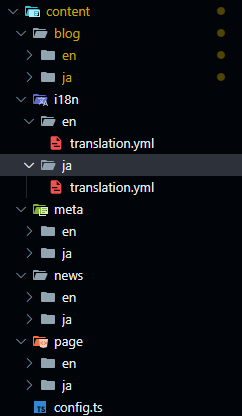
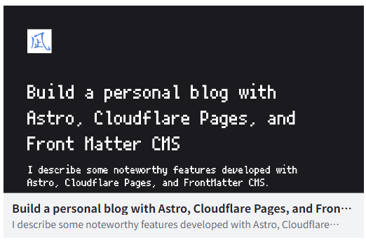
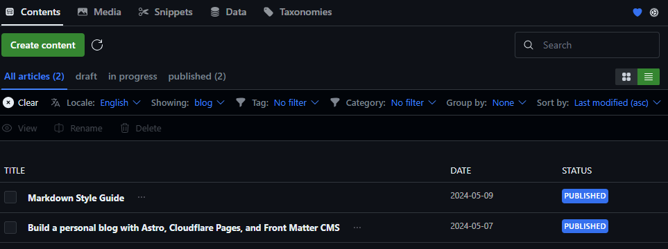
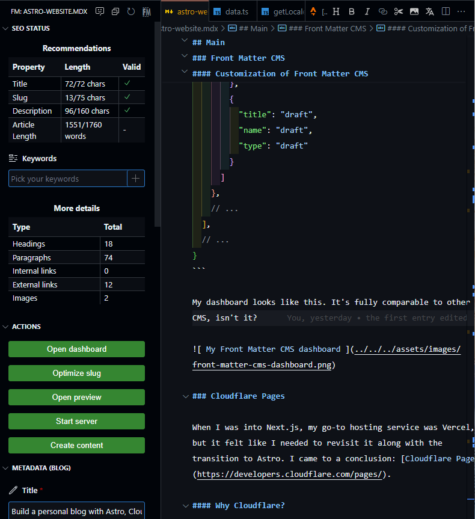

## TL:DR

https://younagi.dev/

https://www.youtube.com/watch?v=cvBdqZFZwj8

https://speakerdeck.com/tengu712/simplest-vulkan-tutorial-in-japanese

aaaaa [^1]
[^1]: 脚注だよ～

bbbbb [^2]
[^2]: 脚注です～

- I created my website switching over from Next.js to Astro
- My Astro website is equipped with some features: full-text search(Pagefind), internationalization(i18n) and more. They are mentioned with some code examples
- Cloudflare offers a wide range of support for:
  - hosting your website
  - getting your own domain
  - creating your custom email address
- Above all, its unlimited maximum bandwidth use for free is a great advantage to small-to-medium services
- Front Matter CMS enables you to write an article, tweak code, build and deploy your website in your VS Code editor

## Intro

As to the topics not covered here, consult other helpful info sources.

If you're interested in the code behind my website, see [my Github repo](https://github.com/brklntmhwk/younagi.dev).

### What is covered

- Some noteworthy features developed with Astro
- Why I chose Cloudflare Pages for hosting my website
- Customization of Front Matter CMS

### What is not covered

For example:

- Launching your project with the Astro starter template
- Connecting it to Git(Github)
- Deploying it on Cloudflare Pages
- Getting an own domain on Cloudflare
- Creating a custom email address using Cloudflare Email Routing
- Preparation for using Front Matter CMS
- Basic knowledge about Astro (by extension, JS and TS)

## Main

### Astro

I avoid using other JS frameworks like React inside Astro and stick to vanilla JS (TypeScript) as much as possible. With that in mind, I topped up some features, whether necessary or not, on my website.

#### Full text search

I decided to use [Pagefind](https://pagefind.app/), a Rust based static search library. It's lightweight, lightning fast, and easy to use!

After adding the `pagefind` and `@pagefind/default-ui` library to my project, I created the search component like this.
The point is the `search` id given to an empty `div` tag. Inside the tags with this id will be the search component that Pagefind provides. Plus, the modal window toggles in response to the presence of the `hidden` class.

```astro title="src/components/Search.astro"
---
import '@pagefind/default-ui/css/ui.css'
// ...
import Modal from '@/components/Modal.astro'
// ...
---

<Modal
  modalName="search"
  iconName="magnifier"
  buttonLabel={t.data.search.button_label}
  class="search-window"
>
  <div id="search"></div>
</Modal>
<style>
  /* ... */
  #search-modal.hidden {
    display: none;
  }
  /* ... */
</style>
<!-- ... -->
```

Now, let's move on to the JS part. the `PagefindUI` instance takes the `element` prop, to which the id attribute should be passed. Other than that, I specified the image option and excerpt length as you can see. For more info about the props, consult [the official doc](https://pagefind.app/docs/ui/).

Inside the `listenToModalEvents` is event registration code. For PC users, I added a shortcut key for searching and enabled the escape key to toggle it. (Hit `Ctrl + Shift + F` if you're on PC right now!)

```astro title="src/components/Search.astro"
<!-- ... -->
<script>
  import { PagefindUI } from '@pagefind/default-ui'

  function init() {
    new PagefindUI({
      element: '#search',
      showImages: false,
      excerptLength: 20,
    })

    const listenToModalEvents = (
      modalButton: Element,
      modal: Element,
      input: HTMLInputElement
    ) => {
      modalButton.addEventListener('click', () => {
        modal.classList.toggle('hidden')
        input.focus()
      })

      modal.addEventListener('click', (e) => {
        if (e.target === modal) {
          modal.classList.toggle('hidden')
        }
      })

      window.addEventListener('keydown', (e) => {
        if (e.key === 'Escape') {
          modal.classList.add('hidden')
        }
        if (e.code === 'KeyF' && e.ctrlKey && e.shiftKey) {
          e.preventDefault()
          modal.classList.toggle('hidden')
          input.focus()
        }
      })
    }

    const modalButton = document.querySelector('#search-icon-button')
    const modal = document.querySelector('#search-modal')
    const input = document.querySelector(
      '.pagefind-ui__search-input'
    ) as HTMLInputElement | null

    if (modalButton && modal && input) {
      listenToModalEvents(modalButton, modal, input)
    }
  }

  const eventsToBeAdded = ['DOMContentLoaded'] as const

  eventsToBeAdded.forEach((evName) => {
    document.addEventListener(evName, init)
  })
</script>
```

Finally, I added it to the navigation component.

```astro title="src/components/Navigation.astro" {4, 16}
---
// ...
import NavMenuContainer from '@/components/NavMenuContainer.astro'
import Search from '@/components/Search.astro'
// ...
---

<nav class="glassmorphism" data-pagefind-ignore="all">
  <!-- ... -->
  <NavMenuContainer>
    <div class="nav-links">
      <!-- ... -->
    </div>
    <div class="icon-links">
      <!-- ... -->
      <Search />
    </div>
  </NavMenuContainer>
</nav>
<!-- ... -->
```

#### Internationalization (i18n)

I was able to develop it thanks to [the official doc](https://docs.astro.build/ja/recipes/i18n/). First, I followed the steps and created locale directories (`en` and `ja`, in my case.) You've got to make as many files as the number of languages for the same content.

Not only does Astro offer Markdown/MDX file format, but also those of YAML and JSON. I chose YAML for storing translation strings because of its brevity.



When it comes to the configuration, consult [the official doc for Content Collections](https://docs.astro.build/en/guides/content-collections/).

Here are some important parts about i18n settings. Under the `utils` directory is that of `i18n`, which contains two files.

```typescript title="src/utils/i18n/data.ts"
export const languages = {
  en: 'English',
  ja: '日本語',
}
export const langList = ['en', 'ja'] as const
export const defaultLang = 'en'
```

```typescript title="src/utils/i18n/getLocaleFromUrl.ts"
import { defaultLang, languages } from './data'

export const getLocaleFromUrl = (url: URL) => {
  const [, lang] = url.pathname.split('/')
  if (lang && lang in languages) return lang as Languages

  return defaultLang
}
```

These are used like shown below. I created the locale picker component leveraging them.

```astro title="src/components/LocalePicker.astro" {2,4,6-7,20-31}
---
import { languages } from '@/utils/i18n/data'
import Modal from '@/components/Modal.astro'
import { getLocaleFromUrl } from '@/utils/i18n/getLocaleFromUrl'
// ...
const locale = getLocaleFromUrl(Astro.url)
const t = await getEntry('i18n', `${locale}/translation`)
const [_firstSlash, _prevLocale, ...rest] = Astro.url.pathname.split('/')
const slug = rest.join('/')
// ...
---

<Modal
  modalName="lang"
  iconName="language"
  buttonLabel={t.data.locale_picker.button_label}
>
  <ul class="lang-list">
    {
      Object.entries(languages).map(([lang, label]) => (
        <li>
          <a
            class:list={[{ active: lang === locale }]}
            href={`/${lang}/${slug}`}
          >
            {label}
          </a>
        </li>
      ))
    }
  </ul>
</Modal>
<!-- ... -->
<script>
  {
    /* ... */
  }
</script>
```

In terms of event registration, I did almost the same thing as the search component, so let's skip it.

Another important thing is locale metadata. In terms of SEO, I added as many `link` tags as the number of locales to the head component.

```astro title="BaseHead.astro" {3-4,8-23}
---
// ...
import { getAbsoluteLocaleUrl } from 'astro:i18n'
import { langList } from '@/utils/i18n/data'
// ...
---

{
  langList.map((lang) => (
    <>
      <link
        rel="alternate"
        href={getAbsoluteLocaleUrl(lang, slug)}
        hreflang={lang}
      />
      <link
        rel="alternate"
        type="application/rss+xml"
        href={getAbsoluteLocaleUrl(lang, 'rss.xml')}
      />
    </>
  ))
}

<!-- ... -->
```

Finally, I added it to the navigation as earlier.

#### OG Image (Open Graph)

OG Images are dynamically generated via [the API endpoint functionality](https://docs.astro.build/en/guides/endpoints/) Astro provides. To make it simpler, I installed the `astro-og-canvas` library and used it like shown below. The workflow is as follows:

1. Get all content collections data for which you want to have OG images dynamically generated
2. Process the data so that the `OGImageRoute` can take as its prop `pages`
3. Pass it to the `OGImageRoute`

In my case, things around paths are a bit messy because of the locale directories, so I had to do some processing of paths.

```typescript title="src/pages/og/[...slug].ts"
import { getCollection } from 'astro:content'
import { OGImageRoute } from 'astro-og-canvas'

const entries = await getCollection('blog')
const articles = Object.fromEntries(
  entries.map(({ slug, data, collection }) => {
    const locale = slug.slice(0, slug.indexOf('/'))
    const rawSlug = slug.slice(slug.indexOf('/') + 1)

    // e.g., "/en/blog/example1": { example1's data here }
    return [`${locale}/${collection}/${rawSlug}`, data]
  })
)

export const { getStaticPaths, GET } = OGImageRoute({
  param: 'slug', // this must be consistent with the dynamic path name
  pages: articles,
  getImageOptions: (_path, page: (typeof articles)[number]) => {
    return {
      title: page.title,
      description: page.description ?? '',
      bgGradient: [[26.99, 26.99, 30.99]],
      padding: 80,
      font: {
        title: {
          size: 64,
          lineHeight: 1.35,
          families: [
            'PixelMPlus10',
            'Arial',
            'Hiragino Kaku Gothic ProN',
            'Hiragino Sans',
          ],
          weight: 'Medium',
          color: [255, 255, 255],
        },
        description: {
          size: 36,
          lineHeight: 1.2,
          families: ['Arial', 'Hiragino Kaku Gothic ProN', 'Hiragino Sans'],
          weight: 'Normal',
          color: [255, 255, 255],
        },
      },
      logo: {
        path: './src/assets/images/logo.png',
        size: [80, 80],
      },
      fonts: ['./src/assets/fonts/PixelMplus10-Regular.woff2'],
    }
  },
})
```

For more info about the options, consult [the astro-og-canvas doc](https://github.com/delucis/astro-og-canvas/tree/latest/packages/astro-og-canvas).

Now you can access the og endpoint. Let's see one example of it. The above-mentioned head component is in the base layout.

```astro title="src/components/BaseHead.astro"
---
// ...
import type { Props as BaseLayoutProps } from '@/layouts/BaseLayout.astro'

type Props = BaseLayoutProps
// ...
const { title, description, og } = Astro.props
---

<!-- ... -->
<meta property="og:type" content="website" />
<meta property="og:url" content={Astro.url} />
<meta property="og:title" content={title} />
<meta property="og:description" content={description} />
{
  og.show && (
    <>
      <meta
        property="og:image"
        content={og.image ?? new URL('/placeholder.png', Astro.url)}
      />
      <meta
        property="og:image:height"
        content={(og.height ?? 720).toString()}
      />
      <meta property="og:image:width" content={(og.width ?? 720).toString()} />
      <meta property="og:type" content={og.type ?? 'website'} />
    </>
  )
}
<meta property="twitter:url" content={Astro.url} />
<meta property="twitter:title" content={title} />
<meta property="twitter:description" content={description} />
{
  og.show && (
    <>
      <meta
        property="twitter:card"
        content={og.type === 'article' ? 'summary_large_image' : 'summary'}
      />
      <meta
        property="twitter:image"
        content={og.image ?? new URL('/placeholder.png', Astro.url)}
      />
    </>
  )
}
<!-- ... -->
```

```astro title="src/layouts/BaseLayout.astro" {2, 24}
---
import BaseHead from '../components/BaseHead.astro'
// ...

// this is supposed to be imported from the BaseHead component
export type Props = {
  title: string
  description?: string
  og: {
    show: boolean
    image?: URL
    height?: number
    width?: number
    type?: 'article' | 'website'
  }
}

const { title, description, og } = Astro.props
---

<!doctype html>
<html lang={/* ... */}>
  <head>
    <BaseHead {title} description={description ?? ''} {og} />
  </head>
  <body data-pagefind-body>
    <!-- ... -->
  </body>
</html>
```

This page included, every blog article is wrapped by the blog layout, which in turn is by the base layout. In the meantime, the `og` prop is passed onto the base layout, and then the base head one after another.

```astro title="src/layouts/BlogLayout.astro" {24-33}
---
// ...
import type { MarkdownHeading } from 'astro'
import type { CollectionEntry } from 'astro:content'
// ...
import BaseLayout from '@/layouts/BaseLayout.astro'
// ...

type Props = {
  entry: CollectionEntry<'blog'>
  headings: MarkdownHeading[]
}

// ...
const { entry, headings } = Astro.props
const { data, collection, slug } = entry
const { title, description, category, tags, publishedAt, modifiedAt } = data
// ...
---

<BaseLayout
  title={title}
  description={description ?? ''}
  og={{
    show: true,
    height: 630,
    width: 1200,
    image: new URL(
      `/og/${locale}/${collection}/${slug.slice(slug.indexOf('/') + 1)}.png`,
      Astro.url
    ),
    type: 'article',
  }}
>
  <main>
    <!-- ... -->
  </main>
</BaseLayout>
<!-- ... -->
```

Finally, the OG image has successfully been created like this!



#### Styling inside articles

Aside from the detailed styling of the blog body part, here I picked up some specific elements.

##### KaTex

$\KaTeX$ beautifully styles mathematical expressions on a web page. For instance, this turns into...

```Markdown
$$
x = {-b \pm \sqrt{b^2-4ac} \over 2a}
$$
$$
( \sum_{k=1}^{n} a_k b_k )^2 \leq ( \sum_{k=1}^{n} {a_k}^2 ) ( \sum_{k=1}^{n} {b_k}^2 )
$$
$$
\int_{0}^{1} f(x) \ dx
= \lim_{n \to \infty} \dfrac{1}{n} \sum_{k=0}^{n-1} f \left (\dfrac{k}{n} \right)
$$
```

This! Very legible, isn't it?

$$
x = {-b \pm \sqrt{b^2-4ac} \over 2a}
$$

$$
( \sum_{k=1}^{n} a_k b_k )^2 \leq ( \sum_{k=1}^{n} {a_k}^2 ) ( \sum_{k=1}^{n} {b_k}^2 )
$$

$$
\int_{0}^{1} f(x) \ dx
= \lim_{n \to \infty} \dfrac{1}{n} \sum_{k=0}^{n-1} f \left (\dfrac{k}{n} \right)
$$

To use $\KaTeX$, I added the `katex`, `rehype-katex`, `remark-math` and `@types/katex` libraries, and then did the following code tweaks.

```typescript title="astro.config.ts" {2-3,10,14}
// ...
import remarkMath from 'remark-math'
import rehypeKatex from 'rehype-katex'
// ...
export default defineConfig({
  // ...
  markdown: {
    // ...
    remarkPlugins: [
      remarkMath,
      // ...
    ],
    rehypePlugins: [
      rehypeKatex,
      // ...
    ],
  },
})
```

I had the $\KaTeX$ stylesheet read only in the blog layout because it's not supposed to be used in other pages.

```astro title="src/layouts/BlogLayout.astro"
---
import 'katex/dist/katex.min.css'
// ...
---

<!-- ... -->
```

##### Code block

Up here, I put a bunch of code blocks to explain how each code works. I customized the syntax highlighting, code line highlighting, and so on behind the scenes.

To that end, I added the `rehype-pretty-code` and `shiki` library and then tweaked the following parts. For it to supersede the Astro's default syntax highlight, I set the `syntaxHighlight` to false.

You can see all the themes Shiki offers and the previews of them in [the Shiki official page](https://shiki.style/themes).

> [!caution]+Caution
> The `rehype-pretty-code` uses the `shiki` behind the scenes and therefore it's necessary.

```typescript title="astro.config.ts" {2,7,11-20}
// ...
import rehypePrettyCode from 'rehype-pretty-code'
// ...
export default defineConfig({
  // ...
  markdown: {
    syntaxHighlight: false,
    // ...
    rehypePlugins: [
      // ...
      [
        rehypePrettyCode,
        {
          theme: {
            light: 'github-dark',
            dark: 'github-dark',
          },
          grid: false,
        },
      ],
      // ...
    ],
  },
})
```

Next, I created two components for HTML elements shown below. As to this nested structure (and the better part of the code styling) I consulted the Github repo of [haxibami.net](https://www.haxibami.net/)

The data attribute `data-rehype-pretty-code-figure` is added by the `rehype-pretty-code` plugin, and it's programmed to be added to code blocks. This means, you can use it as a flag to confirm if there are `code` tags inside the `figure` tags.
Below is the code that branches conditions of what's inside the `figure`. (`img` or `code`)

```astro title="src/components/elements/Figure.astro"
---
import AstroCode from './Code.astro'
import AstroImage from './Image.astro'

export type Props = {
  'data-image-figure'?: ''
  'data-rehype-pretty-code-figure'?: ''
}

const props = Astro.props
const isCodeFigure = Object.hasOwn(props, 'data-rehype-pretty-code-figure')
const isImageFigure = Object.hasOwn(props, 'data-image-figure')
---

{
  isCodeFigure ? (
    <AstroCode {...props}>
      <slot />
    </AstroCode>
  ) : isImageFigure ? (
    <AstroImage {...props}>
      <slot />
    </AstroImage>
  ) : (
    <figure {...props}>
      <slot />
    </figure>
  )
}
```

By the way, images embedded in a Markdown file are simply surrounded by `p` tags and appear bizarre. It's quite natural to think that they should be surrounded by `figure` tags in terms of semantics, so I did it by making a `rehype` plugin on my own. (Along the way, I consulted [haxibami.net](https://www.haxibami.net/) and other helpful sites)

```astro title="src/components/elements/Code.astro"
---
const props = Astro.props
---

<figure {...props}>
  <slot />
</figure>
<style>
  figure {
    /* ... */
  }
  @media (min-width: 1024px) {
    figure {
      /* ... */
    }
  }
  :global(pre[data-theme*=' ']),
  :global(pre[data-theme*=' '] span) {
    /* ... */
  }
</style>
```

Finally, explicitly export and give it to the `Content`. (MDX requires this)

```astro title="src/pages/[locale]/blog/[slug].astro" {4, 7-10, 16}
---
// ...
import BlogLayout from '@/layouts/BlogLayout.astro'
import Figure from '@/components/elements/Figure.astro'
// ...

export const components = {
  figure: Figure,
  // ...
}

// ...
---

<BlogLayout entry={/* ... */} headings={/* ... */}>
  <Content components={mdxComponents} />
</BlogLayout>
```

##### Callout

I've been using [Obsidian](https://obsidian.md/) for years as my knowledge base and love [the callout component](https://help.obsidian.md/Editing+and+formatting/Callouts) in Markdown. I wanted to have it here too and finally nailed it.

Below are some examples of it.

```Markdown title="Info callout"
> [!info]+Info
> Info callout example. (Expanded by default)
```

> [!info]+Info
> Info callout example. (Expanded by default)

---

```Markdown title="Caution callout"
> [!warning]-warning
> Caution callout example. (Folded by default)
```

> [!warning]-Caution
> Caution callout example. (Folded by default)

---

```Markdown title="Check callout"
> [!check] Check
> Check callout example. (No expansion/fold)
```

> [!idontknow] Check
> Check callout example. (No expansion/fold)

---

Behind the scenes, I made a remark plugin on my own as I did earlier for code blocks. (Along the way, I consulted [the Github repository of the remark-obsidian-callout](https://github.com/escwxyz/remark-obsidian-callout) and other helpful sources)

Since the closing angle bracket ">" morphs into a `blockquote` HTML tags, it visits all of them in Markdown/MDX files and then processes them as written below.

```typescript title="src/plugins/remark-callout.ts"
import type { RemarkPlugin } from '@astrojs/markdown-remark'
import type { Plugin } from 'unified'
import type { Node, Root, Parent, Data, Blockquote, RootContent } from 'mdast'
import { visit } from 'unist-util-visit'
import { toString } from 'mdast-util-to-string'
import { optimize } from 'svgo'
import {
  quoteIcon,
  infoIcon,
  xIcon,
  helpCircleIcon,
  alertTriangleIcon,
  pencilIcon,
  checkIcon,
} from '../consts'

type Callout = Map<string, string>
type HtmlNode = Node & {
  type: 'html'
  data: Data
  value: string
}

const regex = /^\[!(\w+)\]([+-]?)/
const containsKey = (mapObj: Callout, str: string) => mapObj.has(str)
const optimizeSvgIcons = (callouts: Callout) => {
  for (const [key, svg] of callouts.entries()) {
    callouts.set(
      key,
      optimize(svg, {
        multipass: true,
        js2svg: { pretty: true },
      }).data
    )
  }
}
const callouts: Callout = new Map([
  ['question', helpCircleIcon],
  ['help', helpCircleIcon],
  ['faq', helpCircleIcon],
  ['info', infoIcon],
  ['tip', infoIcon],
  ['hint', infoIcon],
  ['warning', alertTriangleIcon],
  ['attention', alertTriangleIcon],
  ['caution', alertTriangleIcon],
  ['quote', quoteIcon],
  ['cite', quoteIcon],
  ['success', checkIcon],
  ['check', checkIcon],
  ['done', checkIcon],
  ['note', pencilIcon],
  ['failure', xIcon],
])

const remarkCallout: Plugin<[], Root> = (): ReturnType<RemarkPlugin> => {
  return (tree) => {
    const blockquoteChildrenTriples: {
      node: Blockquote
      firstChild: RootContent
      children: RootContent[]
    }[] = []

    visit(tree, 'blockquote', (node) => {
      if (
        !('children' in node) ||
        (node as Parent).children.length === 0 ||
        (node as Parent).children[0]?.type !== 'paragraph'
      )
        return

      blockquoteChildrenTriples.push({
        node,
        firstChild: (node as Parent).children[0]!,
        children: (node as Parent).children,
      })
    })

    blockquoteChildrenTriples.map(({ node, firstChild, children }, index) => {
      const value = toString(firstChild)
      const [firstLine, ...rest] = value.split('\n')
      const restContent = rest.join('\n')
      const matched = firstLine?.match(regex)

      if (matched) {
        const array = regex.exec(firstLine!)
        const calloutType = array?.at(1)
        const expandCollapseSign = array?.at(2) as '+' | '-' | undefined

        if (array && calloutType && containsKey(callouts, calloutType)) {
          const title = array.input.slice(matched[0].length).trim()
          const isExpandable = Boolean(expandCollapseSign)
          const isExpanded = expandCollapseSign === '+'

          optimizeSvgIcons(callouts)

          const calloutHtmlNode: HtmlNode = {
            type: 'html',
            data: {},
            value: isExpandable
              ? `
              <input type="checkbox" id="callout-toggle-check-${calloutType}-${index}" ${isExpanded === true ? 'checked' : ''} />
              <label for="callout-toggle-check-${calloutType}-${index}" class="callout-title">
                <div class="callout-title-icon">${callouts.get(calloutType)}</div>
                <span class="callout-title-text">${title}</span>
              </label>
              <div class="callout-content">${restContent}</div>
              `
              : `
              <div class="callout-title">
                <div class="callout-title-icon">${callouts.get(calloutType)}</div>
                <span class="callout-title-text">${title}</span>
              </div>
              <div class="callout-content">${restContent}</div>
              `,
          }

          children.splice(0, 1, calloutHtmlNode)

          node.data = {
            hProperties: {
              ...((node.data && node.data.hProperties) || {}),
              className: `callout-${calloutType}`,
              dataCalloutBlockquote: true,
              dataCallout: calloutType,
              dataExpandable: String(isExpandable),
              dataExpanded: String(isExpanded),
            },
          }
        }
      }
    })
  }
}

export default remarkCallout
```

Here are some points of the code:

- **Expandable/foldable callout content:** With the "+" or "-" symbol added right after the callout type in Markdown, it can be expandable/foldable when clicked
  - the data attributes `data-expandable` and `data-expanded` will be used on the callout component side later to toggle it
- **The SVG icon optimization by `svgo`:** In the `optimizeSvgIcons` function, SVG string constants passed onto it are optimized
- **Various data attributes given**: Other than the two mentioned above, those attributes are used for styling each callout type later

And then I did the exact same thing for the `blockquote` tags and the callout component as I did for the `figure` and `code` tags (the nested structure explained [here](#code-block))

```astro title="src/components/elements/Blockquote.astro"
---
import Callout from './Callout.astro'

export type Props = {
  'data-callout-blockquote'?: ''
}

const props = Astro.props
const isCallout = Object.hasOwn(props, 'data-callout-blockquote')
---

{
  isCallout ? (
    <Callout {...props}>
      <slot />
    </Callout>
  ) : (
    <blockquote {...props}>
      <slot />
    </blockquote>
  )
}
```

```astro title="src/components/elements/Callout.astro"
---
const props = Astro.props
---

<blockquote class="callout-blockquote" {...props}>
  <slot />
</blockquote>
<style>
  .callout-blockquote {
    /* ... */
    & :global(input[id^='callout-toggle-check']) {
      display: none;
    }
    & :global(.callout-title) {
      /* ... */
      & :global(.callout-title-text) {
        /* ... */
      }
      & :global(.callout-title-icon > svg) {
        /* ... */
      }
    }
    & :global(.callout-content) {
      /* ... */
    }
    &
      :global(input[id^='callout-toggle-check']):checked
      ~ :global(.callout-title)::after {
      transform: rotate(90deg);
    }
    &
      :global(input[id^='callout-toggle-check']):checked
      ~ :global(.callout-content) {
      display: inline-block;
    }
    &
      :global(input[id^='callout-toggle-check']):not(:checked)
      ~ :global(.callout-content) {
      display: none;
    }
  }
  .callout-blockquote[data-expandable='true'] {
    & :global(.callout-title) {
      &::after {
        content: '›';
        color: inherit;
        display: inline-block;
        font-size: 1.35rem;
        transition: transform 0.3s ease;
      }
    }
  }
  .callout-blockquote[data-callout='info'],
  .callout-blockquote[data-callout='tip'],
  .callout-blockquote[data-callout='hint'] {
    background-color: var(--callout-info-bg);
    & :global(.callout-title) {
      color: var(--callout-info-fg);
      & :global(.callout-title-text) {
        color: var(--callout-info-fg);
      }
      & :global(.callout-title-icon > svg) {
        stroke: var(--callout-info-fg);
      }
    }
  }
  .callout-blockquote[data-callout='caution'],
  .callout-blockquote[data-callout='attention'],
  .callout-blockquote[data-callout='warning'] {
    background-color: var(--callout-caution-bg);
    & :global(.callout-title) {
      color: var(--callout-caution-fg);
      & :global(.callout-title-text) {
        color: var(--callout-caution-fg);
      }
      & :global(.callout-title-icon > svg) {
        stroke: var(--callout-caution-fg);
      }
    }
  }
</style>
```

As mentioned above, callout styles and the expansion/fold part are defined according to the data attributes given.

Finally, I added it to the config file and explicitly exported the blockquote component as I did earlier.

```astro title="src/pages/[locale]/blog/[slug].astro" {4, 7-10, 16}
---
// ...
import BlogLayout from '@/layouts/BlogLayout.astro'
import Blockquote from '@/components/elements/Blockquote.astro'
// ...

export const components = {
  blockquote: Blockquote,
  // ...
}

// ...
---

<BlogLayout entry={/* ... */} headings={/* ... */}>
  <Content components={mdxComponents} />
</BlogLayout>
```

```typescript title="astro.config.ts" {3, 11}
import { defineConfig } from 'astro/config'
// ...
import remarkCallout from './src/plugins/remark-callout'

export default defineConfig({
  // ...
  markdown: {
    // ...
    remarkPlugins: [
      // ...
      remarkCallout,
    ],
    // ...
  },
})
```

##### Anchor headings

This article included, all my blog articles have headings with anchor links, which enables the table of content to spot and lead you to every one of them.

To make it work, I added the `rehype-autolink-headings`, `rehype-slug`, and `hastscript` library and tweaked the following parts.

> [!info]-Note
> `rehype-slug` adds `id` attributes to headings, and `hastscript` works in between the transformation of syntaxes like between Markdown and HTML, manipulating ASTs (Abstract Syntax Trees) in the middle.

```typescript title="astro.config.ts" {2-4,12-25}
// ...
import { h } from 'hastscript'
import rehypeSlug from 'rehype-slug'
import rehypeAutolinkHeadings from 'rehype-autolink-headings'
// ...
export default defineConfig({
  // ...
  markdown: {
    // ...
    rehypePlugins: [
      // ...
      rehypeSlug,
      [
        rehypeAutolinkHeadings,
        {
          behavior: 'prepend',
          content: h(
            'span.heading-anchor-icon',
            {
              title: 'Anchor link',
            },
            ['#']
          ),
        },
      ],
      // ...
    ],
  },
})
```

And then I added the styling for anchor links in every content layout. Below is the example of the blog layout.

```astro title="src/components/BlogLayout.astro" {17-26}
---
// ...
---

<BaseLayout {/* ... */}>
  <main>
    <article>
      <!-- ... -->
    </article>
  </main>
</BaseLayout>
<style>
  article {
    /* ... */
    .prose {
      /* ... */
      & :global(a):has(.heading-anchor-icon) {
        /* ... */
        & :global(span.heading-anchor-icon) {
          /* ... */
        }
        &:hover {
          /* ... */
        }
        /* ... */
      }
    }
  }
</style>
```

### Front Matter CMS

Along with a choice of framework, what takes you ages to decide is that of CMS(Content Management System). I fell in love with [Front Matter CMS](https://frontmatter.codes/) for the following reasons:

- Writing and storing articles in local
- Markdown/MDX file format

It's unlike other headless CMS in that it's a VS Code extension and works in local, in your code editor! This centralizes all the editing work: code tweaks, blog writing, and deployment. I believe it'd especially be a huge advantage to developers.

When it comes to the setup, consult [the Front Matter official doc](https://frontmatter.codes/docs/getting-started). During the procedure, it automatically detects Astro's content folder and creates each content's fields' definitions in the `frontmatter.json` accordingly.

#### Customization of Front Matter CMS

In the `frontmatter.json`, there are two notable points here:

- `frontMatter.content.publicFolder`: it refers to the public folder by default. I wanted to use [the asset directory](https://docs.astro.build/ja/guides/images/) Astro offers for image optimization, so changed it to `src/assets/images/`
- `frontMatter.content.i18n`: Front Matter CMS also covers an i18n feature. With this setting, it can spot the association between locales and directories

```json title="frontmatter.json"
{
  "$schema": "https://frontmatter.codes/frontmatter.schema.json",
  "frontMatter.framework.id": "astro",
  "frontMatter.preview.host": "http://localhost:4321",
  "frontMatter.content.publicFolder": "./src/assets/images/",
  "frontMatter.content.pageFolders": [
    {
      "title": "blog",
      "path": "[[workspace]]/src/content/blog",
      "contentTypes": ["blog"],
      "defaultLocale": "en"
    }
    // ...
  ],
  "frontMatter.content.i18n": [
    {
      "title": "English",
      "locale": "en",
      "path": "en"
    },
    {
      "title": "Japanese",
      "locale": "ja",
      "path": "ja"
    }
  ],
  "frontMatter.content.draftField": {
    "name": "draft",
    "type": "choice",
    "choices": ["draft", "in progress", "published"]
  },
  "frontMatter.taxonomy.seoTitleLength": 72,
  "frontMatter.taxonomy.contentTypes": [
    {
      "name": "blog",
      "pageBundle": false,
      "previewPath": "'blog'",
      "filePrefix": null,
      "clearEmpty": true,
      "fileType": "mdx",
      "fields": [
        {
          "title": "Title",
          "name": "title",
          "type": "string",
          "single": true,
          "required": true
        },
        {
          "title": "Description",
          "name": "description",
          "type": "string"
        },
        {
          "title": "Category",
          "name": "category",
          "type": "categories",
          "required": true,
          "taxonomyLimit": 1,
          "singleValueAsString": true
        },
        {
          "title": "Tags",
          "name": "tags",
          "type": "tags"
        },
        {
          "title": "Draft status",
          "name": "draft",
          "type": "draft",
          "required": true,
          "default": "draft"
        },
        {
          "title": "Published At",
          "name": "publishedAt",
          "type": "datetime",
          "default": "{{now}}",
          "isPublishDate": true
        },
        {
          "title": "Modified At",
          "name": "modifiedAt",
          "type": "datetime",
          "isModifiedDate": true
        },
        {
          "title": "type",
          "name": "type",
          "type": "string"
        },
        {
          "title": "draft",
          "name": "draft",
          "type": "draft"
        }
      ]
    }
    // ...
  ]
  // ...
}
```

My dashboard looks like this. It's fully comparable to other CMS, isn't it?





### Cloudflare Pages

When I was into [Next.js](https://nextjs.org/), my go-to hosting service was [Vercel](https://vercel.com/), but it felt like I needed to revisit it along with the transition to Astro. I came to a conclusion: [Cloudflare Pages](https://developers.cloudflare.com/pages/).

#### Why Cloudflare Pages?

I decided to use Cloudflare Pages to host my website for the following reasons:

- The generous free plan
  - The unlimited maximum bandwidth per month is awesome (As of May 9, 2024)
- Lightning fast deployment
- Custom email addresses for your domain available
- Own domains available (paid)

I suppose the free plan suffices for a small project like my website. That's the most appealing factor to me.

## Afterword

I spent a tremendous amount of time reading articles about how to create my personal website, watching a bunch of tutorials for various JS frameworks on YouTube, and actually getting to work on it. As a novice, it felt as if I were stargazing when I was looking for a constellation of frameworks.

Among them, I bumped into outstanding and brilliant one above all: Next.js, a framework for React. Since then, I started creating my personal website, simultaneously learning it. After 8 months or so, I successfully built a decent Next.js website.

However, long story short, we broke up finally. How come? It's fascinating in providing a full range of features, handling the backend stuff on behalf of me, and so on, but therein lies the rub; as it upgrades and becomes equipped with a lot more features, it seems to be deviating from the JS standard. Plus, I've found it hard to catch up with those continuously upcoming features. Yes, We were growing apart before I knew it. (I barely stuck at it until the App Router...)

In the end, I encountered with Astro, a framework for JS frameworks, if you like. What I love most about it is its flexibility; it keeps its functionality to a bare minimum and leaves enough room for your customization. In my case, I avoid using such JS frameworks as React where possible and stick to using vanilla JS(TypeScript).
