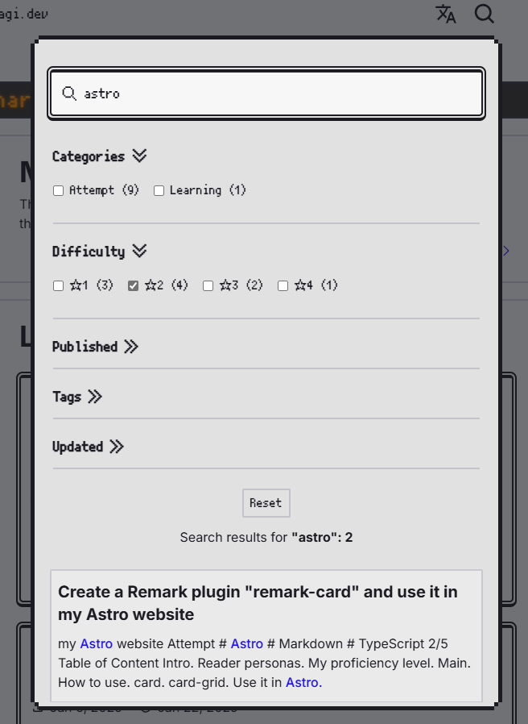

## Intro

This website has a keyword search feature for my content ever since its early days. [^1]

Behind the scenes, [Pagefind](https://pagefind.app/), a search library built using Rust, is working hard to make visitors' browing lives more comfortable and smooth. As to the old days, see the articles below.

[^1]: Specifically, it includes blog and news articles.

https://younagi.dev/blog/astro-website/

However, there's something critical missing to this day──Filtering functionality.
So I finally embarked on a journey seeking for the last "ONE PIECE".

### Reader personas

- Want to add search functionality to one's website
- Looking for a lightning fast and lightweight search library
- Interested in how the search feature in this website is implemented

### My proficiency level

As of the day I'm writing this article, my proficiency level in this field is as follows:

- Have about a one-year experience using Pagefind
- Have been around Astro for about two years
- Have been around TypeScript for about four years

## Main

First off, here's the whole picture.



### Preparing filtering items is easy-peasy

My website has the following filters:

- Categories
- Tags
- Published dates
- Updated dates
- Difficulty

To set them up, All you have to do is add the following data attribute to your filter items.

```html "data-pagefind-filter"
<span data-pagefind-filter="Categories">Category 1</span>
```

In the example above, a filter item "Categories" will be created and the "Category 1" will be added as one of the options

The published and updated dates in my website, for instance, are set as search filters like this:

```astro title="FormattedDate.astro" "data-pagefind-filter"
---
import { type FormattedDate, formatDate } from './format-date';

type Props = {
  date: FormattedDate[0];
  locale: FormattedDate[1];
  show?: FormattedDate[2];
  filterTitle?: string;
};

const { date, locale, show, filterTitle } = Astro.props;
const displayDate = formatDate(date, locale, show);
---

<time datetime={date.toISOString()} data-pagefind-filter={filterTitle}>
  {displayDate}
</time>
```

And then, it's used in the blog layout where the filter titles and the dates data are passed onto it.

```astro title="BlogLayout.astro" {23,29}
---
/* ... */

const { entry, /* ... */ } = Astro.props;
const { data, /* ... */ } = entry;
const {
  /* ... */
  publishedAt,
  updatedAt,
} = data;

/* ... */
---

<BaseLayout {/* ... */}>
  <main>
    <Article kind="blog">
      <section slot="metadata" {/* ... */}>
        {/* ... */}
        <div {/* ... */}>
          <div {/* ... */}>
            <Icon iconName="publish" width={20} height={20} />
            <FormattedDate date={publishedAt} locale={locale} filterTitle={t!.data.layouts.common.published_label} />
          </div>
          {
            updatedAt && (
              <div {/* ... */}>
                <Icon iconName="update" width={20} height={20} />
                <FormattedDate date={updatedAt} locale={locale} filterTitle={t!.data.layouts.common.updated_label} />
              </div>
            )
          }
        </div>
        {/* ... */}
      </section>
      <Prose slot="content">
        <slot />
      </Prose>
      <section slot="cta" {/* ... */}>
        {/* ... */}
      </section>
    </Article>
  </main>
</BaseLayout>
```

There's more to it than explained here, but I won't dig deeper into it. For more information, see the official page below.

https://pagefind.app/docs/filtering/

### Pagefind's default UI is convenient, but...

Pagefind offers what's called [the default UI](https://pagefind.app/docs/ui-usage/) and if you use it, surprisingly, that's all for the search filters──Yes, only if you use it.

It's a search component set, so to speak, containing the HTML, CSS and JS all together. To start using it, add `@pagefind/default-ui` to your project, and then import the CSS or UI component from where you want use it like this:

```astro title="A simple example of an Astro component"
---
import "@pagefind/default-ui/css/ui.css"

/* ... */
---

<div id="search"></div>
<script>
  import { PagefindUI } from "@pagefind/default-ui";

  function init() {
    new PagefindUI({
      element: "#search",
      /* ... */
    });

    /* ... */
  }

  document.addEventListener("DOMContentLoaded", init);
</script>
```

Now you'll see the search window together with the filtering UI appear on your page.
We're living in such a convenient era, aren't we?──Having said that, I DON'T use it. How come? Because it was giving off the "This is not what I expected" mood.

I suppose it's good enough to most people and I'm one of them. However, my website has already come a long way with its pixelated retro design for the navigation menus; it looks out of harmony with the sophisticated and modern UI. [^2]

[^2]: That said, it's still possible to customize the styles of the default UI to some extent. For instance, you can overwrite the values of CSS Variables such as text or background colors, borders, etc.

To implement it on my own, I extended the existing search component and added the checkboxes for filtering. The code below is written in SolidJS and TSX.

```tsx title="Search.tsx" del={64,72} ins={15,17,26,29-31,52,55,58,65-69,73-75,107-122,147-190}
import '@/styles/pixel-m-plus.css';
import type { I18nData } from '@/lib/collections/types';
import { isDev } from '@/lib/mode';
import {
  type Component,
  Suspense,
  createMemo,
  createResource,
  createSignal,
  onMount,
} from 'solid-js';
import { SearchIcon } from './SearchIcon';
import { SearchResults } from './SearchResults';
import type {
  PagefindFilterCounts,
  PagefindSearchOptions,
  PagefindSearchResults,
} from './types';

type Pagefind = {
  init: () => void;
  search: (
    query: string,
    options?: PagefindSearchOptions,
  ) => Promise<PagefindSearchResults>;
  filters: () => Promise<PagefindFilterCounts>;
};

type EnabledFilters = {
  [key: string]: string[];
};

const initPagefind = async () => {
  const pagefindPath = isDev
    ? '../../../dist/pagefind/pagefind.js'
    : '/pagefind/pagefind.js';
  const pagefind = (await import(/* @vite-ignore */ pagefindPath)) as Pagefind;
  pagefind.init();

  return pagefind;
};

type Props = {
  t: I18nData<'search'>;
};

export const Search: Component<Props> = (props) => {
  let pagefind: Pagefind;

  onMount(async () => {
    pagefind = await initPagefind();
    setFilters(await pagefind.filters());
  });

  const [filters, setFilters] = createSignal<PagefindFilterCounts>({});
  const [query, setQuery] = createSignal('');
  // This should preferably be a store but it's not possible to use stores in createResource
  const [enabledFilters, setEnabledFilters] = createSignal<EnabledFilters>({});
  const isQuerying = createMemo(() => query().length > 0);
  const [searchResultRefs, setSearchResultRefs] = createSignal<
    HTMLAnchorElement[]
  >([]);

  const [searchResults] = createResource(query, async (query: string) => {
  const [searchResults] = createResource(
    () => {
      return { query: query(), filters: enabledFilters() };
    },
    async ({ query, filters }) => {
      if (query.length === 0) return undefined;

      const searchResults = await pagefind?.search(query);
      const searchResults = await pagefind.search(query, {
        filters: filters,
      });
      setSearchResultRefs(Array(searchResults?.results.length ?? 0).fill(null));
      setActiveIndex(0);

      return searchResults;
    },
  );
  const [activeIndex, setActiveIndex] = createSignal(0);
  const incrementActiveIndex = () =>
    setActiveIndex(Math.min(activeIndex() + 1, searchResultRefs().length - 1));
  const decrementActiveIndex = () =>
    setActiveIndex(Math.max(activeIndex() - 1, 0));

  const handleKeyDown = (e: KeyboardEvent) => {
    switch (e.key) {
      case 'ArrowDown':
        e.preventDefault();
        incrementActiveIndex();
        searchResultRefs()
          .at(activeIndex())
          ?.scrollIntoView({ block: 'nearest' });
        break;
      case 'ArrowUp':
        e.preventDefault();
        decrementActiveIndex();
        searchResultRefs()
          .at(activeIndex())
          ?.scrollIntoView({ block: 'nearest' });
        break;
    }
  };

  const handleCheckboxChange = (e: Event) => {
    const target = e.target as HTMLInputElement;
    const { name, value } = target;

    setEnabledFilters((prev) => ({
      ...prev,
      [name]: prev[name]?.includes(value)
        ? prev[name]?.filter((v) => v !== value)
        : [...(prev[name] ?? []), value],
    }));
  };

  const handleReset = () => {
    setQuery('');
    setEnabledFilters({});
  };

  const handleSubmit = (e: SubmitEvent) => {
    e.preventDefault();
    if (searchResultRefs().length <= 0) return;

    searchResultRefs().at(activeIndex())?.click();
  };

  return (
    <div class="...">
      <form class="..." onsubmit={handleSubmit}>
        <div class="...">
          <SearchIcon label={props.t.button_label} width={22} height={22} />
          <input
            id="search-window"
            type="text"
            value={query()}
            placeholder={props.t.placeholder}
            onInput={(e) => setQuery(e.currentTarget.value)}
            onKeyDown={handleKeyDown}
            class="..."
            autocomplete="off"
          />
        </div>
        <div class="p-1 flex flex-col gap-2 py-3">
          {Object.entries(filters() ?? {}).map(([title, filterMap]) => (
            <details class="w-full py-3 border-b-2 border-solid border-line-solid [&>summary:after]:open:rotate-90">
              <summary class="cursor-pointer select-none list-none text-base sm:text-lg font-bold after:ml-2 after:content-['≫'] after:text-inherit after:inline-block">
                {title}
              </summary>
              <fieldset class="flex flex-wrap gap-4 py-4">
                <legend class="sr-only">{title}</legend>
                {Object.entries(filterMap).map(([value, count]) => (
                  <div class="flex items-center">
                    <input
                      type="checkbox"
                      class="checked:accent-neutral-500"
                      id={`${title}-${value}`}
                      name={title}
                      value={value}
                      onChange={handleCheckboxChange}
                    />
                    <label
                      for={`${title}-${value}`}
                      class="select-none font-medium pl-2"
                    >
                      {value} ({count})
                    </label>
                  </div>
                ))}
              </fieldset>
            </details>
          ))}
        </div>
        <input
          type="reset"
          class="font-semibold cursor-pointer py-1 px-2 rounded-sm self-center border-2 border-solid border-line-solid hover:bg-default-reverse-hover"
          value={props.t.reset_label}
          onClick={handleReset}
        />
        {isQuerying() && (
          <p class="text-center">
            {props.t.results_label}{' '}
            <span class="font-bold">
              "{query()}": {searchResults()?.results.length}
            </span>
          </p>
        )}
      </form>
      <Suspense>
        {isQuerying() && (
          <SearchResults
            query={query()}
            results={searchResults()?.results}
            resultRefs={searchResultRefs()}
            setResultRefs={setSearchResultRefs}
            activeIndex={activeIndex()}
            setActiveIndex={setActiveIndex}
            notFoundLabel={props.t.result_not_found}
          />
        )}
      </Suspense>
    </div>
  );
};
```

Here are a rough review of the changes:

- Get the data of filters Pagefind has
  - You can get them as a type of `Record<string, Record<string, number>>`
- After an initial rendering when elements are mounted on a page and Pagefind is instantiated, set them to the Solid signal
- Implement the filtering UI with checkboxes and currently valid filters will be set to the Solid signal when the `onChange` fires
- In addition to the query, let the Solid resource monitor changes of currently valid filters
  - Every time changes happen, search with the query and filter(s) and set the search results to the resource
- Add the reset button and it will clear the whole search conditions

Now it's all taken care of. Incidentally, the search logic is `AND`.

### Extra stage: Add weights to search results

Believe it or not, Pagefind also offers search weighting. Are you a department store of search functionality or something?

As someone who is a "Take whatever you can get" type of person, I tweaked the weight of articles' titles. More precisely, I set it to 10.0. [^3]

[^3]: To be honest, I don't even know what the point of this is.

```html "data-pagefind-weight"
<h1 data-pagefind-weight="10">{title}</h1>
```

Incidentally, the default weights are as follows:

| Elements | Rankings |
| --- | --- |
| h1 | 7.0 |
| h2 | 6.0 |
| h3 | 5.0 |
| h4 | 4.0 |
| h5 | 3.0 |
| h6 | 2.0 |
| All others | 1.0 |

## Outro

I can't thank you enough, Pagefind.

If I had to implement such lightweight and performant search functionality, it would've taken me ages. Plus, Pagefind is so kind and easy-going; you can add the bulk of the features with an "absolutely minimum efforts" as the default UI shows.

When this website's grown up enough to be called something of a library, I'll realize how much I appreciate it. Anyway, I hope that day will come someday.
