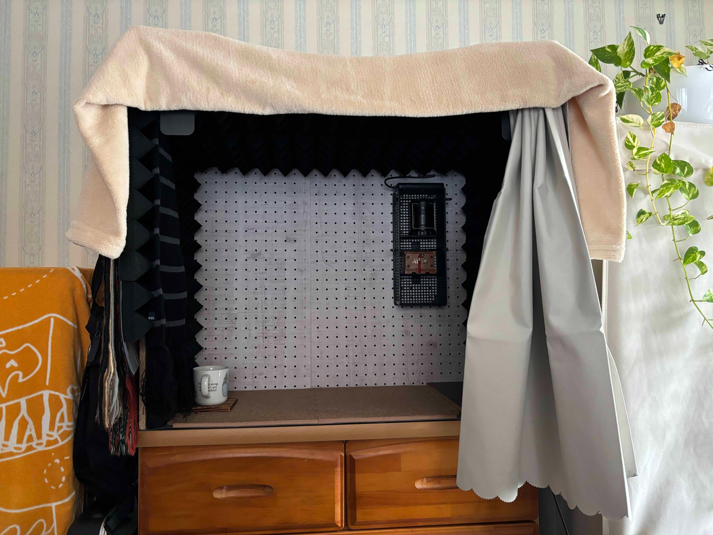
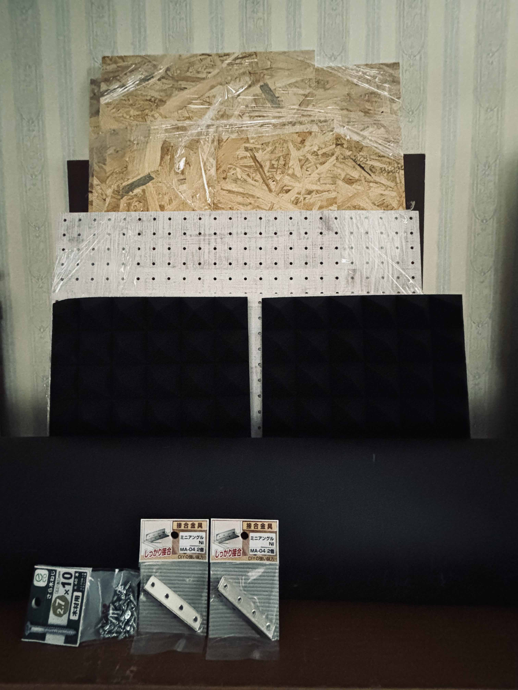
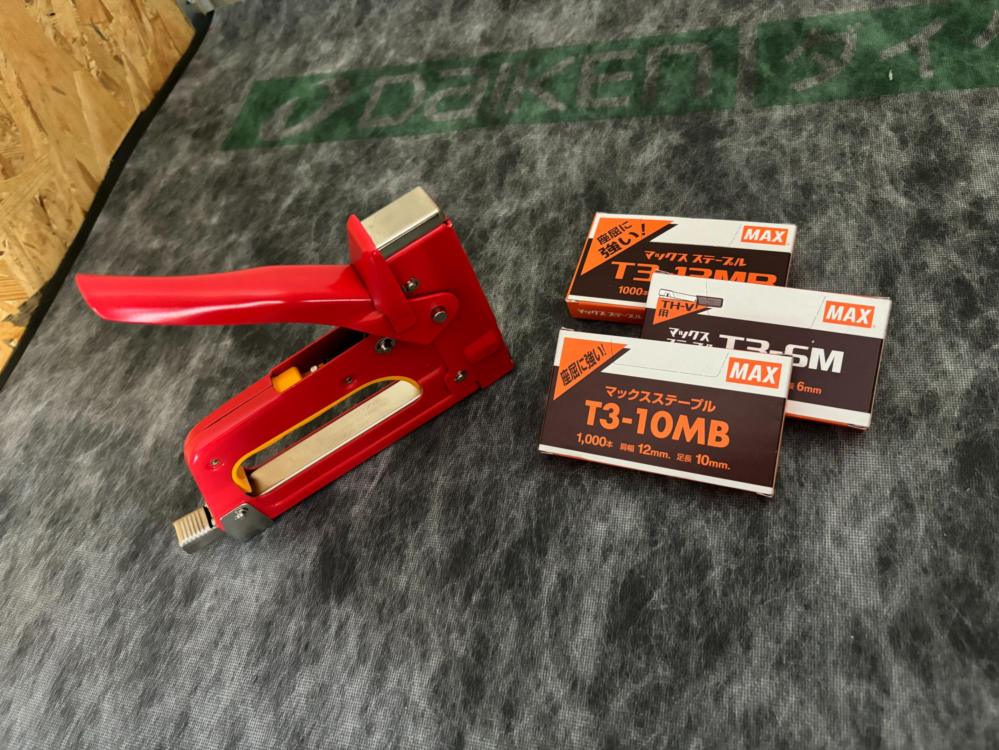
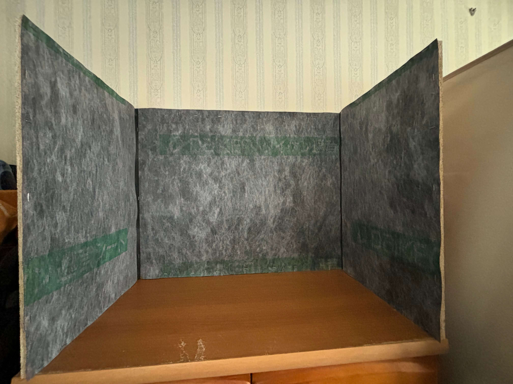
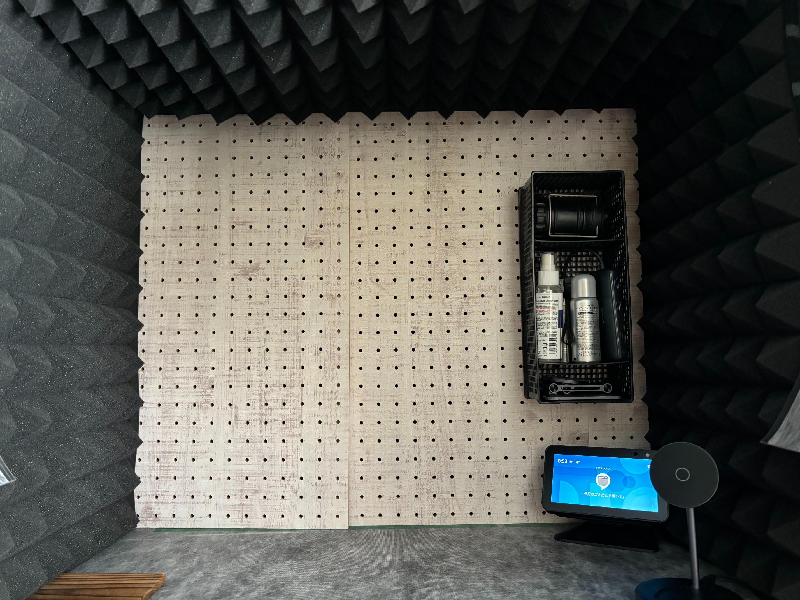
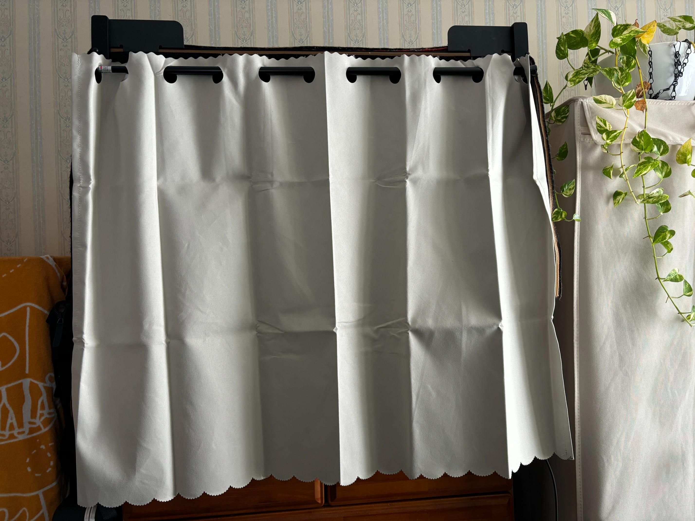
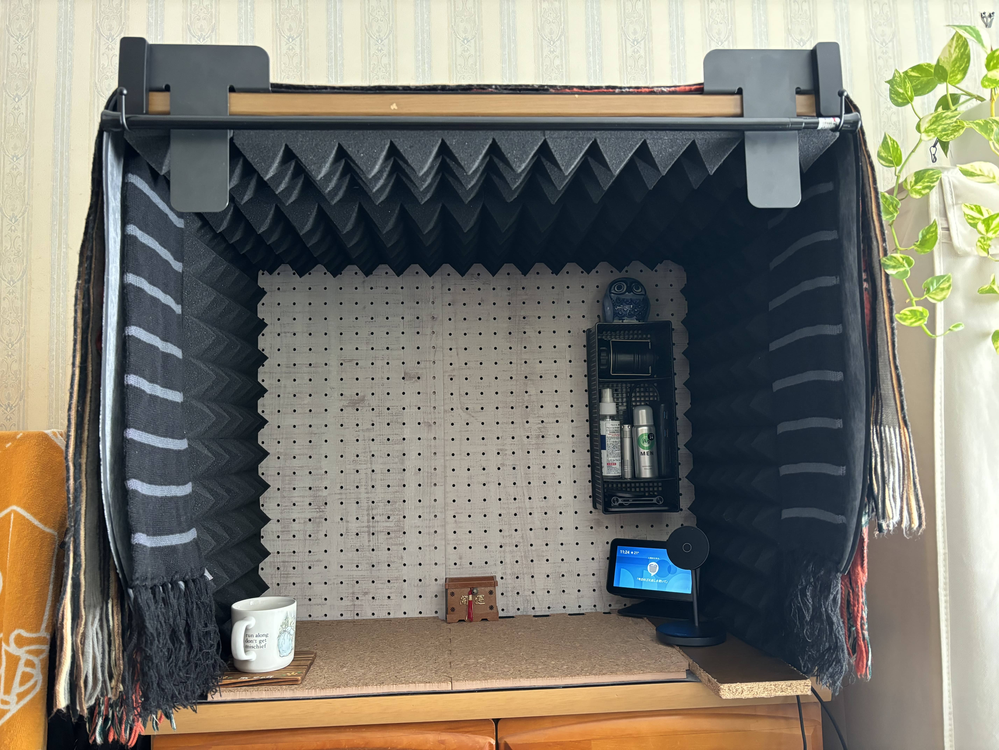

## Intro

I've always envisioned having my own soundproof room someday but it's already been ages ever since then. The space limitation had long been standing in my way.

That said, nothing could beat my fiery motivation. After countless attempts to find a middle ground, I came to one conclusion: A vocal booth on a shelf.

### Reader personas

- Want to have a soundproof room but the space limitation thwarts it
- Thinking about building a soundproof vocal booth
- Want to know whether it's worth a shot to build a soundproof vocal booth

### My proficiency level

As of the day I'm writing this article, my proficiency level in this field is as follows:

- Have built something of a small wooden desk and shelf several times
- Have no experience in working on such a large DIY project as this

## Main

First, here's the final product.
It took me a week and a half to complete the project from planning and designing to building the booth.
It cost **19,480 yen in total** including only the materials. (As of Oct 2024)

The concepts are:

- As cheap as possible
- Short build time
- Easy to dismantle and tweak later

Whereas it's nowhere near as good as those soundproof rooms posted by profesional DIYers on YouTube, it seems good enough in terms of cost-performance, time-effectiveness, and effortlessness.

| Product | Price (yen) |
| --- | --- |
| OSB board 1820 x 910 x 11 (mm) | 2,480 |
| Pegboard 600 x 450 and 600 x 300 (mm) | 1,589 |
| Sound blocking sheet 940mm x 10 m | 3,745 |
| Acoustic panels 300mm x 300mm x 24 | 4,799 |
| Connecting brackets x 4 | 656 |
| L-shaped corner brackets x 4 | 560 |
| Flat-head screws 2.7 x 10 & 3.8 x 13 (mm) | 278 |
| Tension rod | 110 |
| Book stand x 2 | 220 |
| Cafe curtain | 1,518 |
| Gap sealing tape 3m | 110 |
| Hooks x 2 | 1,342 |
| Cork boards 300 x 300 (mm) x 10 | 1,756 |
| Lumber cutting service x 5 | 275 |

### Plan and design

I went through this phase perfunctorily because I wanted to embark on building as soon as possible.
First, I made a nominal design on iPad, which is nothing but a drawing, and then fixed the sizes of the booth. Second, the meterial of the walls and how to arrange them are finalized. [^1]

[^1]: I've also learnt "What's soundproof?" simultaneously.

The material ended up being OSB(Oriented Strand Board), not the popular plasterboard. How come? In Japan, they must be disposed of as industrial waste and it takes a fairly amount of effort.

> [!info]+
> One of the most important criteria for soundproof walls is high density (≒ massive)

### Procure tools and materials

Most of them were available at EC stores. Other than that, I went to a DIY store nearby to buy some lumber and other stuff.

All materials eventually used are as follows:

- OSB board 1820 x 910 x 11 (mm)
- Pegboard 600 x 450 and 600 x 300 (mm)
- Wooden board leftover for work desk 710 x 590 (mm)
- Sound blocking sheet 940mm x 10 m
- Acoustic panels 300mm x 300mm x 24
- Connecting brackets ×4
- L-shaped corner brackets ×4
- Flat-head screws 2.7mm x 10mm & 3.8mm x 13mm
- Tension rod
- Book stands ×2
- Cafe curtain
- Gap sealing tape 3m
- Hooks ×2
- Cork boards 300 x 300 (mm) x 10

Tools I used are:

- Drill driver
  - Used to make pilot holes and drill screws
- Staple gun
  - Used to attach the sound blocking sheet
- Step ladder
  - Used to handle the top board
- Convex
  - Used to measure longer distances
- Square
  - Used to build the booth at right angles
- Craft knife
  - Used to cut the sound blocing sheet
- Cutting mat
  - Used with the craft knife
- Double-sided tape
  - Used to attach the acoustic panels

I enjoyed the lumber cutting service from the DIY store. Thanks to that, I was able to cut corners in the most laborious task, which I'm very happy about and thankful for. [^2]

[^2]: It was 5-times straight-line cuts and took only shorter than half an hour. Unless you're a considerably skilled DIYer, you should enjoy the service.

### Build the booth

The rough process is as follows:

- Make the framework of the booth
- Cover the inner walls with the sheet and panels
- Install the pegboard to the front wall
- Put the cork boards onto the floor
- Install the curtain
- Fill in the gaps

#### Make the framework of the booth

Fixate the walls in a backwards C shape.

I thought it'd be enough to do so with connecting brackets but it turned out to be too optimistic. The connecting parts are wobbling like a guest dancing in a nightclub and it looks more like a trapezoid. I bought L-shaped corner brackets to stabilize them.

#### Cover the inner walls with the sheet and panels

Next, cut the sound blocking sheet for 4 sides of the inner walls and fixate them to the OSB boards.

That was my first time to use a staple gun and to be honest, I was skeptical like "Does something merely superior to a stapler really have the ability to penetrate the dense OSB board?"
That turned out to be underestimation very soon.

And then glue the acoustic panels with a double-sided tape and apply them to the walls. Cut them when they don't fit perfectly on an as-needed basis.

Now it starts assuming a recording booth.

#### Install the pegboard to the front wall

While saying "install", it's merely "insert".
I was like, "Wouldn't it be better to apply 1 x 4 pieces of wood and mount the pegboard on them...(gibberish)?", but luckily there are subtle gaps where the pegboard fits into perfectly.
Unintentionally, this met the design concept "Easy to dismantle and tweak later".

It's giving off good vibes with the pegboard.

#### Put the cork boards onto the floor

The top board of the shelf is supposed to be the floor of the booth but it resonated more than I'd expected.
So I covered the floor with the sheet and put some cork boards on it. It incredibly stopped resonating as a result.

#### Install the curtain

Now, it was supposed to be almost all done at this point but it still sounded noisy when I made a fuss in the booth. Hmm...

Speaking of which, I remember someone leaving a famous quote, "Sound leaks from gaps."
After all, I embarked on installing a curtain in front of the booth. [^3]

[^3]: In addition, I stacked up a wooden board leftover for my work desk whose depth is longer than the top board onto it.

Having bought a cafe curtain and a tension rod, I dragged book stands that was almost falling into eternal sleep out of bed and allocated them a totally irrelevant job. I'm so sorry for that.

After installing the cafe curtain, the first impression I got was, "Isn't it like the photo booth of Purikura?"

But don't take it lightly. Just doing so changed the world; sounds resonate in the booth like a recording studio and it sounds a bit less loud outside.

#### Fill in the gaps

Finally, I filled in the gaps empty-mindedly.

One example is the one between the inner walls and the curtain.
Cut the sheet and put it together with the panels, and then stack some layers of scarves on the outside: The three layered structure of acoustic panels, sound blocking sheet, and scarves.

Other than that, countless gaps are bridged. The more gaps filled, the closer I find myself feeling to the booth. It's a long story so let's skip it for now.

### Extra stage: Test the soundproofing effect

Who's going be convinced without any valid data?
I sort of collected data by using the free app "Decibel X" just in case, though this time I value subjective outcomes more than objective.

The monitoring song is their hit song "Needled 24/7" from Children of Bodom and I used the first 20 seconds or so. I feel sorry to treat it as a noise, but for those who are not interested in metal music... [^4]

https://open.spotify.com/track/1aKrYw2i1mWRPMOUUe3dT8?si=1e65dc5163174e85

[^4]: I love it by the way.

Test it three times for these situations:

1. In front of the sound source
2. Outside of the door with the sound source put outside of the booth
3. Outside of the door with the sound source put inside of the booth

And the results are:

| Situation | Average(dB) | Minimum(dB) | Maximum(dB) | Peak(dB) |
| --- | --- | --- | --- | --- |
| 1 | 66.0 | 57.4 | 69.9 | 71.7 |
| 2 | 38.0 | 28.8 | 45.3 | 51.4 |
| 3 | 31.1 | 25.3 | 34.7 | 42.6 |

As you can see, it has a huge soundproofing effect with only a door in between. As the sound source is only around 1.5 meters away from the door, it'd be okay to regard the attenuation effect caused by the distance as insignificant.

Isn't the door made of a special material or the likes? No.
This is what I'll mention later, but I filled the gaps of the door with a gap sealing tape and partly attatched soundproof boards made of the leftovers of the sheet and panels.
I was blown away when I saw the outcome that they had a soundproofing effect equivalent to 5~7dB on average.

Getting back on track, the booth ifself turned out to **have an approximate 7dB soundproofing effect** .
In general, it's said that humans can distinguish a change in sound level from that of about 3dB and it feels like they become halved or doubled by that of about 10dB. [^5]
The booth ifself falls a bit short of the number but they do surpass the effect in combination with soundproofing efforts put on the door.

[^5]: Reference: https://www.noisequest.psu.edu/pdfs-documents/basics.pdf

Indeed, it was no longer something categorized as melodic death metal when I listened to "Needled 24/7" in the 3rd situation──the sharp-edged guitar riffs and the rain-storm-like double bass drums were nowhere to be seen; cars running far away outside could even obliterate their hustle and bustle in a heartbeat.
In short, you can't hear it at midday unless you try to listen carefully.

## Outro

I've completely fallen down the rabbit hole of soundproofing.

I filled the gaps around the door with a gap sealing tape, attached some soundproofing boards, and so on.
That made it less noisy outside the door to the extent I was able to notice it.

Long story short, I got an environment in my room where I can do vocal exercise ~~to the fullest~~ to some extent.
First thing first, I'm going to test if it can withstand my singing voice, which is said to be over 120dB. And then I will lower the volume by 10dB every time my family gets mad at me.

### P.S.

In the early Dec 2024, the light turns on in the booth. It looks more stylish than I expected despite that I simply squeezed an off-the-shelf LED tape light in the gaps.

