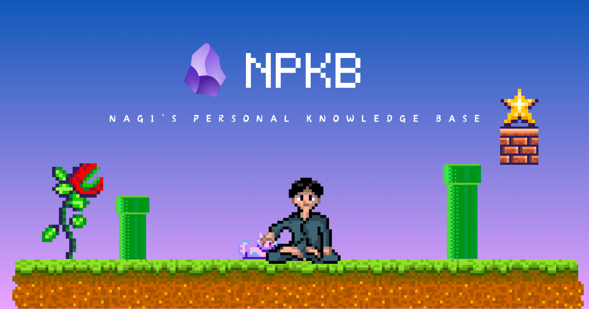
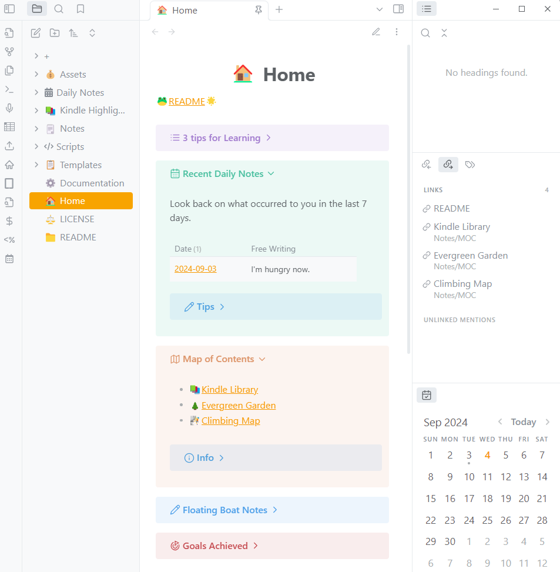
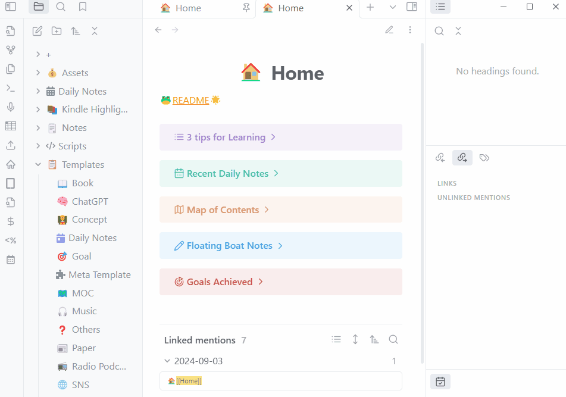
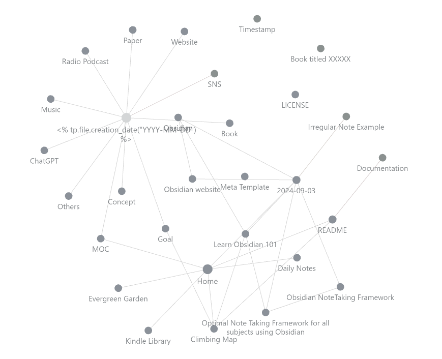
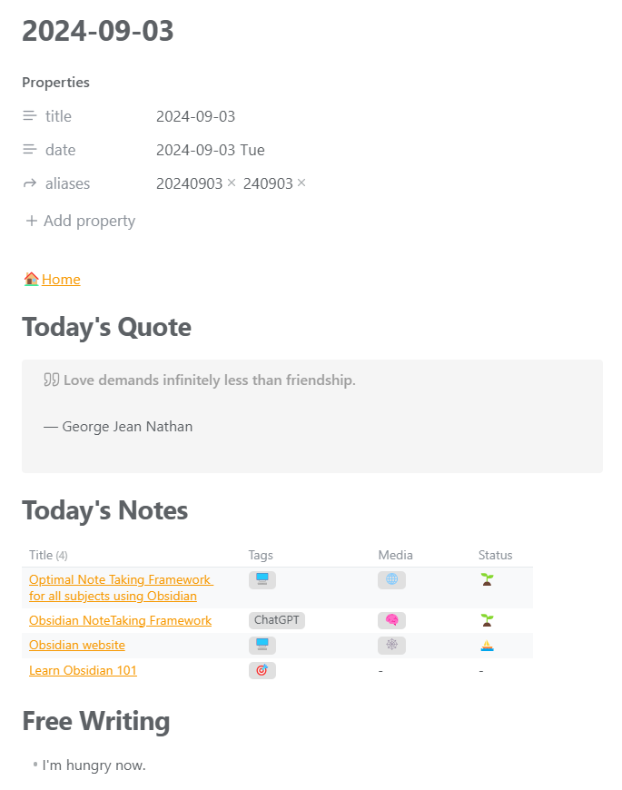
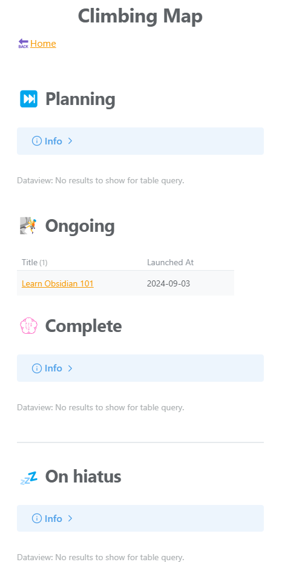
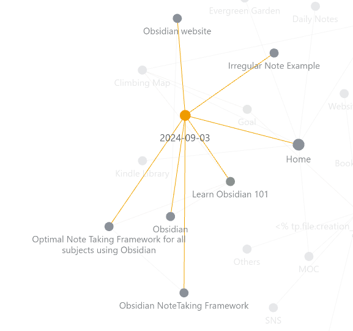

## Intro

> [!quote] One Phrase
> — You shape your tools, and they shape you

I love [Obsidian](https://obsidian.md/) and have been using it as my knowledge base where almost all info and data I gather are stored daily.

Here, let me introduce a showcase project for my personal knowledge base built on top of Obsidian. It's called **"Nagi's Personal Knowledge Base(NPKB)"**.

### Reader personas

- Want to create a personal knowledge base using Obsidian but have no idea how
- Want to migrate from Notion, Evernote, or other note-taking app to Obsidian but it's overwhelming with a bunch of settings
- Don't want to get bothered by tinkering with the numerous settings (Just want to have a comfortable knowledge base and quick start!)

### My proficiency level

As of the day I'm writing this article, my proficiency level in this field is as follows:

- Have a three-year experience as a software engineer in total (Not in a row)
- Understand the basics of JavaScript, CSS, and Markdown
- Have been using Obsidian for 3 years

## Main



First of all, let me clarify what NPKB isn't cut out for.

- **Schedule and task management**
	- Managing them on your smartphone or tablet is much more handy
	- A lot of useful calendar and To-do apps available now
- **Mind map and other visualization**
	- The same reason as above (e.g., iPad)
	- Personally, I love using iPad when creating a mind map or visualizing any ideas or thoughts
- **Quick notes creation and management**
	- You can leave quick notes here on the spot if you're on the PC but if not, it's quite hard (e.g., When you're walking outside)
	- Figure out another alternative way possibly with your smartphone or tablet

Then, what's it for after all? Basically, **it's meant to be the final destination for all info and data you gather on a daily basis**. That means, anything from anywhere all over the place like your smartphone, tablet, or a piece of paper ends up here.

I'm not going to mention that here though, I've made the ecosystem where my knowledge base is accessible and editable from anywhere among my smartphone, tablet, and PC. Of course it's synched among them. For more details, see the article below.

(🚧Coming soon...)

Check the repository below if you're interested in NPKB.

https://github.com/brklntmhwk/npkb

> [!note]+
> The version of NPKB is managed by [Git](https://git-scm.com/). Although you don't have to manually input the Git commands in most cases except the first setup, preferably you know the basics of Git at least in preparation for unexpected errors that must be fixed manually.

### Demo

Before getting into the details, here are some demos of NPKB.

#### Home page



As a starting point rather than a hub of all notes, the home page plays a pivotal role in:

- giving you access to secondarily upper-class notes
  - Daily Notes from the calendar or the Recent Daily Notes section, [MOC](#mocmap-of-content) from the Map of Contents section, etc.
- reminding you of the presence of notes waiting to be raised
  - You can see how long they've been staying floated (as a boat note) from the Floating Boat Notes section
  - As for the meaning of boat note, see [the evergreen ethos](#the-evergreen-ethos) section.
- helping you connect the dots and refine your random thoughts or ideas
  - You can see [the Free Writing](#daily-note) data of the last seven days in the Recent Daily Notes section

#### Create a new note



In NPKB, you can create a new note with some prompts. Depending on your responses, it's created with a specific template.

#### Graph view



This is an important feature that Obsidian offers. You can switch the view mode to that of the graph view and see the whole picture of your vault. By clicking the nodes, it guides you to the note page.

#### Daily note



Daily notes have the following sections:

- **Today's Quote:** A random quote gotten via https://api.quotable.io
- **Today's Notes:** A data table of notes created today
- **Free Writing** A free writing area where whatever you want to take a note of or pops into your mind is supposed to be

#### Your long-term goals



Schedule and task management aside, you can create a note for your long-term goal and then manage them on one page: Climbing Map.

There are four stages as you go along:

- **Planning:** Projects waiting to be launched
- **Ongoing** Ongoing projects
- **Complete** Projects already complete
- **On hiatus** Projects currently on hiatus

Notes switch among those stages by changing some frontmatter data of them. The more you achieve, the more you feel a sense of fulfillment!

### Directory Tree

```Markdown
NPKB/
├── +/
├── Assets/
│   └── Images/
├── Daily Notes/
│   └── ...
├── Kindle Highlights/
│   └── ...
├── Notes/
│   ├── Concepts/
│   ├── Efforts/
│   ├── Gleanings/
│   └── MOC/
│       ├── Climbing Map
│       ├── Evergreen Garden
│       └── Kindle Library
├── Scripts/
│   └── ...
├── Templates/
│   └── ...
├── Documentation
├── Home
└── README
```

Since Obsidian offers [the bidirectional links (a.k.a Wiki links) feature](https://help.obsidian.md/Linking+notes+and+files/Internal+links), **hierarchical directory structures are not so important as traversal links**. That's why the directory tree is kept to an absolute minimum.

### Note Classification

#### Daily Notes

This is helpful to centralize the info or data gathered on that day, which in turn creates a strong connection between the resources and the date.



Personally, I keep it in mind to connect whatever I do on that day to the content of notes via the date one way or another, which adds up to a trigger to recall them later.

#### Templates

Templates are stored here.

#### Notes

Notes contain the rest of all. They are supposed to be, so to speak, "Evergreen Notes" down the road, following [the evergreen process](#the-evergreen-ethos).

##### Media

As an inlet of new notes, you can choose an info medium to specify where you collect it from in the prompts mentioned earlier.

- `📖` **Book:** Paper books (Kindle excluded)
- `🧠` **ChatGPT:** Chats with ChatGPT
- `🎧` **Music:** Songs from streaming services like Spotify
- `📰` **Paper:** Research paper
- `📻` **Radio/Podcast**
- `🌐` **SNS:** YouTube, X, Instagram, etc
- `🕸` **Website**
- `❓` **Others:** Concepts or irregular topics

##### Concepts

You can manage bigger and more abstract things here. When you want to start with a bigger concept from the beginning, this is the one.

> [!info]
> In NPKB, basically you're not supposed to start with them but with more specific and smaller notes like the "[Notes](#notes)" above because it seems better to speed up our note-taking process.

##### Efforts

[Your long-term goals](#your-long-term-goals) are supposed to be here.

##### Gleanings

Everything gathered from external info sources (e.g., Social media) are stored here.

##### MOC(Map Of Content)

MOC is a collection of notes that are geared towards a specific topic. You just write about the topic and add links of relevant notes along the way. That's all.

The advantages of MOC are:

- Able to handle more complicated topics that cannot be categorized as one or traverse multiple small genres
  - e.g., A MOC "Healthy recipes" could contain notes like:
    - How to prevent food from losing its nutritions during cooking
    - 10 healthy vegetables
    - A healthy miso soup with broccoli, carrot, and coriander
- Able to create it from any angles independent of folders, categories, etc.
- Able to connect the dots putting related notes to the topic together
  - Helps you understand the topic more deeply

> [!info]+
> When it comes to MOC, No special rules exist but one thing to be kept in mind is **a "Note first, map last" slogan**.
> That is rather a bottom-up process than that of trickle-down; it's not until you raise a decent number of notes that you start creating the map. (Existing MOCs are exceptional though)

### The Evergreen Ethos

As an indicator of to what extent a note has been matured, the following emojis are used in the frontmatter of every note. This concept is the Evergreen ethos advocated by [Andy Matuschak](https://andymatuschak.org/).

- `⛵ Stage 1. Boat note:` Just started or floating around isolated from other notes with no content added
- `🌱Stage 2. Seedling:` Growing with a few contents and bidirectional links added but still in its infancy
- `🌿 Stage 3. Budding:` Growing with more than a few  bidirectional links and contents added but still developing
- `🌲 Stage 4. Evergreen forest:`  Well developed and full-fledged "Evergreen Notes"

I often create a note anyway just adding the link to the media whenever coming across something interesting and later on, add more contents and Wiki links.

The advantages of this system are as follows:

- Clearly able to tell to what extent notes have grown at a glance
  - NPKB has a data table for this
- Helps you prioritize note-taking
  - e.g., Make connections among this boat note and others first!
- Keeps you aware of the importance of making as more connections as possible among notes

Incidentally, I determined the classification above referring to [Bryan Jenks](https://notes.bryanjenks.dev/Z/HOME).

## Outro

NPKB is based on a lot of great community plugins. Above all, here are some of them that play an integral role in the above-mentioned features.

- [Dataview](https://blacksmithgu.github.io/obsidian-dataview/): Helps me create a data table easily
- [Templater](https://silentvoid13.github.io/Templater/introduction.html): Helps me build the prompt workflow of creating notes with its template and scripting functionality
- [Metadata Menu](https://mdelobelle.github.io/metadatamenu/): Helps me handle metadata in the frontmatter, especially the evergreen statues and tags

If you're becoming interested in NPKB, see the repository below.

https://github.com/brklntmhwk/npkb

> [!warning]
> As of Sep 2024, it's available only in English. Translate the docs into your language on an as-needed basis.
