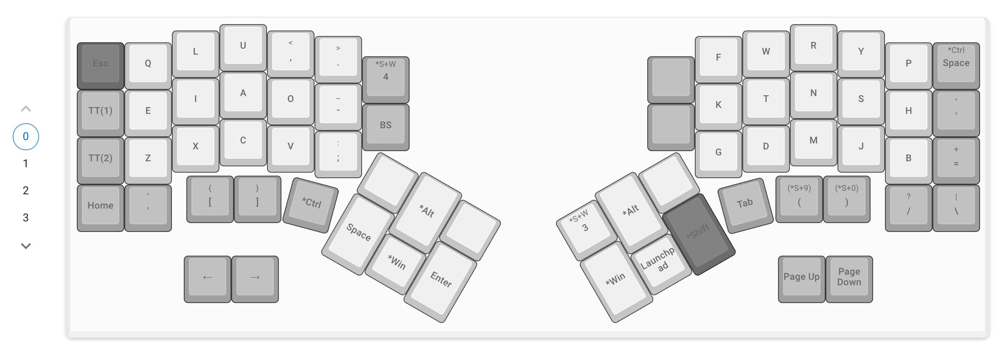
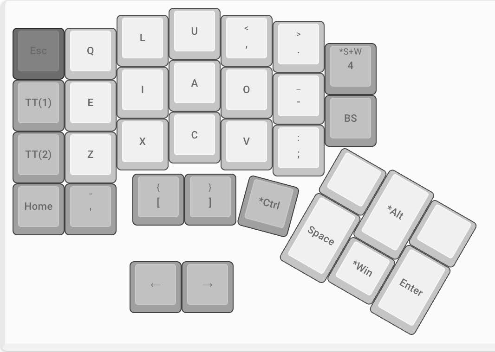
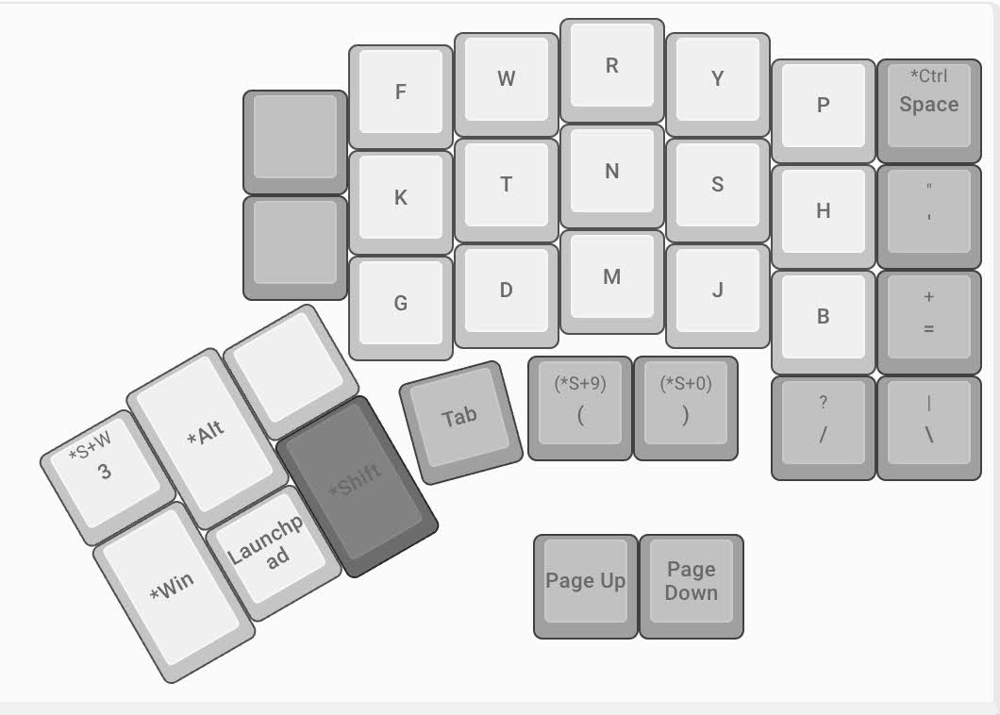
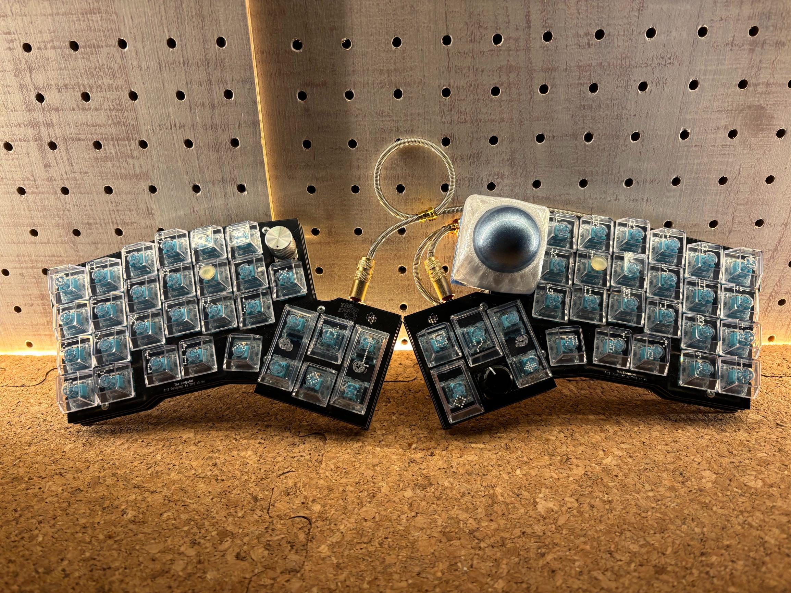

## Intro

The other day, I built my first keyboard kit.
It's a very cool split keyboard called "The Endpoint".

https://younagi.dev/blog/split-keyboard-the-endpoint-build/

I'm such a greedy creature, however, that I wanted to tinker with the keyboard layout once the keyboard build had been done.

Stepping headlong into the rabbit hole of keyboard layouts, I found out that a keyboard layout called "[the Ohnishi Layout](https://o24.works/layout/)" is seemingly very hot in Japan nowadays and the developer is──that OHNISHI Takuma! [^1]

[^1]: I've seen him featured on TV labeled as "Gifted" so I knew of him.

I've also leanrt this: There are bunches of keyboard layouts out there motivated by this spirit── "Emancipation from the QWERTY-dominant world".
And all these considered, I still picked out the Ohnishi Layout as my partner.

The reasons will be mentioned later with its lovely parts.

### Reader personas

- Interested in the Ohnishi Layout but can't get away from the QWERTY
- Want to know to what extent the Ohnishi Layout works well in programming
- Want to know the user experience

### My proficiency level

As of the day I'm writing this article, my proficiency level in this field is as follows:

- Have 10 year experience in blind touch typing (blindly) with the QWERTY layout
- Have never tried any other keyboard layouts including the Ohnishi Layout

## Main

Note that I'm a Mac & Linux user hereafter.

### The whole picture of my keyboard layout

Firstly, here's the whole picture.

I abided by the rules the Ohnishi Layout brought in and customized some other parts──"Rules make or break your shacking up with your partner...!" [^2]

[^2]: Never been there, never done that either though.

#### The intentions of my customization

When you say "customization", there should necessarily be a certain intention or two in it── but it's only a few that I can explain it in confidence.

Below are the "only a few":

- **`Ctrl` & `Tab`:** Assigned to the home positions of the left and right thumbs
  - Easier to move between browser tabs
- **`Space`:** Assigned to the left thumb
  - Assigned it to near the home posision since it's the most frequently used one when typing
  - Same as the QWERTY Layout
- **`Cmd(Win)`:** Assigned to the left and right thumbs
  - This is beside the point but it's convenient to be able to use the key simultaneously when using the trackball  and trying to open a page in another browser tab
  - It's set to the closer position to the left thumb since being frequently used on Mac
- **`Backspace`:** Assigned to the left index finger
  - To take care of my right little finger tortured by the QWERTY Layout
- **`Esc`:** Assigned to the left little finger at the top left end
  - I'm a natural-born escapist
  - Same as the QWERTY Layout

### A rich month spent with the Ohnishi Layout

I spent a mouth with the Ohnishi Layout under the same roof.
Here's the candid feelings I've got from that so far.

#### Lovely parts of the Ohnishi Layout

Love is blind──What I love about my partner? It's no brainer.

{/* textlint-disable ja-technical-writing/max-comma */}
- **Easy to remember the layout**
  - Voiced and unvoiced sounds of consonants are aligned in a row
    - e.g. `K` and `G`, `P`, `H` and `B`, etc.
  - Frequently used keys for shortcuts and some others are placed at the same position as the QWERTY layout
    - e.g. `C`, `V`, `P`, `Q`, etc.
    - Easier to migrate from the QWERTY Layout
- **Comfortable with the Roman alphabet input**
  - Vowels on one hand, and consonants frequently used in the Roman alphabet input on the other hand around the home position
    - `k`, `t`, `n`, etc.
- **Hands travel less far reducing fatigue**
  - Goes without saying, doesn't it?

Personally, the "Easy to remember the layout" was a decisive factor. In terms of the benchmark scores, some other layouts are more attractive──but all of them are hard nuts to crack: difficult to remember.

In contrast, the Ohnishi Layout is built on the perfect balance among these factors──the benchmarks, the learning curve, and its usability.
Indeed, I'm already getting used to blind touch typing with it spending only one month together. It's not too bad.

#### Where the Ohnishi Layout falls short

Love is blind──That said, I tried hard to nitpick what could be better about it now that I've learnt too many from the past(make of that what you will)

Below are the "only a few":

- **Hard to use in English**
  - As shown in the benchmark scores, the Ohnishi Layout isn't that good at typing in English [^3]
  - Personally, words like "can't", "list" or "photo" turned out to be hard to hit because of the two consecutive alphabets being aligned in the same row

[^3]: Just in case, it holds true only when comparing it to the Roman alphabet input or other keyboard layouts focused on typing in English.
In comparison with the QWERTY Layout or some other layouts, it's even better.

#### Programming with the Ohnishi Layout!

As just another developer, whether it's usable in coding is a big deal.

{/* textlint-disable ja-technical-writing/max-comma */}
...Having said that, it takes the "Do as you think best" stance as for symbols except some like commas, periods, dashes, etc. In other words, it almost solely depends on your work.[^4]

[^4]: As described later, Vim(Neovim) users are an exception.
If you were a profoundly experienced Vimmer getting accustomed to your own key bindings with the QWERTY Layout, you'd go through a series of rough patches.

Now let's see the whole picture again.

When it comes to symbols frequently used in coding, their positions are as follows:

- `()`: Assigned to the right middle and ring fingers at the bottom
  - Want them to be at the same positions as the QWERTY Layout because they are the most frequently used ones
- `[]` & `{}`: Assigned to the left middle and ring fingers at the bottom
  - Prioritized the `()` because they seem to be more frequent in coding
  - Assigned them to the corresponding left positions to the `()` to make them memorable
- `<>`: Assigned to the left index finger at the top
  - Abiding by the Ohnishi rules unexpectedly led to this consequence: Angle brackets placed around the home position (They are two sides of the coin with the comma and period)
- `?` & `/`: Assigned to the home position of the right little finger
  - Same as the QWERTY Layout
- Single & double quotations: Assigned to the right little finger at the right end
  - Similar to the QWERTY Layout
- Back quotation & `~`: Assigned to the left little finger at the bottom
  - Similar to the QWERTY Layout

[The Endpoint](https://younagi.dev/ja/blog/split-keyboard-the-endpoint-build/) has four layers in total, which enables you to switch among them with keys for the switching itself.
So I assigned the parentheses above to the home positions on another layer as well. You can type them by either way depending on your mood.

## Outro

Long story short, I'm going to continue our relationship with the Ohnishi Layout. That said, there's still a difficult challenge in front of us──How to make out with Vim(NeoVim). More precisely, how to make out with their unique key bindings.

Luckily, it's still early days for me as a Vimmer and the key bindings are still growing day by day; therefore it seems somehow easier for me to act as a go-between for them.
When the dust settles, I'll share the ins and outs.
