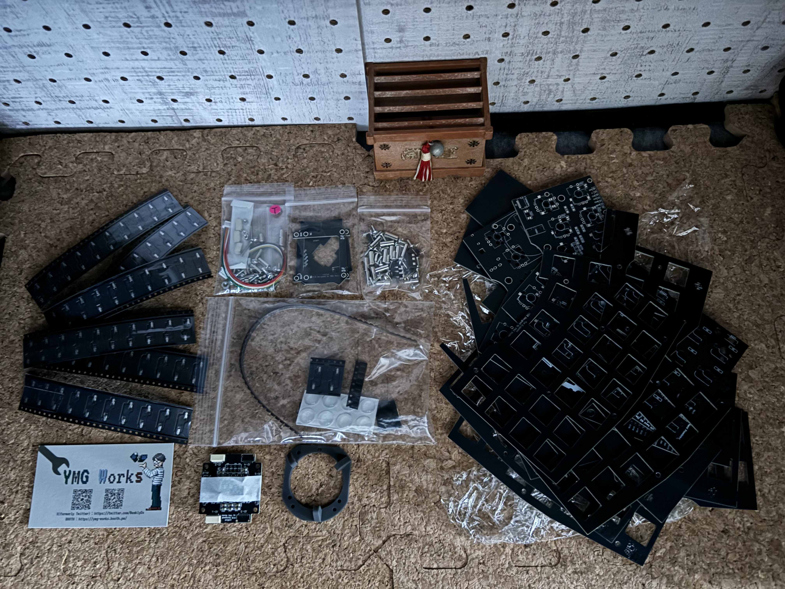
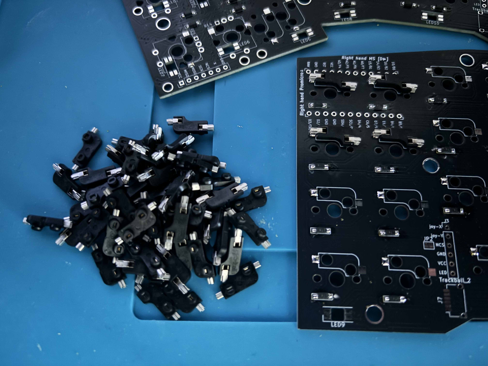

## Intro

{/* textlint-disable ja-technical-writing/max-comma */}
Entering the 2020s, this has been creating a huge whirlwind in the self-made keyboard community.
It calls itself "Split Keyboard", as the eye of the storm, and seems to be gaining increasing fans around productivity supremacists, efficiency fanatics, desk setup freaks, etc. [^1]

[^1]: I respect someone like them who can pursue one thing thoroughly.

What's obviously different about them is, they are literally split into left and right. Thanks to this unique feature, users can do typing with their comfortable shoulder widths. "THIS IS 'Ergonoimics'...!"

As I continued investigating it, I couldn't help chafing at the bit in the end. So I ended up diving into the split keyboard world on the pretext of undercover investigation.

This time, the target is a keyboard kit "[The Endpoint](https://booth.pm/ja/items/5397024)". The developer is YMG WORKS.

As to how to build, see the clear official build guide below. I'm not going to show every build step here.

https://note.com/underthrow_/n/n577c993cd733

https://note.com/underthrow_/n/n65385d90a76e

### Reader personas

- Want to see how "The Endpoint" is built
- Want to know how many and what sort of steps have to be taken to build a custom keyboard kit in general
- Interested in electronics overall

### My proficiency level

As of the day I'm writing this article, my proficiency level in this field is as follows:

- A total newbie in building a keyboard from a build kit
- Have tried more than 10 off-the-shelf keyboards
- Haven't done soldering ever since elementary school

## Main

Here's the final product.
The key caps are transparent so the color of the switches stands out as the main color.

What's nice about it is, it offers 4 optional areas where you can install a trackball. They are the index finger and the thumb positions from both left and right.
Plus, it can make your dream of dual trackballs come true.

In my case, The batting order is, right index finger a trackball, left index finger and right thumb rotary encoders.

I didn't setup LED lights this time, but might add them as a sign of keyboard layers changing. The feeling's getting stronger day by day. [^2]

[^2]: He just wants to do soldering making up a plausible reason.

### Preparation

All the keyboard parts are as follows:

| Product | Cost (Yen) |
| --- | --- |
| The Endpoint build kit | 25,000 |
| Pro Micro Type-C with 12-pin conthrough x2 | 3,146 |
| Trackball 34mm | 1,300 |
| Metal knob for rotary encoder x2 | 1,320 |
| Rotary encoder switch x2 | 660 |
| Type-C cable | 2,580 |
| Type-C magnetic adapter L-shaped | 1,988 |
| TRRS metal cable | 1,100 |
| Yushakobo Fairy Silent Linear Switch x70 | 5,004 |
| Asimov Cherry Profile Transparent Keycaps Colorless | 9,350 |

And the tools I used are:

- Soldering iron
- Soldering iron stand
- Solder wick
- Solder for PCB 0.8mm
- Soldering flux
- Epoxy resin glue
- Self-closing tweezers
- Precision tweezers
- Key puller
- Sandpaper
- Masking tape
- Anti-static mat
- Compartment box

It costs well over 30,000 yen together with the key caps and switches, and is definitely not affordable compared to those off-the-shelf keyboards.
However, no one could stop me; with a one-way ticket to a utopia, I got onto the train bound for SOMEWHERE.

### Start building

As I mentioned earlier, I'm not going to describe how to build it here. Instead, I'm going to share some photos along the way and come clean about all the steps that I found tricky as a newbie.

::::card-grid
:::card

Soldering process
:::
:::card

Continuity checking process
:::
:::card

Soldering switch sockets
:::
::::

#### A formidable enemy: Trackball unit

It's rather laborious than hard.
I was doing better than I'd expected with building the main part, but the flag was finally triggered and resolved here.

How laborious is it?

- A lot of infinitesimal screws and nuts
- The installation directions of the parts are specified meticulously and it requires a considerable amount of energy

#### The toughest part ever: Soldering the trackball connector

Along the way of building the trackball unit, there's a step where you solder the 6-pin SH connector to the board. It was extremely hard.
I'd done a lot of soldering processes up until this point and was almost narcissistic about my own soldering work, but my heart was broken in a heart beat.

I ended up starting it over and over about 10 times and wasting 100mm or so of the solder wick just for this process.

> [!info]
> If your trackball doesn't move the mouse cursor at all, check if this process is done properly first.

#### Plates are tougher than they look

The most exciting phase, installing key switches and caps, are waiting for you after this... but life is not that easy.
I was feeling as if being in front of the goal tape at that time, but the plates were more formidable than I'd expected.

As the official build guide explains, it's important to set some key switches to the edges of the plate prior to installing the top plate. [^3]
This is because the plate will tilt if you rush headlong into tightening the screws.
By doing so, you can tighten them while keeping the balance.

[^3]: As of Nov 2024. This may change depending on updates down the road.

> [!note]
> The knack of screw tightening is checking the whole balance while tightening little by little rather than tightening each all at once.

### Customization of keymap

The keymap of "The Endpoint" is customizable via [Remap](https://remap-keys.app/). It's very convenient to be able to tweak it on the browser.

One noteworthy thing is, it supports the Auto Mouse Layer. [^4]
By default, the 3rd layer works as its mouse layer. It automatically switches to it when detecting the mouse movements, and switches back when the mouse cursor stops.
On the 3rd layer, I personally allocate the left and right click jobs to:

- Left click: Left middle finger at the home position
- Right click: Left index fingers at the home position

[^4]: As of Nov 2024.

#### New key layout

Having been together with the QWERTY layout for so long, it might be high time we led our own lives each other.
While still missing it, I started dating the "[Ohnishi Layout](https://o24.works/layout/)", who has recently been very hot in Japan.

For more details , see the article below.

https://younagi.dev/blog/one-month-with-the-ohnishi-keyboard-layout-a-status-update/

## Outro

It's been a week or two since I built and started using it and it's indescribably comfortable without having to go back and forth between the mouse and the keyboard.
I also enjoy one of the privileges split keyboards bring about:
The capability to adjust it to my shoulder width.

On the other hand, it doesn't include anything like trackball cover, which means your trackball is merely there like a strawberry on top of a strawberry shortcake.
Once you tilt your keyboard outside, it will jump out vigorously and then walk out on you very soon.

I used to be one of them who thought it'd be no problem if using it home only, but reconsidered quickly, "Definitely need something to cover it".
That's because it's often gone like a pinball game whenever I accidentally hit my keyboard. [^5]

[^5]: I played it 3 times in shorter than 2 weeks. They were all gone too far unbelievably.

Luckily and thankfully, one great volunteer has created and published the 3D data of the cover, so I'm thinking about giving it a shot.

https://x.com/kepeoo/status/1787519812505407943

### P.S.

In the late Dec 2024, the trackball issue was finally taken care of.

I bought a 3D printer and use it to make the cover instead of outsourcing it.
[Bambu Lab A1 mini](https://bambulab.com/ja-jp/a1-mini) was on sale just right. It's so cool.

### Acknowledgement

I would like to thank YMG WORKS, the developer of "The Endpoint", for swiftly and carefully responding to my questions countless times despite most of them being rudimentary.
