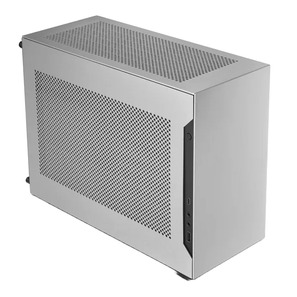
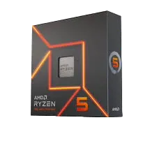
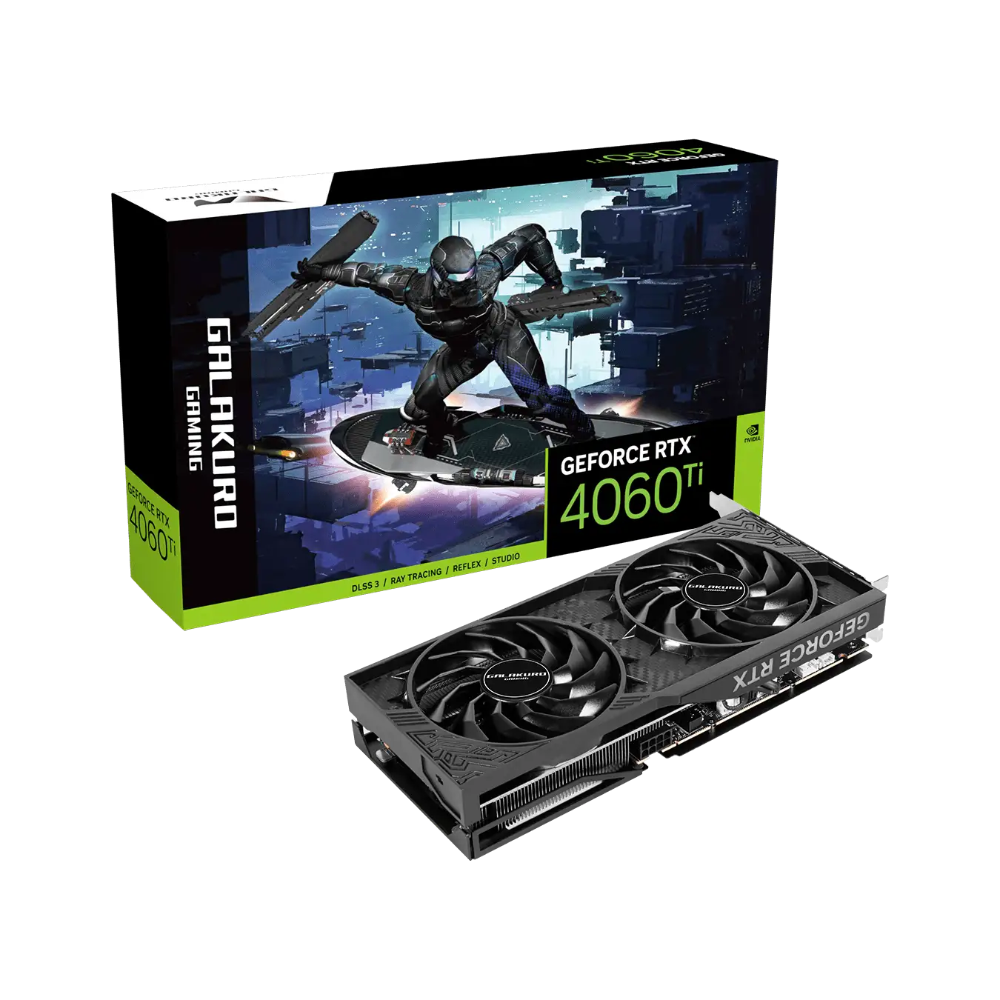
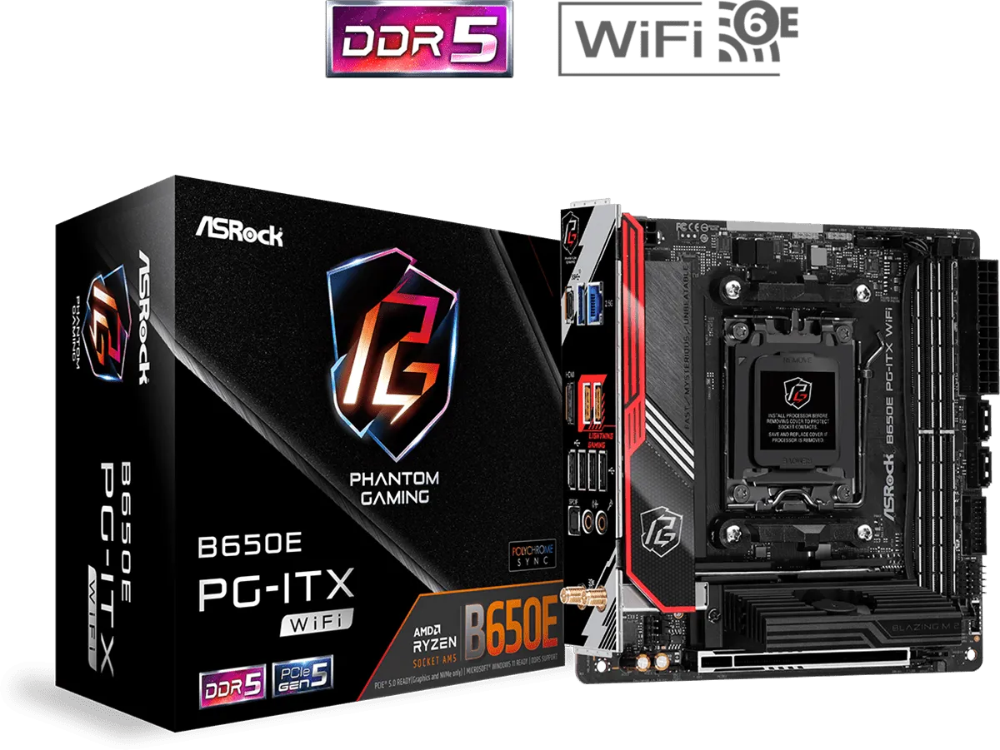
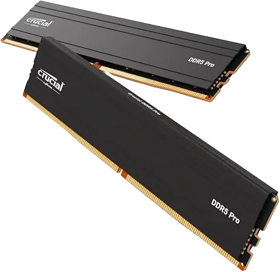
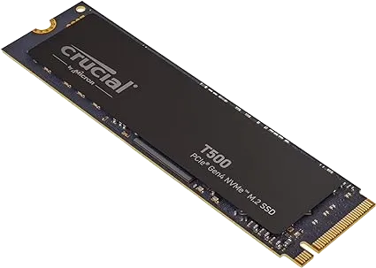
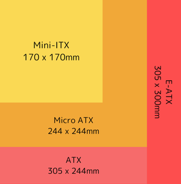
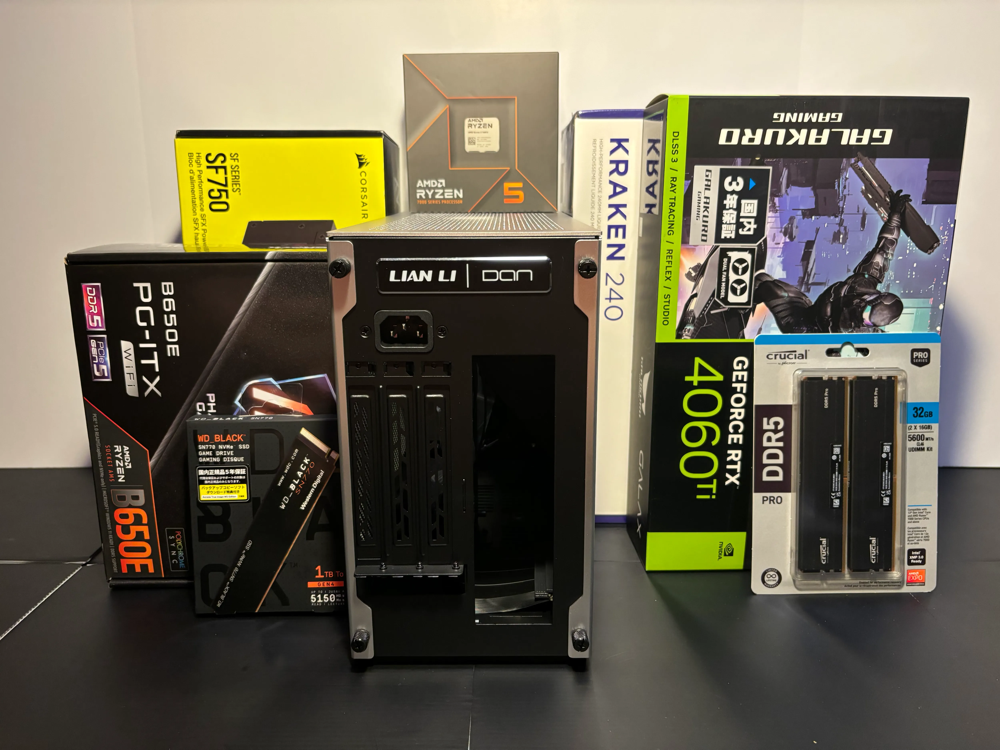

## Intro

> [!quote] One phrase
> — My daily routine: Do something the hardest way in overconfidence, fail to do it, regret doing it, and repeat this

There are bunches of tutorials or instructions on the internet about how to build a PC, but it seems most of them are explained from experts' or advanced users' perspectives.

As a total newbie, here are my struggles along the way of building my Linux PC for the first time. (A lot of errors included)

### Reader personas

- Want to build a PC from scratch but have no idea what to do or how to start either
- Struggling with some errors along the way right now
- Want to know what it's like to build a Mini-ITX PC

### My proficiency level

As of the day I'm writing this article, my proficiency level in this field is as follows:

- A total newbie in building a PC
- Have more than 10-year expericence in using PCs

## Main

From parts selection to OS installation, it took me almost a month. Here's the schedule:

1. **Select parts:** 1 week
2. **Procure parts:** 3~4 days
3. **Build the PC:** 2 days
4. **Fix errors:** 2 weeks
5. **install the OS:** 1 day

### Select PC parts

The overview of my parts selection is as follows:

---
- @= Lian Li A4-H2O
  - 
  - **Lian Li A4-H2O**
  - PC case for Mini-ITX
- @= AMD Ryzen™ 5 7600X
  - 
  - **AMD Ryzen™ 5 7600X**
  - CPU
- @= 玄人志向 GALAKURO GAMING NVIDIA GeForce RTX 4060ti
  - 
  - **玄人志向 GALAKURO GAMING NVIDIA GeForce RTX 4060ti**
  - GPU
- @= ASRock B650E PG-ITX WiFi
  - 
  - **ASRock B650E PG-ITX WiFi**
  - Mini-ITX Motherboard
- @= Corsair SF750
  - 
  - **Corsair SF750**
  - Power Supply
- @= NZXT KRAKEN 240 RL-KN240-B1
  - 
  - **NZXT KRAKEN 240 RL-KN240-B1**
  - CPU Cooler
- @= Crucial DDR5 Pro 16GB x 2
  - 
  - **Crucial DDR5 Pro 16GB x 2**
  - Memory
- @= Crucial T500 500GB PCIe Gen4 NVMe M.2 SSD
  - 
  - **Crucial T500 500GB PCIe Gen4 NVMe M.2 SSD**
  - Storage
---

Just in case, "Mini-ITX" is one of the motherboard types. It's the smallest one of the common options and said to be the most difficult one to build because of its small size. You can see how small it is at a glance.

> [!warning]+
> Personally, I don't recommend going with a Mini-ITX PC case if you're a newbie like me because one of the most hardest parts was cable menagement. On top of that, I felt like it's a bit more expensive than other types, guessing it has a fewer lineups or is a niche option. (As of Sep 2024)

#### Requirements

This PC is supposed to be my development workstation, which means I don't use it for heavily loaded tasks like gaming. With that in mind, here are the requirements I defined:

- **Cost:** As low as possible
  - I chose more affordable options when it comes to CPU and GPU
- **Size:** As compact as possible
  - Mini-ITX. For me, it was no-brainer
- **Performance:** Able to do coding and browsing comfortably
  - The CPU and GPU don't have to be that efficient

### Start building a Mini-ITX PC!

Building the PC in and of itself took me only a few days but I faced a lot of trouble during and after that.

#### Trouble 1: Cable management

What plagued me most was hands down cable management. I ended up having to unbuild and dismantle the PC over and over to finalize the cable positions. This might especially be true for Mini-ITX PCs though.

The power cable almost touches the fans of the GPU, the extremely thick cable of the CPU cooler is tricky to handle, the numerous cables from the power supply take up so much space in the Mini-ITX case as it is, to name a few.

Incidentally, I recommend you get velcro tapes for tieing cables. I bought them at DAISO. They are very versatile as you can see in the photo above!

> [!note] Lessons
> - Cable management is a very deep subject
> - Velcro tapes are very useful for tieing cables

#### Trouble 2: Black screen

Through the cabling hell, I was able to turn on the PC; its CPU cooler was working properly. However, nothing was displayed on the monitor; it kept showing the black screen even after a few minutes.

Since there's no such thing as a text error message, I had no idea how to fix it. At this time, my googling skill shined. Thanks to a lot of helpful info sources, it became clear that I could spot where the error occurs with the motherboard buzzer and LED lumps.

I additionally bought and plugged them in the motherboard.

As a result, it turned out that the error lay in the memories so I tried to plug and unplug them several times but to no avail. At this point, I contacted the retail store for free exchange and it was accepted.

> [!info]+
> In my case, it beeped 3 times, which alludes to a memory problem according to some info sources. It differs depending on the type of BIOS your motherboard adopts.

Surprisingly, replacing the memories fixed the error and the BIOS/UEFI menu successfully appeared on the monitor. How unfortunate I am drawing the short straw from the beginning...

> [!note] Lessons
> - Go get the motherboard buzzer, LED indicators, and preferably switch module just in case your PC doesn't work
> - Apparently, it often happens that you pick up defective PC parts
> - Keep it in mind that you can receive support like free replacement if they are under warranty and it covers the support
> - Make sure to keep the warranties in a safe place

#### Trouble 3: SSD not recognized

I was over the moon when I finally saw the BIOS/UEFI menu on the screen, but misfortunes never come alone.

After looking over some of the BIOS settings, preparing the flash memory for installing the OS, and almost being finished installing it, this error message stood in the way: The installer failed to create a partition table on USB Flash Drive.

As I was also new to installing the Linux OS, I thought there might've been something wrong with my partition settings at first. However, they turned out to have nothing to do with the error - I noticed something amiss: The SSD not recognized in the first place.

Long story short, I ended up going through the following paths:

1. Happened to find the support list of SSD for my motherboard and learned mine was not supported...
2. Bought another supported one and replace it with the new one but to no avail...
3. Contacted the support team of ASRock (the motherboard maker) to ask for advice
4. Got a response from them and tried three things they suggested doing:
    1. Clear CMOS → Didn't fix it
    2. Retry setting the SSD **→ Did fix it!**
    3. Update the BIOS/UEFI → Didn't fix it
5. Fixed the problem by trying No.2 and my SSD successfully recognized!

By the way, did you notice that the SSD in [the photo](#start-building-a-mini-itx-pc) and that in [the parts list](#select-pc-parts) are different? (WD SN770 1TB vs. Crucial T500 500GB) This was sort of foreshadowing.

At any rate, how clumsy I am, wasting a lot of time not setting up the SSD securely and a lot of money overlooking the support list...

> [!note] Lessons
> - Make sure to have your SSD seated in the slot securely. They don't make any sounds that tell you it's positioned correctly.
> - Check the support list for your motherboard carefully before you buy the SSD, memory, CPU, etc.

### Install the Linux OS

Now I managed to install the OS. My choice is [NixOS](https://nixos.org/), a purely functional Linux distribution. For more details, see the article below.

(🚧Coming soon...)

## Outro

### What I found tricky as a newbie

What's taken for granted by advanced users is not always so by newbies. Here are what I found tricky as a total newbie:

- **Memory & storage compatibility:**
  - Even if your choice of the memory or storage is compatible with your motherboard in the types or interface, it cannot accept some of them
    - Examples of the types & interface: "DDR4" or "DDR5" for memories, "PCIe Gen xxx" or "SATA" for storages, etc.
  - Depending on the vendor or even its specific products, your motherboard doesn't accept them
  - I strongly recommend checking out the maker's official website
    - There will usually be the support lists of memory, storage, and CPU
    - In my case, [this page](https://pg.asrock.com/mb/AMD/B650E%20PG-ITX%20WiFi/index.jp.asp#Support)
- **How can I figure out the cause of errors?:**
  - Unlike coding, there's nothing like a text error message during PC building
  - After all, I had to buy the buzzer and LED lumps to figure out the error
    - Even this info, I could not have gotten if it hadn't been for those helpful videos on YouTube
- **Where's the thermal grease?**:
  - I knew it usually comes with a CPU cooler but couldn't find it (I even turned the box upside down but to no avail..)
  - It was not until I'd spotted something white on my pants that I came to realize that it'd already been applied to the surface!
  - Don't you think it comes in a small container or something?

Although you may bump into unexpected errors like me along the way, things will work out somehow in the end. Just keep it up when you're doing well, and hang in there when you're not!　

I'll never forget the moment when I saw the BIOS/UEFI menu on the monitor for the first time. It was indescribably exciting.
