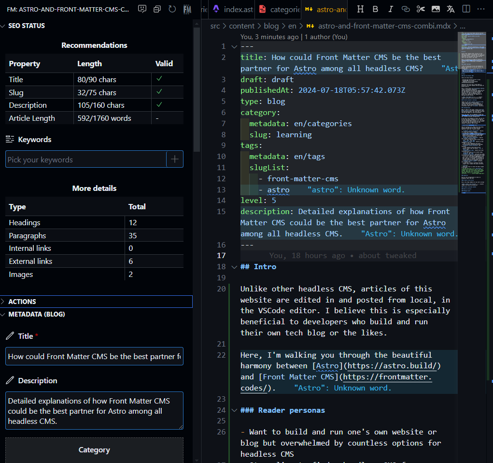

## 導入

当サイトは [Astro](https://astro.build/) という JS (メタ)フレームワークで構築されているが、開発の際に肝心の機能実装以外で大いに困ったことがある。それが CMS 選びである。

2024 年現在、ヘッドレス CMS 界隈は特に混沌としており、無数の CMS が乱立する事態となっている。
選択肢が多いのは有難い一方で、入門者にとっては地獄である。「ブログを個人開発したかっただけなのに、気づけば CMS のチュートリアルに膨大な時間を溶かしてしまった・・。」私もかく言う一人だ。

そんな折、突如として私の前に舞い降りたのが [Front Matter CMS](https://frontmatter.codes/) である。
「この星は明らかに異彩を放っている・・！」そう確信した私は、この CMS にコンテンツの命運を預けることにした。

そういうわけで、以降は [Astro](https://astro.build/) で作ったウェブサイトを例に、Front Matter CMS との連携が完了するまでを見ていく。当サイトの技術構成など、詳細はこちらの記事を参照されたし。

https://younagi.dev/ja/blog/astro-website/

### 想定読者

- 自分のウェブサイトやブログを開発・運営したいがヘッドレス CMS が多すぎて圧倒されている
- ちょうど Astro 製ウェブサイトのヘッドレス CMS 探しに苦戦している
- Front Matter CMS と Astro を組み合わせたプロジェクトの具体例が見たい

### 現時点での私の習熟度

記事執筆時点での私の習熟度は次の通り。

- ソフトウェアエンジニアとして計 3 年の経験あり(勤続ではない)
- Front Matter CMS は触ったことがない
- WordPress や MicroCMS で何度か CMS を使用したウェブサイト制作を経験している

## 本題

### なぜFront Matter CMS?

大きく 3 つの理由がある。

- ローカルで記事の執筆・管理ができる
  - Front Matter CMS はあくまで VSCode や GitPod の拡張機能
- マークダウン/MDX フォーマット
- ディレクトリで分ける多言語化(i18n)に対応している

特に 1 つ目が他のヘッドレス CMS と大きく異なる点で、私が Front Matter CMS を選んだ最たる理由だ。

また驚くべきことに、Front Matter CMS は [AI アシスタンス機能](https://frontmatter.codes/docs/sponsor-features#front-matter-ai)まで搭載しており、VSCode コマンドから呼び出しが可能である。
つまり、調べものをするのにインターネット接続が不要となるのだ。これはオフラインで記事が編集できるメリットと相まって、かなり魅力的ではないだろうか。


### Front Matter CMSの欠点

とはいえ、苦しい点も幾つかある。

- VSCode or Gitpod ユーザしか使えない
- 利用できる言語は少ない
  - 2024 年 7 月時点で、`en`、`de`、`ja`がサポートされている
  - [翻訳のお手伝いをしてプロジェクトに貢献する](https://frontmatter.codes/docs/contributing#translating-the-extension)ことも可能
- PC なしでは記事の編集が難しい(例: スマホ)
  - とは言え、[VSCodeウェブバージョン](https://vscode.dev/)を使用すれば不可能ではない

### 私のAstroプロジェクトの概観

Astro の[コンテンツコレクションAPI](https://docs.astro.build/en/guides/content-collections/)のおかげで、コンテンツやデータは全て`src/content`ディレクトリで一元管理できる。

下記が当サイトの概観である。簡単の為、本記事に無関係な大部分はディレクトリツリーから省略している。

{/* biome-ignore format: The directory tree should not be formatted */}
```txt title=""
younagi.dev/
├── public
├── src/
│   ├── assets/
│   │   ├── font
│   │   └── images
│   └── content/
│       ├── blog/
│       │   ├── en
│       │   └── ja
│       ├── categories/
│       │   └── ...
│       ├── i18n/
│       │   └── ...
│       ├── meta/
│       │   └── ...
│       ├── news/
│       │   └── ...
│       ├── page/
│       │   └── ...
│       ├── tags/
│       │   └── ...
│       └── config.ts
├── frontmatter.json
└── astro.config.ts
```

本題ではないが、コンテンツコレクションは`config.ts`ファイルによって機能し、全てのコンテンツのタイプとフィールドはここで定義される。

```typescript title="src/content/config.ts"
import { defineCollection, reference, z } from "astro:content";
import { colors } from '@/components/models/Taxonomy';

const blog = defineCollection({
  type: "content",
  schema: z.object({
    title: z.string(),
    description: z.string().optional(),
    publishedAt: z.coerce.date(),
    modifiedAt: z.coerce.date().optional(),
    category: z.object({
      metadata: reference("categories"),
      slug: z.string(),
    }),
    tags: z.object({
      metadata: reference("tags"),
      slugList: z.array(z.string()).optional(),
    }),
    draft: z.enum(["draft", "in progress", "published"]),
    level: z
      .union([
        z.literal(1),
        z.literal(2),
        z.literal(3),
        z.literal(4),
        z.literal(5),
      ])
      .optional(),
  }),
});

const taxonomySchema = z.object({
  title: z.string(),
  slug: z.string(),
  ruby: z.string(),
  color: z.enum(colors),
});

const categories = defineCollection({
  type: "data",
  schema: z.array(taxonomySchema),
});

const tags = defineCollection({
  type: "data",
  schema: z.array(taxonomySchema),
});

// ...

export const collections = { blog, categories, tags /* ... */ };
```

`astro.config.ts`は Astro プロジェクト全体の編集ファイルである。当記事に関連する内容で言えば、多言語化機能をここで追加している。

この後、Front Matter CMS の方でも多言語化設定し、この設定と一貫性を保つようにする。

```typescript title="astro.config.ts"
import { defineConfig /* ... */ } from "astro/config";
// ...

export default defineConfig({
  // ...
  i18n: {
    defaultLocale: "en",
    locales: ["en", "ja"],
  },
  // ...
});
```

### 設定ファイルの編集

初期セットアップについては、[Front Matter公式ドキュメント](https://frontmatter.codes/docs/getting-started)を参照されたし。このドキュメントと AI アシスタンスがあれば、そうそう迷子になることはないと思われる。

セットアップが完了したら、`frontmatter.json`がプロジェクトのルート直下に自動生成される。このファイル内で Astro のコンテンツやデータとの連携など行っていく。

今回は Astro を使用しているが、マークダウン/MDX で記事を作成している限りはその他のフレームワークでも同じことが実現可能と思う。
大事なのは、コンテンツ用のディレクトリを Front Matter CMS 側で正確に指定することである。[^1]

[^1]: 2025 年 1 月現在、公式にサポートされているのは Astro、Hugo、Next.js の 3 つであった。
参考: https://frontmatter.codes/docs/ssg-and-frameworks

````json title="frontmatter.json"
{
  "$schema": "https://frontmatter.codes/frontmatter.schema.json",
  "frontMatter.framework.id": "astro",
  "frontMatter.preview.host": "http://localhost:4321",
  "frontMatter.content.publicFolder": "./src/assets/images/",
  "frontMatter.content.pageFolders": [
    {
      "title": "blog",
      "path": "[[workspace]]/src/content/blog",
      "contentTypes": ["blog"],
      "defaultLocale": "en"
    },
    {
      "title": "news",
      "path": "[[workspace]]/src/content/news",
      "contentTypes": ["news"],
      "defaultLocale": "en"
    },
    {
      "title": "page",
      "path": "[[workspace]]/src/content/page",
      "contentTypes": ["page"],
      "defaultLocale": "en"
    }
  ],
  "frontMatter.content.i18n": [
    {
      "title": "English",
      "locale": "en",
      "path": "en"
    },
    {
      "title": "Japanese",
      "locale": "ja",
      "path": "ja"
    }
  ],
  "frontMatter.content.draftField": {
    "name": "draft",
    "type": "choice",
    "choices": ["draft", "in progress", "published"]
  },
  "frontMatter.taxonomy.seoTitleLength": 90,
  "frontMatter.taxonomy.contentTypes": [
    {
      "name": "blog",
      "pageBundle": false,
      "previewPath": "'blog'",
      "filePrefix": null,
      "clearEmpty": true,
      "fileType": "mdx",
      "fields": [
        {
          "title": "Title",
          "name": "title",
          "type": "string",
          "single": true,
          "required": true
        },
        {
          "title": "Description",
          "name": "description",
          "type": "string"
        },
        {
          "title": "Category",
          "name": "category",
          "type": "fields",
          "fields": [
            {
              "title": "Category ID",
              "name": "metadata",
              "type": "categories",
              "required": true,
              "taxonomyLimit": 1,
              "singleValueAsString": true
            },
            {
              "title": "Category Slug",
              "name": "slug",
              "type": "dataFile",
              "dataFileId": "categories",
              "dataFileKey": "slug",
              "dataFileValue": "title",
              "required": true,
              "singleValueAsString": true
            }
          ]
        },
        {
          "title": "Tags",
          "name": "tags",
          "type": "fields",
          "fields": [
            {
              "title": "Tags ID",
              "name": "metadata",
              "type": "tags",
              "required": true,
              "taxonomyLimit": 1,
              "singleValueAsString": true
            },
            {
              "title": "Tag Slugs",
              "name": "slugList",
              "type": "dataFile",
              "dataFileId": "tags",
              "dataFileKey": "slug",
              "dataFileValue": "title",
              "multiple": true
            }
          ]
        },
        {
          "title": "Draft Status",
          "name": "draft",
          "type": "draft",
          "required": true,
          "default": "draft"
        },
        {
          "title": "Published At",
          "name": "publishedAt",
          "type": "datetime",
          "default": "{{now}}",
          "isPublishDate": true
        },
        {
          "title": "Modified At",
          "name": "modifiedAt",
          "type": "datetime",
          "isModifiedDate": true
        },
        {
          "title": "Level",
          "name": "level",
          "type": "number",
          "numberOptions": {
            "min": 1,
            "max": 5,
            "step": 1
          }
        },
        {
          "title": "type",
          "name": "type",
          "type": "string"
        }
      ]
    },
    {
      "name": "news",
      "pageBundle": false,
      "previewPath": "'news'",
      "filePrefix": null,
      "clearEmpty": true,
      "fileType": "md",
      "fields": [
        {
          "title": "Title",
          "name": "title",
          "type": "string",
          "single": true,
          "required": true
        },
        {
          "title": "Published At",
          "name": "publishedAt",
          "type": "datetime",
          "default": "{{now}}",
          "isPublishDate": true
        },
        {
          "title": "Modified At",
          "name": "modifiedAt",
          "type": "datetime",
          "isModifiedDate": true
        },
        {
          "title": "type",
          "name": "type",
          "type": "string"
        },
        {
          "title": "draft",
          "name": "draft",
          "type": "draft"
        }
      ]
    },
    {
      "name": "page",
      "previewPath": "'page'",
      "pageBundle": false,
      "clearEmpty": true,
      "filePrefix": null,
      "fileType": "mdx",
      "fields": [
        {
          "title": "Title",
          "name": "title",
          "type": "string",
          "single": true,
          "required": true
        },
        {
          "title": "Description",
          "name": "description",
          "type": "string"
        },
        {
          "title": "Modified At",
          "name": "modifiedAt",
          "type": "datetime",
          "isModifiedDate": true
        }
      ]
    }
  ],
  "frontMatter.data.types": [
    {
      "id": "categories",
      "schema": {
        "title": "Categories",
        "type": "object",
        "required": ["title", "slug", "color"],
        "properties": {
          "title": {
            "type": "string",
            "title": "Title"
          },
          "slug": {
            "type": "string",
            "title": "Slug"
          },
          "color": {
            "type": "string",
            "title": "Color"
          }
        }
      }
    },
    {
      "id": "tags",
      "schema": {
        "title": "Tags",
        "type": "object",
        "required": ["title", "slug", "color"],
        "properties": {
          "title": {
            "type": "string",
            "title": "Title"
          },
          "slug": {
            "type": "string",
            "title": "Slug"
          },
          "color": {
            "type": "string",
            "title": "Color"
          }
        }
      }
    }
  ],
  "frontMatter.data.files": [
    {
      "title": "En Categories",
      "id": "categories",
      "type": "categories",
      "file": "[[workspace]]/src/content/categories/en/categories.yml",
      "fileType": "yaml"
    },
    {
      "title": "Ja Categories",
      "id": "categories",
      "type": "categories",
      "file": "[[workspace]]/src/content/categories/ja/categories.yml",
      "fileType": "yaml"
    },
    {
      "title": "En Tags",
      "id": "tags",
      "type": "tags",
      "file": "[[workspace]]/src/content/tags/en/tags.yml",
      "fileType": "yaml"
    },
    {
      "title": "Ja Tags",
      "id": "tags",
      "type": "tags",
      "file": "[[workspace]]/src/content/tags/ja/tags.yml",
      "fileType": "yaml"
    }
  ],
  "frontMatter.snippets.wrapper.enabled": false,
  "frontMatter.content.snippets": {
    "Image with caption": {
      "description": "Insert image with caption",
      "body": "![ [[alt]] ](../../../assets/images/[[filename]])",
      "isMediaSnippet": true
    },
    "Code block with specified language": {
      "description": "Insert code block snippet",
      "body": ["```[[language]] title=\"[[filename]]\"", "", "```"],
      "fields": [
        {
          "name": "language",
          "title": "Language",
          "type": "choice",
          "choices": [
            "html",
            "css",
            "javascript",
            "typescript",
            "rust",
            "yml",
            "astro",
            "jsx",
            "tsx",
            "json",
            "markdown",
            "mdx",
            "bash",
            "txt"
          ],
          "single": true,
          "default": "markdown"
        },
        {
          "name": "filename",
          "title": "filename",
          "type": "string",
          "single": true,
          "default": ""
        }
      ]
    },
    "Callout": {
      "description": "Insert a callout",
      "body": ["> [![[type]] ][[symbol]][[title]]", "> [[content]]"],
      "fields": [
        {
          "name": "type",
          "title": "Type",
          "type": "choice",
          "choices": [
            "info",
            "note",
            "warning",
            "quote",
            "question",
            "failure",
            "check"
          ],
          "single": true,
          "default": "info"
        },
        {
          "name": "symbol",
          "title": "Symbol",
          "type": "choice",
          "choices": ["+", "-", " "],
          "single": true,
          "default": " "
        },
        {
          "name": "title",
          "title": "Title",
          "type": "string",
          "single": true,
          "default": ""
        },
        {
          "name": "content",
          "title": "Content",
          "type": "string",
          "single": true,
          "default": ""
        }
      ]
    }
  },
  "frontMatter.website.host": "https://younagi.dev/",
  "frontMatter.framework.startCommand": "bun dev",
  "frontMatter.dashboard.openOnStart": true
}
````

上記オプションには自動で追記されるものと、そうでないものがある。私が別途追加した項目の中で、重要なものを幾つか挙げる。

- `frontMatter.content.publicFolder`: 必要に応じてメディアなどアセットのディレクトリを指定する
  - 私の場合、[Astroのアセット最適化](https://docs.astro.build/en/guides/images/#where-to-store-images)の恩恵にあずかりたかったのでパスを指定し直した。デフォルトは`public`ディレクトリとなっている
- `frontMatter.content.pageFolders`: コンテンツの設定をする
  - 私の場合、`blog`、`news`、`page`の 3 つ
- `frontMatter.content.i18n`: 使用する言語を指定する
  - ディレクトリで分けるタイプの多言語化に対応している
- `frontMatter.content.draftField`: 必須ではない
  - 個人的に記事のステータスをデフォルトの`true`か`false`の判定よりも 3 段階に分けたかった為、別途変更した
- `frontMatter.data.types`: データの設定をする
  - 私の場合、`categories`、`tags`の 2 つ
- `frontMatter.data.files`: データを特定のパスやフォーマットに指定する
  - 私の場合、各データは 1 つのファイルに追記されるよう変更した。(例: "src/content/tags/en/tags.yml")
  - ここでデータの各ファイルへのパスを指定する。コンテンツ同様、言語の数と同じだけ言語ディレクトリを切り分ける
- `frontMatter.content.snippets`: スニペットをカスタマイズする
  - 私の場合、アセットディレクトリを変更したため、メディアスニペットを別途カスタマイズする必要があった

> [!question]+
> Q. 何故メディアスニペットをカスタマイズしなければならなかったか？
> `publicFolder`で指定されたアセットディレクトリはメディアスニペットに自動で反映されるが、デフォルトで存在するメディアスニペットは`/src/assets/images/image.png`のような無効なパスを参照してしまうから。(正しくは、`../../../assets/images/image.png`)

### 使い心地

ここまでの編集内容を踏まえ、私のダッシュボードはこのようになっている。

#### 新規記事の作成

書き始めるまでに必要な手続きはたったこれだけ。

1. コマンドパレットを開く
2. "Front Matter: Create new content" を選ぶ
3. 記事のタイプと言語を選ぶ
4. 記事のタイトルを入力
5. 準備完了

:::video[デモ: 新規記事の作成]
/videos/front-matter-cms-demo.mp4
:::

#### 新規データの作成

直接ファイルに編集を加える必要はなくなり、ダッシュボードからデータの必須項目を入力するだけで追記できるようになった。

:::video[デモ: 新規データの作成]
/videos/front-matter-cms-create-data.mp4
:::

#### 記事の編集

特筆すべきポイントは次の通り。

- フロントマターの値はビジュアルエディタから入力可能
  - 画像の左側
- マークダウンエディタのパレットが使用可能
  - 画像の上部右側



何かやりたいことがあった時に、アクセス手段が複数ある。これは非常に快適だ。(例: スニペット機能はマークダウンパレットだけでなく VSCode コマンドからも呼び出せる)

#### メディアの管理

メディアはダッシュボードから一覧で確認・管理できる。長所は次の通り。

- 一目でメディアが区別できる
- 新規メディアを追加したいときにドラッグ&ドロップ可能
- 検索窓からメディアを検索できる
- メディアのメタデータはメニューから直接編集可能


## 結び

Front Matter CMS の実態は VSCode の拡張機能である。仮に開発が止まってしまったとしても、他の CMS への移行は簡単だ。
この点は、現代の技術進歩の速さを鑑みると、最も重要なポイントだと考える。

同じ理由で、私はナレッジベースとして[Obsidian](https://obsidian.md/)を、当サイトのメタフレームワークとして[Astro](https://astro.build/)を使用しており、両者に共通する点は「**ポータビリティ(可搬性)**」である。

- **Obsidian**: Notion などと異なり、全てのコンテンツはマークダウン書かれ、ローカルで管理される
  - 移行の際は全マークダウンファイルを移行先に持っていくだけ
- **Astro**: `.astro`拡張子のついたファイルでは HTML、CSS、バニラ JS が使用できる。コンテンツはマークダウン/MDX で書かれる
  - 仮に Astro がサポート終了を迎えても、HTML などの基礎的な技術はそう易々と廃止されるものではなく、依然としてその中身は再利用が可能
