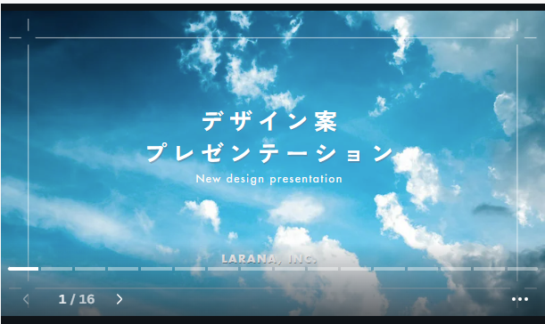
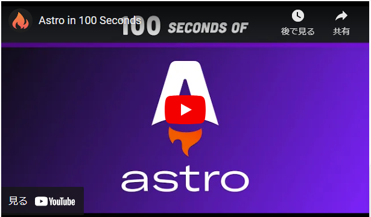
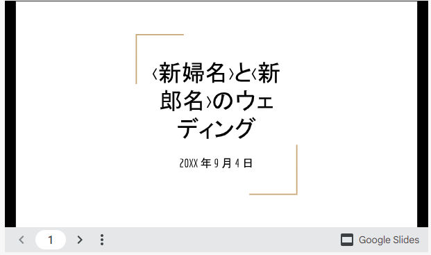

## 導入

「Rust を勉強せねば、Rust を・・・」と思いながらも、フロントエンドの視察にかこつけて Astro で個人ウェブサイトを開発してしまい、極めつけには 4 ヶ月もの月日を費やしてしまった話。尚、後悔はしていないと言ったら噓になる。

当サイトのソースコードは下記の Github リポジトリで公開している。百聞は一見(コード)に如かず。

https://github.com/brklntmhwk/younagi.dev

### 想定読者

- Astro でウェブサイトを作りたいが、プロジェクト全体の構成をどうすればいいのか、どんな機能を実装すればいいのかわからない
- Astro で作ったプロジェクトの全体像を参考にしたい
- 個人開発のウェブサイトにどんな機能を盛り込めばよいか分からない

### 現時点での私の習熟度

記事執筆時点での私の習熟度は次の通り。

- ソフトウェアエンジニアとして計 3 年の経験あり(勤続ではない)
- JavaScript、TypeScript、Astro の基本は理解している(つもり)
- Next.js や Astro で何度かウェブサイト制作を経験している

## 本題

### Astro

まず以て、そもそも Astro とは何ぞや？詳しい説明は[本家ホームページ](https://docs.astro.build/en/getting-started/)に譲るとして、ひと言で言えば「爆速なウェブサイトが簡単に作れる JavaScript(以降 JS と呼ぶ)ベースのメタフレームワーク」である。メタフレームワークと言われる所以は、プロジェクト内で React や Vue、SolidJS などの JS フレームワークを自由に使いまわすことができるところからきている。

どちらかと言えば、EC サイトや SNS サービスのようなユーザとの双方向のやり取りが多くなるものよりも、企業のコーポレートサイトやブログのようにやり取りが一方向なサービスに向いている。

私の場合は、できる限り Astro の標準機能で実装し、一部[SolidJS](https://www.solidjs.com/)を使って実装している。また、コードを書く時は型がないと生まれたての小鹿のように足下が覚束ない気持ちになるので、TypeScript と TSX で書くこととした。

> [!info]- 技術構成
> **言語:** [TypeScript](https://www.typescriptlang.org/), [TSX](https://www.typescriptlang.org/docs/handbook/jsx.html), [YAML](https://yaml.org/)
> **データフォーマット:** [JSON](https://www.json.org/json-en.html)
> **メタフレームワーク:** [Astro](https://astro.build/)
> **フレームワーク:** [SolidJS](https://www.solidjs.com/)
> **スタイリング:** [Tailwind CSS](https://tailwindcss.com/), [AstroのScoped CSS](https://docs.astro.build/en/guides/styling/#scoped-styles)
> **データベース:** [Cloudflare D1](https://developers.cloudflare.com/d1/)([Sqlite](https://www.sqlite.org/))
> **ORM:** [Drizzle ORM](https://orm.drizzle.team/)
> **開発環境:** [Dev Containers](https://code.visualstudio.com/docs/devcontainers/containers), [Docker](https://www.docker.com/)
> **CI/CD:** [Github Actions](https://github.co.jp/features/actions), [DangerJS](https://danger.systems/js/)
> **コミット管理:** [Git-cz](https://ttys3.github.io/git-cz/)
> **デプロイ:** [Cloudflare Pages](https://pages.cloudflare.com/)
> **CMS:** [Front Matter CMS](https://frontmatter.codes/)
> **ボット対策**: [Cloudflare Turnstile](https://www.cloudflare.com/products/turnstile/)
> **パッケージマネージャ:** [Bun](https://bun.sh/)
> **パッケージ依存関係管理**: [Renovate](https://github.com/renovatebot/renovate)
> **リンター & フォーマッター**: [Biome](https://biomejs.dev/)
> **テキスト校正**: [Textlint](https://textlint.github.io/)
> **Gitフックマネージャ**: [Lefthook](https://github.com/evilmartians/lefthook)
> **Eメール送信:** [Resend](https://resend.com/docs/introduction)

#### 全文検索

:::video[デモ: 検索機能]
/videos/fulltext-search-demo.mp4
:::

{/* textlint-disable ja-technical-writing/no-doubled-joshi */}
ユーザの快適なブラウジングライフを支えるのに欠かせないのが検索機能である。
古き良きいにしえのウェブサイトに想いを馳せるあまり、敢えて検索機能をつけず、アクセスカウンターを実装することに躍起になっている個人ウェブサイトは後を絶たない。とても格好イイと思う。だがしかし、それとこれとは別である。[^1]

[^1]: ネットの海を回遊しているとしばしば散見されるので、是非マグロにでもなった気分で気持ちよく泳いでみて欲しい。

それなりの検索機能を自前実装するのは大変なので、Rust 製の検索ライブラリである[Pagefind](https://pagefind.app/)を採用。とにかく軽量、高速、そして導入が簡単。

サーバーとのやり取りが不要でブラウザ完結である点は魅力的である。仕組みは至ってシンプルで、ビルド時生成ファイルを基に予めインデックスファイルを作成しておき、ブラウザからのキーワード検索に対してこのインデックスファイルを参照して応答するというもの。

開発に際してこだわったポイントは下記の通り。

- ショートカットキーでも呼び出せる
  - PC からであれば`Ctrl + K`で呼び出し可能
- キーワードのハイライトをカスタマイズ
- サイトのどこからでもアクセスできる
  - ナビゲーションバー内に設置
- 検索窓にオートフォーカス
  - 検索モーダルを開くとカーソルが検索窓にオートフォーカスされる

#### 多言語対応 (i18n)

Astro は我々に代わってブログ記事やニュースなどのコンテンツ管理をよろしくやってくれる。それが[Content Collections API](https://docs.astro.build/en/guides/content-collections/)という機能である。

この機能を応用して、言語ディレクトリを切り分けることで多言語化対応をした。昨今の機械翻訳や AI の要約技術の発展には目もくれず、地道な手動翻訳による多言語化という茨の道を歩むことと相成った。「語学学習にもなって一石二鳥じゃん！」と自分に言い聞かせて何とか正気を保っている。
詳しい方法については、[公式のドキュメント](https://docs.astro.build/ja/recipes/i18n/)を参照されたし。

ちなみにコンテンツは Markdown/MDX だけでなく、YAML や JSON 形式も可能。私は記事以外の手動翻訳文字列の保存に YAML 形式を採用した。


#### OG 画像 (Open Graph)

当サイトに足繫く通い、SNS で喧伝してまわるようなヘビーな読者が現れる日を夢見て、一応全ページに OG 画像を設定している。

ホームページやその他固定ページにはあらかじめ拵えた画像を指定しているのだが、ブログ記事やニュースについては、Astro の[Dynamic routes](https://docs.astro.build/en/guides/routing/#dynamic-routes)で記事のファイルパスから動的に生成される仕組みになっている。
おかげで、記事が増える度にいちいち OG 画像に頭を悩ませる必要がない。ありがとう、Astro。

ちなみに画像生成は、[`satori`](https://github.com/vercel/satori)から[`sharp`](https://sharp.pixelplumbing.com/)へのバケツリレー形式で処理がなされている。

1. `satori`の仕事: 受け取った HTML と CSS に基づき、SVG 形式で画像を生成する
2. `sharp`の仕事: SVG のバッファを受け取り、画像最適化処理など適宜加えつつ PNG 形式の画像を出力する

```txt title="パスの例"
https://younagi.dev/api/og/blog/astro-website.png
```


#### Remark/Rehype プラグイン

Astro ではコンテンツの形式に関して選択肢が豊富である、という話をしたが、私は記事の執筆にはマークダウン/MDX を採用した。

{/* textlint-disable ja-technical-writing/no-double-negative-ja */}
標準実装されている記法だけでもやってやれないことはないが、どうにも味気ない。舌の肥えた読者は、きっとコードブロックや数式、メディアフレームなどリッチなコンテンツを欲しているに違いない・・！

そうした思い込みに駆られ、[Remark](https://unifiedjs.com/explore/project/remarkjs/remark/)/[Rehype](https://unifiedjs.com/explore/project/rehypejs/rehype/)プラグインで記法を拡張した。主に既製品を使用し、無いものは自作。[^2]

[^2]: このプラグイン自作に凝ってしまい、1 ヶ月余りを費やしてしまった。

> [!info]+Remark & Rehype
> [Unified](https://unifiedjs.com/)という文書変換系のエコシステムに属するプロセッサ群
> **Remark:** マークダウンにASTの状態で変換処理を加える(mdast)
> **Rehype:** HTMLにASTの状態で変換処理を加える(hast)
> ASTはAbstract Syntax Tree(抽象構文木)の略。詳細は他の文献を参照されたし。

##### KaTex

数学に明るい訳でもなく、今後数式を披露する予定がないにもかかわらず、欲望に負けてついやってしまった。万が一、億が一、私が数学を自在に操れる世界線に備えて・・・。

$\KaTeX$ は特定の所作に従って呪文を唱えるとよしなに数式変換してくれる。[`remark-math`と`rehype-katex`](https://github.com/remarkjs/remark-math/tree/main/packages/rehype-katex)を追加し、ほんの少しスタイルを調整するだけで。

入力:

```Markdown
$$
x = {-b \pm \sqrt{b^2-4ac} \over 2a}
$$
$$
( \sum_{k=1}^{n} a_k b_k )^2 \leq ( \sum_{k=1}^{n} {a_k}^2 ) ( \sum_{k=1}^{n} {b_k}^2 )
$$
$$
\int_{0}^{1} f(x) \ dx
= \lim_{n \to \infty} \dfrac{1}{n} \sum_{k=0}^{n-1} f \left (\dfrac{k}{n} \right)
$$
```

出力:

$$
x = {-b \pm \sqrt{b^2-4ac} \over 2a}
$$

$$
( \sum_{k=1}^{n} a_k b_k )^2 \leq ( \sum_{k=1}^{n} {a_k}^2 ) ( \sum_{k=1}^{n} {b_k}^2 )
$$

$$
\int_{0}^{1} f(x) \ dx
= \lim_{n \to \infty} \dfrac{1}{n} \sum_{k=0}^{n-1} f \left (\dfrac{k}{n} \right)
$$

とどのつまり、これがやりたかっただけである。

##### コードブロック

開☆発☆者(デベロッパ)として、コードを交えた説明は避けられない宿命である。
そこで、[rehype-pretty-code](https://rehype-pretty.pages.dev/)を使用し、シンタックスハイライトを実装した。シンタックスハイライターは[Shiki](https://shiki.style/)を採用。

```astro title="example.astro" "Astro.props" {6,9}
---
type Props = {
  title: string
}

const { title } = Astro.props
---

<div>{`これは例。タイトルは ${title}`}</div>
```

##### コールアウト

[Obsidian](https://obsidian.md/) で書ける[コールアウト](https://help.obsidian.md/Editing+and+formatting/Callouts)のマークダウン方言を個人ブログでも摂取したく、こちらにも手を出してしまった。

実装に際してこだわった点は次の通り。

- 開閉可能
  - コールアウトタイトルの横に "+" もしくは "-" のマークがある場合、そのコールアウトは開閉可能と判断される
  - "+" が開く、"-" が畳む
  - 入れ子(入れ孫、入れひ孫、...)のコールアウトはそれぞれ親コールアウトが開閉すると一緒に開閉される
- 多彩な種類と色

以下がその例である。

```Markdown title="Info コールアウト"
> [!info]+
> Info コールアウトの例 (デフォルトで開く)
```

> [!info]+
> Info コールアウトの例 (デフォルトで開く)

---

```Markdown title="Warning コールアウト"
> [!warning]-
> Caution コールアウトの例 (デフォルトで閉じる)
```

> [!warning]-
> Caution コールアウトの例 (デフォルトで閉じる)

---

```Markdown title="Check コールアウト"
> [!check]
> Check コールアウトの例 (開閉なし)
```

> [!check]
> Check コールアウトの例 (開閉なし)

---

```Markdown title="入れ子コールアウト"
> [!note]+
> コールアウト
>
> > [!info]+
> > 子コールアウト
> >
> > > [!warning]+
> > > 孫コールアウト

> [!question]+
> Question!
>
> > [!failure]+
> > Failure!
> >
> > > [!check]+
> > > Check!
> > >
> > > > [!quote]+
> > > > Quote!
```

> [!note]+
> コールアウト
>
> > [!info]+
> > 子コールアウト
> >
> > > [!warning]+
> > > 孫コールアウト

> [!question]+
> Question!
>
> > [!failure]+
> > Failure!
> >
> > > [!check]+
> > > Check!
> > >
> > > > [!quote]+
> > > > Quote!

##### OEmbed(埋め込み)

動画の時代に大手を振って個人ブログに舵を切った私だが、早くも心が揺らいでいる。結局、我々は大手テックカンパニーの掌の上で踊らされる宿命なのか・・・。

YouTube の呪縛からは完全に逃れることはできないと悟り、恐る恐るメディアの埋め込みを実装した。
Canva、YouTube、そして Google Slides の変換処理をひとまず作成し、それ以外のメディアは[OEmbed](https://oembed.com/)の規格に応じて適宜メディアフレームに変身するよう、Remark プラグインを自作した。「これはあくまでセーフティネット、ブログで表現できる限りはこんな機能には頼らないんだから・・！」と自分に言い聞かせる。

ちなみに裏では[unfurl](https://github.com/jacktuck/unfurl)というライブラリが健気に働き、上記の規格に必要なメディアのメタデータを URL 経由で取得してくれている。

###### Canva

```txt
https://www.canva.com/design/DAGKC41Tjws/zSEw1hvi9r30o5KiF96AGA/view
```



###### YouTube

```txt
https://www.youtube.com/watch?v=dsTXcSeAZq8
```



###### Spotify

```txt
https://open.spotify.com/intl-ja/track/04z1fwsw1gXI8HWQpoETa9?si=862c02d3e52a49b0
```

https://open.spotify.com/intl-ja/track/04z1fwsw1gXI8HWQpoETa9?si=862c02d3e52a49b0

###### Google Slides

```txt
https://docs.google.com/presentation/d/1CbeSiVYta0VTuENQ-25OLcIV5vK8pkcBJ-8DfKqlE2I/edit?usp=sharing
```



> [!warning]-
> 埋め込みはしばしばページの読み込みやSEOに悪影響を及ぼす。
> これは、ホストから膨大なJSコードや最適化されていない画像などをそのまま拝借するからであり、現にこのページの[PageSpeed Insights](https://pagespeed.web.dev/)スコアは悲惨なことになっていた。
> 然り而して、一部をただの画像にすり替えた。実装にそれなりの年月を費やしただけあって、タンスの肥やしになる運命が見えてしまった今、ただただ後悔の念に押し潰されそうである。・・・と同時に、思いがけず他媒体に頼りづらい状況が生まれ、安堵する自分もそこには居た。

##### リンクカード

OEmbed 非対応のメディアの場合は、URL をそのままベタ貼りすると全てリンクカードに変身するよう実装した。先述の OEmbed に加え、この部分も Remark プラグインを自前実装。

ここでも[unfurl](https://github.com/jacktuck/unfurl)が裏で暗躍し、リンクカードに表示するサイト名やディスクリプション、OG 画像などを取得してくれている。

```txt
https://younagi.dev
```

https://younagi.dev

#### お問い合わせフォーム

:::video[デモ: お問い合わせフォーム]
/videos/contact-form-demo.mp4
:::

Remark/Rehype プラグイン群と戯れるのには相当の労力を要したが、お問い合わせフォームも大概だ。
仕様変更に右往左往し、紆余曲折もあったが、最終的に SolidJS + TSX で実装する形に着地した。

とはいえ、お問い合わせフォームを丸ごとクライアントサイドで読み込ませると[^3]、ページロード時に甚大なレイアウトシフトが発生し、SEO に悪影響を及ぼす。
そこで、同じくクライアントサイドでレンダリングされるモーダルの中に押し込むという荒業で緊急着陸した[^4]。

[^3]: 他の JS フレームワーク(私のケースでは SolidJS)を Astro のページやコンポーネント内で使用し、かつそれが JavaScript による処理を含む場合、それがどのフレームワークのコンポーネントなのか、Astro のコンパイラに明示的に教えてあげる必要がある。(クライアントディレクティブなるものをコンポーネント呼び出し箇所に追記すれば OK)
これらフレームワークは、Astro の仕様によって、JS を含む時点でクライアントサイドでのレンダリング扱いとなり、故にコンパイラはビルド時やサーバーサイドで全く関知できないからだ。
お問い合わせフォームはユーザとの双方向のやり取りが発生し、簡素なものでなければ大抵は JavaScript が必要になるため、クライアントサイドのコンポーネントになる。
[^4]: 前提として、Astro のページを含め、`.astro`のファイルはサーバーサイドでレンダリングされる。
その上にクライアントで読み込まれるコンポーネントを置くと、ページ表示後にドサッと降ってくるような見た目の挙動になり、これがお問い合わせフォームのような巨大な部品だと被害は甚大になる。

簡単のため、フォーム制御に[Modular Forms](https://modularforms.dev/)、UI に[Kobalte](https://kobalte.dev/docs/core/overview/introduction)、バリデーションチェックに[Valibot](https://valibot.dev/)など有力なライブラリを採用した。

ポイントは下記の通り。

- クライアントサイドのバリデーション
  - Modular Forms x Valibot x Cloudflare Turnstile
- サーバーサイドのバリデーション
  - Valibot x Cloudflare Turnstile
- 送信ボタンのラベルが送信中に変わる
  - ユーザがわかり易いように
  - Modular Forms のフォーム制御機能のおかげで簡単に実装できた
- 送信完了後、サンクスページにリダイレクトされる

ボット対策にはどうしても Google reCAPTCHA ではなく[Cloudflare Turnstile](https://developers.cloudflare.com/turnstile/)を導入したく、この点はかなりこだわった。[^5] 他の Cloudflare サービスとの連携も踏まえると、私にとっては一択問題であった。

[^5]: ユーザの立場で reCAPTCHA に虐げられた記憶が、昨日のことのように思い出される。あのパズル問題を出題する側に回るのはさすがに御免である。

### Cloudflare

#### Cloudflare Pages

Cloudflare は CDN やサイバーセキュリティ対策、ウェブサイトのホスティングなど、手広いサービスを提供している言わばネットの何でも屋である。今回は、ホスティングサービスである[Cloudflare Pages](https://www.cloudflare.com/ja-jp/developer-platform/products/pages/)を利用してサイトをデプロイすることにした。

##### どうして Cloudflare Pages?

Cloudflare Pages を採用した理由は次の通り。

- 寛大なフリープラン
  - 月あたりの帯域幅上限が無制限という素晴らしさ (2024 年 5 月 9 日現在)
- 非常に高速なデプロイ
- ドメイン用のカスタム E メールアドレスが取得できる
  - お問い合わせフォーム用に使用している
  - フォームから送信されたお問い合わせはこのカスタム E メールアドレス経由で私用のメールアドレスに届くため、プライベートアドレスを公に晒さず済む(返信時にもメールの送信元をカスタム E メールアドレスに設定できる)
- 独自ドメイン取得可能 (有料)
  - `https://younagi.dev`

フリープランでも、当サイトのような小規模プロジェクトならば十分運用可能だ。

#### Cloudflare D1

バックエンドについては、[Cloudflare D1](https://developers.cloudflare.com/d1/)をデータベースとして採用。Pages と同様に寛大なフリープランが魅力的なサービスであるが、ここでは深くは触れない。

##### いいねボタン

:::video[デモ: いいねボタン]
/videos/likes-button-demo.mp4
:::

D1 データベースと[Drizzle ORM(Object-relational Mapping)](https://orm.drizzle.team/)を連携させ、いいねボタンを実装。ブログ記事の各ページ末尾に設置した。大手 SNS と縁を切った身でありながら、無意識のうちにその化身であるところのいいねボタンを実装してしまっていた。そうなるはずの前世からの因縁であったのだろうか・・？

ちなみに仕組みは次のようになっている。

- その記事のいいねの合計数が表示される
  - ページのロードに際して、いいね用の API エンドポイントに GET リクエストが送られ、その時点でのいいねの合計数を取得、ユーザがいいねをしているか否かはデータベースに登録されているクッキーのセッション ID カラムを照合して判断する
  - データベースには、セッション ID とともに該当ページの判別に必要な情報も登録される
- ボタン押下時、ユーザがまだ「いいね」をしていなければカウントが 1 つ増え、そうでない場合は 1 つ減る
  - API エンドポイントに POST リクエストが送られ、リクエストデータがデータベースに登録される

### Front Matter CMS

:::video[デモ: 記事を新規作成する]
/videos/front-matter-cms-demo.mp4
:::

「ブログを作ったはいいが、コンテンツ管理はどうしよう？」何らかの CMS(Content Management System)を利用するか、ローカルで管理するか、或いは・・。
私は [Front Matter CMS](https://frontmatter.codes/) を採用した。理由は次の通り。

- ローカルで記事の執筆や保存ができる
- マークダウン/MDX 形式

VS Code の拡張機能であり、ローカルで動くという点で、他のヘッドレス CMS とは一線を画している。これはつまり、コードの修正や記事の執筆、サイトのデプロイなどの作業が VS Code エディタで一元化できるということだ。特に開☆発☆者(デベロッパ)においては大きなメリットとなるのではないだろうか。

初期セットアップについては[Front Matter 公式ドキュメント](https://frontmatter.codes/docs/getting-started)を参照されたし。手順通りに進めると、Astro の`content`フォルダを自動で検知し、その中身に応じて`frontmatter.json`に各コンテンツの項目の定義などを書き出してくれる。基本、Front Matter CMS の設定はプロジェクトルート直下に置かれたこのファイルで管理することになる。

#### Front Matter CMS のカスタマイズ

`frontmatter.json`のカスタマイズについて、幾つか嬉しいポイントがある。

- [ディレクトリによる多言語化](#多言語対応-i18n)との互換性
  - コンテンツのディレクトリ内にある言語用のディレクトリを指定して、Front Matter CMS の設定と連携できる(私の場合、今のところ`en`と`ja`)
  - こうして、VSCode のコマンドから記事を作成する際に、書きたい言語を選べるようになった。記事は自動で指定のディレクトリに作成される
- Astro の Content Collections との互換性(コンテンツ、データタイプ両方)
  - Front Matter CMS にもコンテンツ、データの概念があり、それぞれを Astro のコンテンツ、データと連携可能
  - ブログやニュースなどの「コンテンツ」はコンテンツとして、翻訳文字列やサイトメタデータ、ブログのカテゴリ・タグなどの「データ」はデータとして扱う

https://younagi.dev/ja/blog/astro-and-front-matter-cms-combi/

## 結び

長かった・・。

これ以前にも、技術選定の為、あらゆるフレームワークに入門し、一度は[Next.js](https://nextjs.org/) x [Vercel](https://vercel.com/)に照準を定めてしゃかりき奮闘していた。
しかし数多の失敗作を生み出し続け、「何の成果も得られませんでした・・！」という言葉が口をついて出ようとしたまさにその時、Astro に出会った。

そこからはネットオーシャンが誇る潤沢な情報源をあたり、何とかここまで漕ぎ着けた。これらの先達が居なければ、私は今頃力尽きて海の藻屑と化していただろう。感謝の意を込めて、以下に足しげく通ったウェブサイトを認める。

プロジェクト全般:

https://astro.build/

https://tus-ricora.com/

https://zenn.dev/ricora/articles/5a170c17933c3f/

https://www.haxibami.net/

https://developers.cloudflare.com/

https://honghong.me/

全文検索:

https://pagefind.app/

お問い合わせフォーム:

https://trap.jp/post/2088/

DB のセットアップ:

https://snorre.io/blog/2024-05-06-likes-cloudflare-d1-astro-api-endpoints/

Front Matter CMS のセットアップ:

https://frontmatter.codes/docs

https://route360.dev/ja/post/frontmatter-cms/

スタイリング:

https://nostalgic-css.github.io/NES.css/

https://tailwindcss.com/
