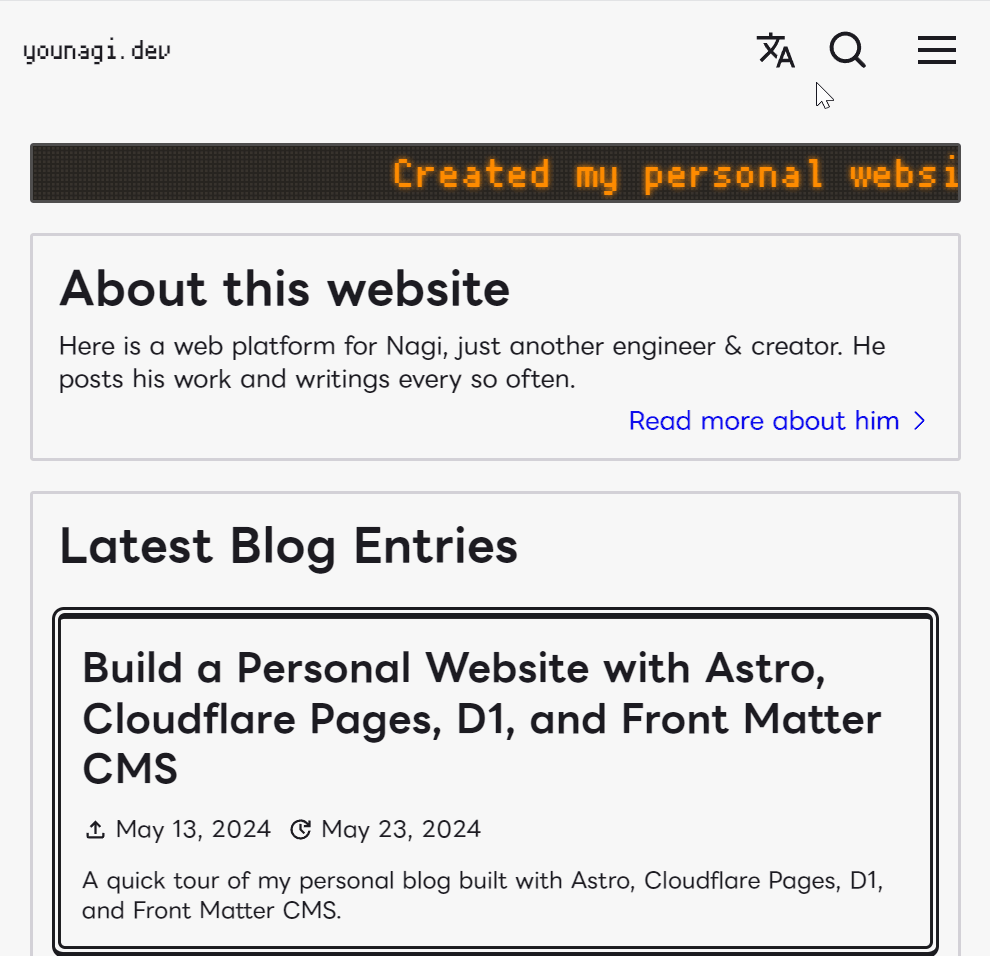
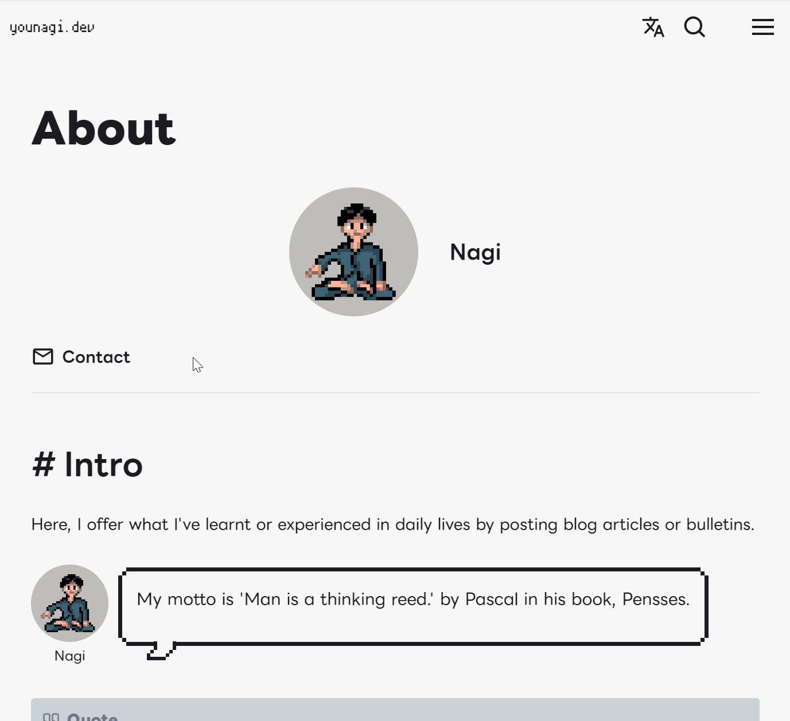
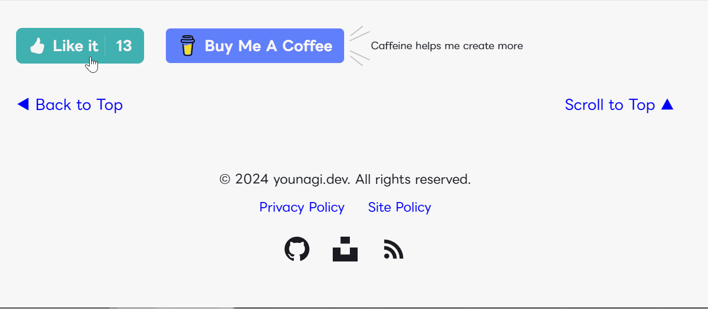

## 導入

個人ウェブサイト開発に4ヶ月程費やし、何とか最低限見せられるレベルまで完成しました。その開発体験についてポイントをかいつまんで書きます。

当サイトのソースコードに興味のある方は、[当サイトの Github レポジトリ](https://github.com/brklntmhwk/younagi.dev)をご覧ください。百文は一見(コード)に如かず。

### 想定読者

- Astroでウェブサイトを作りたいが、プロジェクト全体の構成をどうすればいいのか、どんな機能を実装すればいいのかわからない
- Astroで作ったプロジェクトの全体像を参考にしたい

## 本題

### Astro

基本はAstroの機能範囲で実装し、例外部分は新進気鋭のJSフレームワーク「SolidJS」で実装しています。もちろん全て TypeScript(とTSX) です。

> [!info]- 技術構成
> **言語:** TypeScript, TSX
> **フレームワーク:** Astro, SolidJS
> **スタイリング:** Astro の scoped CSS, Vanilla Extract(ゼロランタイム CSS)
> **データベース:** Cloudflare D1
> **ORM:** Drizzle ORM
> **CI/CD:** Github Actions
> **デプロイ:** Cloudflare Pages
> **CMS:** Front Matter CMS
> **ボット対策**: Cloudflare Turnstile

#### 全文検索



Rust製の静的検索ライブラリである[Pagefind](https://pagefind.app/)の力を借りることにしました。軽量、高速、そして導入が簡単。更にサーバーとのやり取りが不要でブラウザ簡潔なのも魅力的です。仕組みは至ってシンプルで、ビルド時に生成される指定ディレクトリ下の静的ファイルを読みに行き、検索用のインデックスファイルをあらかじめ生成しておくというものです。

開発に際して、次のポイントにこだわりました。

- ショートカットキーでも呼び出せる
  - PCの方は `Ctrl + K` を押してみてください
- キーワードのハイライトをカスタマイズ
- サイトのどこからでもアクセスできる
  - ナビゲーションバー内に設置
- 検索窓にオートフォーカス
  - 検索モーダルを開くとカーソルが検索窓にオートフォーカスされます

#### 多言語対応 (i18n)

[Astro の Content Collections API](https://docs.astro.build/en/guides/content-collections/)を活用して、言語ごとにディレクトリを切り出し、手動翻訳をする方針にしました。

[公式のドキュメント](https://docs.astro.build/ja/recipes/i18n/)に記載されている手順通りに、言語ごとのディレクトリを作成しました。(私の場合は `en` と `ja` です。一つのファイルに対して、言語の数と同じだけ同名のファイルを作成する必要があります)

Astro の [Content Collections](https://docs.astro.build/ja/guides/content-collections/) は Markdown/MDX 形式だけでなく、YAML や JSON形式にも対応しています。私は記事以外の翻訳文字列群の保存にYAML形式を選びました。非常に簡潔で好きです。


#### OG 画像 (Open Graph)

個々のブログやニュース記事については、OG画像が[Astro の APIエンドポイント](https://docs.astro.build/en/guides/endpoints/)を介して動的に生成されます。

OG画像の全パスは[Astro の dynamic routes](https://docs.astro.build/en/guides/routing/#dynamic-routes)によって動的に生成され、その意味では動的なのですが、それらがビルド時に生成されるという意味では静的です。

画像生成に際して、[satori ライブラリ](https://github.com/vercel/satori)にHTMLとCSSを渡せばそこからSVG形式で画像を生成してくれます。そして[Sharp ライブラリ](https://sharp.pixelplumbing.com/)にその結果を渡して画像最適化処理など適宜加えつつPNG形式の画像を出力します。

```txt title="パスの例"
https://younagi.dev/api/og/blog/astro-website.png
```


#### Remark/Rehype プラグイン

このウェブサイトでは、全てのコンテンツはマークダウン、もしくはMDX形式で書かれています。しかし、カスタマイズなしの標準記法では最小限の表現しかできず味気ないです。

そこで、既製品の[Remark](https://unifiedjs.com/explore/project/remarkjs/remark/)/[Rehype](https://unifiedjs.com/explore/project/rehypejs/rehype/)プラグインを利用、無いものは自作することにしました。書き味はブロガーにとって命です。

> [!info] Remark & Rehype
> [Unified](https://unifiedjs.com/)という文書変換系のエコシステムに属するプロセッサ群
> **Remark:** マークダウンにASTの状態で変換処理を加える(mdast)
> **Rehype:** HTMLにASTの状態で変換処理を加える(hast)
> ASTはAbstract Syntax Tree(抽象構文木)の略です。詳細は他の文献をあたってみてください。

##### KaTex

$\KaTeX$ はウェブページ上で数式などをきれいに表示してくれます。その呪文を数式に変換するのに、[remark-math と rehype-katex](https://github.com/remarkjs/remark-math/tree/main/packages/rehype-katex)を追加しました。

入力

```Markdown
$$
x = {-b \pm \sqrt{b^2-4ac} \over 2a}
$$
$$
( \sum_{k=1}^{n} a_k b_k )^2 \leq ( \sum_{k=1}^{n} {a_k}^2 ) ( \sum_{k=1}^{n} {b_k}^2 )
$$
$$
\int_{0}^{1} f(x) \ dx
= \lim_{n \to \infty} \dfrac{1}{n} \sum_{k=0}^{n-1} f \left (\dfrac{k}{n} \right)
$$
```

出力

$$
x = {-b \pm \sqrt{b^2-4ac} \over 2a}
$$

$$
( \sum_{k=1}^{n} a_k b_k )^2 \leq ( \sum_{k=1}^{n} {a_k}^2 ) ( \sum_{k=1}^{n} {b_k}^2 )
$$

$$
\int_{0}^{1} f(x) \ dx
= \lim_{n \to \infty} \dfrac{1}{n} \sum_{k=0}^{n-1} f \left (\dfrac{k}{n} \right)
$$

##### コードブロック

開☆発☆者として、コードの具体例を交えた説明は避けられない宿命です。 [rehype-pretty-code](https://rehype-pretty.pages.dev/)を使ってコードのシンタックスハイライトを実装しました。ちなみにシンタックスハイライターは[Shiki](https://shiki.style/)です。

```astro title="example.astro"
---
type Props = {
  title: string
}

const { title } = Astro.props
---

<div>{`これは例です。タイトルは ${title}`}</div>
```

##### コールアウト

数年間 [Obsidian](https://obsidian.md/) をナレッジベースとして愛用していて、マークダウン記法で書ける[コールアウト](https://help.obsidian.md/Editing+and+formatting/Callouts)が好きでした。このブログでも使いたくなり、実装しました。

実装に際して、こだわった点は次の通りです。

- 開閉可能
  - コールアウトタイトルの横に "+" もしくは "-" のマークがある場合、そのコールアウトは開閉可能と判断される
  - "+" が開く、"-" が畳む
  - 入れ子(入れ孫、入れひ孫、...)のコールアウトはそれぞれ親コールアウトが開閉すると一緒に開閉される
- 多彩な種類と色

以下がその例です。

```Markdown title="Info コールアウト"
> [!info]+Info
> Info コールアウトの例 (デフォルトで開く)
```

> [!info]+Info
> Info コールアウトの例 (デフォルトで開く)

---

```Markdown title="Caution コールアウト"
> [!warning]-warning
> Caution コールアウトの例 (デフォルトで閉じる)
```

> [!warning]-Caution
> Caution コールアウトの例 (デフォルトで閉じる)

---

```Markdown title="Check コールアウト"
> [!check] Check
> Check コールアウトの例 (開閉なし)
```

> [!check] Check
> Check コールアウトの例 (開閉なし)

---

```Markdown title="Nested コールアウト"
> [!note]+
> コールアウト
>
> > [!info]+
> > 子コールアウト
> >
> > > [!warning]+
> > > 孫コールアウト

> [!question]+
> Question!
>
> > [!failure]+
> > Failure!
> >
> > > [!check]+
> > > Check!
> > >
> > > > [!quote]+
> > > > Quote!
```

> [!note]+
> コールアウト
>
> > [!info]+
> > 子コールアウト
> >
> > > [!warning]+
> > > 孫コールアウト

> [!question]+
> Question!
>
> > [!failure]+
> > Failure!
> >
> > > [!check]+
> > > Check!
> > >
> > > > [!quote]+
> > > > Quote!

##### OEmbed(埋め込み)

エディタに直接ペーストされたURLは、埋め込み対応をしているものであればメディアフレームに変身します。

自前でCanva、YouTube、そしてGoogle Slidesの変換処理を追加し、それ以外のメディアは[OEmbed](https://oembed.com/)の規格に応じて適宜メディアフレームに変身するようにRemarkプラグインを自作しました。
ちなみに裏では[unfurlというライブラリ](https://github.com/jacktuck/unfurl)が頑張ってくれていて、上記の規格に必要なメディアのメタデータをURL経由で取得しています。

YouTube

https://www.youtube.com/watch?v=dsTXcSeAZq8

Spotify

https://open.spotify.com/intl-ja/track/04z1fwsw1gXI8HWQpoETa9?si=862c02d3e52a49b0

Canva

https://www.canva.com/design/DAGKC41Tjws/zSEw1hvi9r30o5KiF96AGA/view

Google Slides

https://docs.google.com/presentation/d/1CbeSiVYta0VTuENQ-25OLcIV5vK8pkcBJ-8DfKqlE2I/edit?usp=sharing

##### リンクカード

OEmbed非対応の裸リンクは、フォールバックとして全てリンクカード形式に変身します。先述のOEmbedに加えて、この部分もRemarkプラグインを自作しました。

ここでも[unfurl](https://github.com/jacktuck/unfurl)が裏で暗躍していて、リンクカードに表示するサイト名やディスクリプション、OG画像などを取得してくれています。

```txt
https://younagi.dev
```

https://younagi.dev

#### お問い合わせフォーム



最も頭を悩ませたのがお問い合わせフォームです。幾度かの大きな仕様変更を経て、最終的にSolidJS + TSXで実装する形に着地しました。

とはいえ、お問い合わせフォームを丸ごとクライアントサイドで読み込ませると[^1]、ページロード時に甚大なレイアウトシフトが発生します。これではSEOに悪いということで、同じくクライアントサイドでレンダリングされるモーダルの中に押し込むという荒業に着地しました[^2]。

[^1]: 他のJSフレームワーク(私のケースではSolidJS)をAstroのページやコンポーネント内で使用し、かつそれがJavaScriptによる処理を含む場合、それがどのフレームワークのコンポーネントなのか、Astroのコンパイラに明示的に教えてあげなければならない。これらフレームワークは、Astroの仕様によって、JSを含む時点でクライアントサイドでのレンダリング扱いとなり、故にコンパイラはビルド時やサーバーサイドで全く関知できないからである。お問い合わせフォームはユーザインタラクティブであり、簡素なものでなければ大抵はJavaScriptが必要になるため、クライアントサイドのコンポーネントになる。
[^2]: 前提として、Astroのページを含め、`.astro`のファイルはサーバーサイドでレンダリングされる。その上にクライアントサイドのコンポーネントを置くと、ページ表示後にドサッと降ってくるような見た目の挙動になる。これが小さいコンポーネントならレイアウトシフトは深刻にはならないが、お問い合わせフォームのような巨大な部品だと被害は甚大になる。

簡単のため、フォーム制御に[Modular Forms](https://modularforms.dev/)、UIに[Kobalte](https://kobalte.dev/docs/core/overview/introduction)、バリデーションチェックに[Valibot](https://valibot.dev/)など有力なライブラリを使用しました。
ポイントは下記の通りです。

- クライアントサイドのバリデーション
  - Modular Forms x Valibot x Cloudflare Turnstile
- サーバーサイドのバリデーション
  - Valibot x Cloudflare Turnstile
- 送信ボタンのラベルが送信中に変わる
  - ユーザがわかり易いように
  - Modular Formsのフォーム制御機能のおかげで簡単に実装できました
- 送信完了後、サンクスページにリダイレクトされる

ボット対策にはどうしてもGoogle reCAPTCHAではなく[Cloudflare Turnstile](https://developers.cloudflare.com/turnstile/)を導入したく、この点はかなりこだわりました。(あの車のパズルに費やした合計時間を考えると...しんどい) 無料ですし、他のCloudflareサービスとの連携も考えると、私にとっては一択でした。

### Cloudflare

#### Cloudflare Pages

[Next.js](https://nextjs.org/) に執心だった頃、 私のお気に入りのホスティングサービスは [Vercel](https://vercel.com/) でしたが、Astroへの移行に際して、見直す必要があると感じました。そしてたどり着きました。[Cloudflare Pages](https://developers.cloudflare.com/pages/)という結論に。

##### どうして Cloudflare Pages?

Cloudflare Pagesをホスティング先に選んだのには次のような理由がありました。

- 寛大なフリープラン
  - 月あたりの帯域幅上限が無制限という素晴らしさ (2024年5月9日現在)
- 非常に高速なデプロイ
- ドメイン用のカスタムEメールアドレスが取得できる
  - お問い合わせフォーム用に使用しています
  - フォームから送信されたお問い合わせはこのカスタムEメールアドレス経由で私用のメールアドレスに届くため、プライベートアドレスを公に晒さずに済みます(もちろん、返信時にもメールの送信元をカスタムEメールアドレスに設定できます)
- 独自ドメイン取得可能 (有料)
  - `https://younagi.dev`

フリープランでも当サイトのような小規模プロジェクトならば十分運用可能だと思います。この点が最も魅力的でした。

#### Cloudflare D1

バックエンドについては、[Cloudflare D1](https://developers.cloudflare.com/d1/)をデータベースとして使用しています。Pagesと同様に寛大なフリープランが魅力的だったのですが、ここでは深くは触れません。

##### いいねボタン



D1データベースと[Drizzle ORM(Object-relational Mapping)](https://orm.drizzle.team/)を連携させ、よくあるいいねボタンを実装しました。ブログ記事の各ページに設置しています。

仕組みを簡潔に述べます。

- その記事のいいねの合計数が表示される
  - ページのロードに際して、いいね用のAPIエンドポイントにGETリクエストが送られ、その時点でのいいねの合計数を取得、ユーザがいいねをしているか否かはデータベースに登録されているクッキーのセッションIDカラムを照合して判断する
  - データベースには、セッションIDとともに該当ページの判別に必要な情報も登録される
- ボタン押下時、ユーザがまだ「いいね」をしていなければカウントが1つ増え、そうでない場合は1つ減る
  - APIエンドポイントにPOSTリクエストが送られ、リクエストデータがデータベースに登録される

### Front Matter CMS


フレームワーク選定と並んで、CMS(Content Management System)選定にもかなりの時間を要します。私は [Front Matter CMS](https://frontmatter.codes/) に惹かれました。理由は次の通りです。

- ローカルで記事の執筆や保存ができる
- マークダウン/MDX形式

VS Code の拡張機能であり、ローカルで動くという点で、他のヘッドレスCMSとは一線を画しています。つまり、コードの修正や記事の執筆、サイトのデプロイなどの作業が VS Code エディタで一元化できます。 これは特に開発者にとって大きなメリットとなるのではないでしょうか。

初期セットアップについては[Front Matter 公式ドキュメント](https://frontmatter.codes/docs/getting-started)をご覧あれ。手順通りに進めると、Astroの `content` フォルダを自動で検知し、その中身に応じて `frontmatter.json` に各コンテンツの項目の定義などを書き出してくれます。基本、Front Matter CMSの設定はプロジェクトルート直下に置かれたこのファイルで管理します。

#### Front Matter CMS のカスタマイズ

`frontmatter.json`のカスタマイズについて、幾つかこだわったポイントがあります。

- [ディレクトリによる多言語化](#多言語対応-i18n)との互換性
  - コンテンツのディレクトリ内にある言語用のディレクトリを指定して、Front Matter CMSの設定と紐づけができます(私の場合、今のところ `en` と `ja`)
  - こうして、VSCodeのコマンドから記事を作成する際に、書きたい言語を選べるようになりました。記事は自動で指定のディレクトリに作成されます
- AstroのContent Collectionsとの互換性(コンテンツ、データタイプ両方)
  - Front Matter CMSにもコンテンツ、データの概念があり、それぞれをAstroのコンテンツ、データと関連させられる
  - ブログやニュースなどの「コンテンツ」はコンテンツとして、翻訳文字列やサイトメタデータ、ブログのカテゴリ・タグなどの「データ」はデータとして扱う

## 結び

この長い開発の旅の途中で、沢山の情報源にあたりました。これらの先達なしに今回の旅の成功はあり得なかったでしょう。以下に特によく訪問したウェブサイトやページを載せます。有益な情報やコードをありがとうございました。

プロジェクト全般

https://astro.build/

https://tus-ricora.com/

https://zenn.dev/ricora/articles/5a170c17933c3f/

https://www.haxibami.net/

https://developers.cloudflare.com/

全文検索

https://pagefind.app/

お問い合わせフォーム

https://trap.jp/post/2088/

DBのセットアップ

https://honghong.me/

https://snorre.io/blog/2024-05-06-likes-cloudflare-d1-astro-api-endpoints/

Front Matter CMSのセットアップ

https://frontmatter.codes/docs

https://route360.dev/ja/post/frontmatter-cms/

スタイリング

https://nostalgic-css.github.io/NES.css/

https://vanilla-extract.style/
