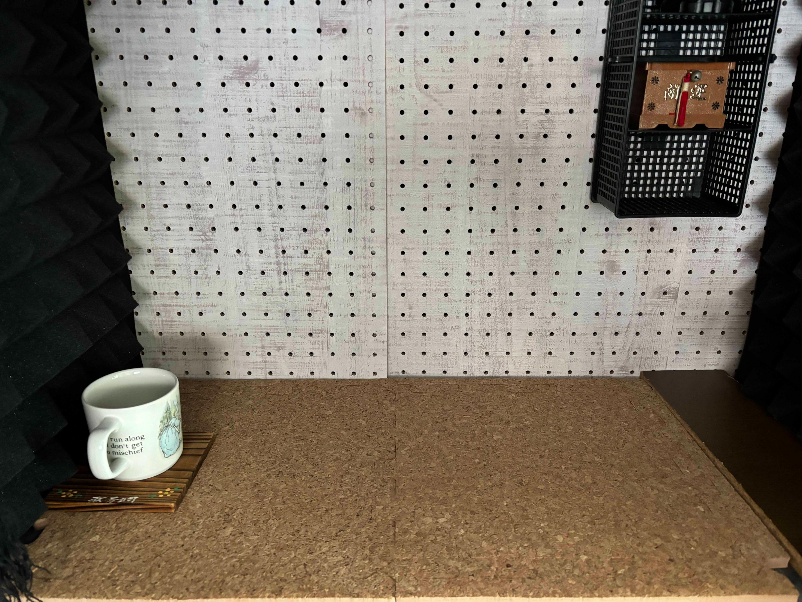
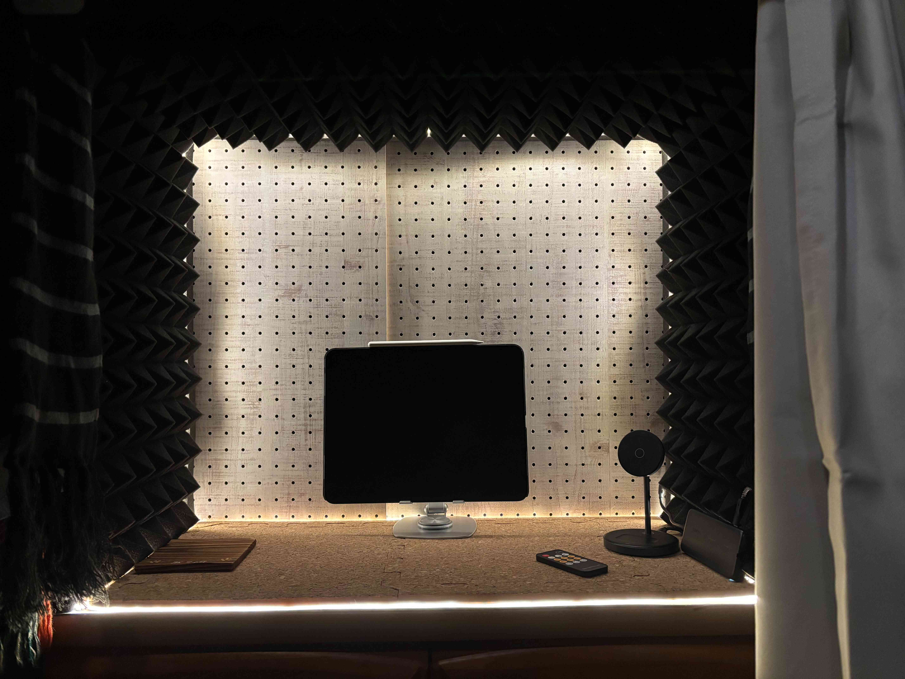

## 導入

いつの日か防音室を所有することを夢見て、早幾許もの月日が流れた。自室のスペースに限界があり、どうしても着工に踏み切れなかったのだ。

しかし、何人も私の裡に灯った強烈なモチベーションの炎を打ち消すことはできなかった。何とか折衷案を絞り出そうとあらゆる手を尽くした末、或る結論に辿り着いた──「スペースがないなら、棚の上に防音ブースを造ればいいじゃない」

### 想定読者

- 防音室を造りたいが部屋のスペースに限界がある
- 防音ブースの造設を考えている
- 防音ブースはそもそも試す価値があるのか知りたい

### 現時点での私の習熟度

記事執筆時点での私の習熟度は次の通り。

- 過去に 2~3 回だけ簡易的な小机や小棚を DIY したことがある
- 今回のプロジェクト程大きなものを DIY するのは初めて

## 本題

まず完成品はこちら。
計画・デザインから着工まで、プロジェクトの完遂には 1 週間半程を要した。材料だけにかかった費用は**総額19,480円**程度であった。(2024 年 10 月時点)

そしてコンセプトは次の通りだ。

- できる限り安く
- 短時間で造る
- 解体やテコ入れが容易

YouTube で公開されているようなプロ DIYer の防音室には到底敵わないが、費用・時間・労力対効果はなかなかいい線をいっていると思う。

| 商品 | 価格(円) |
| --- | --- |
| OSB合板 | 2,480 |
| 有孔ボード 600 x 450 と 600 x 300 (mm) | 1,589 |
| 遮音シート 940mm x 10m | 3,745 |
| 吸音パネル 300mm x 300mm x 24 | 4,799 |
| 接合金具 x 4 | 656 |
| ユニクロ金折 x 4 | 560 |
| 皿木ねじ 2.7 x 10 と 3.8 x 13 (mm) | 278 |
| 突っ張り棒 | 110 |
| ブックスタンド x 2 | 220 |
| カフェカーテン | 1,518 |
| 隙間テープ 3m | 110 |
| 壁掛けフック x 2 | 1,342 |
| コルクボード 300 x 300 (mm) x 10 | 1,756 |
| 木材カットサービス x 5 | 275

### 計画とデザイン

とにかく早く着工したかったため、このフェーズは結構おざなりだ。
まず iPad で設計とは名ばかりのお絵描きをし、ブースの寸法を粗方決めた。次に防音壁の素材を選定し、壁をどのように取り付けるかを試行錯誤した。[^1]

[^1]: 同時並行で「防音とは何ぞや」についても学習した。

壁の素材には OSB 合板を採用。防音壁の定番である石膏ボードは採用を見送った。何故か？日本では産業廃棄物として処分しなければならず、まあまあ手間がかかるからだ。

> [!info]+
> 壁材の選定基準はまず第一に密度が高いこと(≒ 質量が大きいこと)

### 道具と材料の調達

大抵の物はオンラインストアで手に入った。その他、木材などは近所のホームセンターまで赴き別途購入した。

最終的に必要となった材料は下記の通りだ。

- OSB 合板 1820 x 910 x 11 (mm)
- 有孔ボード 600 x 450 と 600 x 300 (mm)
- 学習机の余り板 710 x 590 (mm)
- 遮音シート 940mm x 10m
- 吸音パネル 300mm x 300mm x 24
- 接合金具 x4
- ユニクロ金折 x4
- 皿木ねじ 2.7mm x 10mm と 3.8mm x 13mm
- 突っ張り棒
- ブックスタンド x2
- カフェカーテン
- 隙間テープ 3m
- 壁掛けフック x2
- コルクボード 300 x 300 (mm) x 10

使用した工具類も認めておく。

- ドリルドライバー
  - 下穴空けとねじの打ち込み
- ハンドタッカー
  - 遮音シートの貼り付け
- 脚立
  - 天板の取り付けなどに使用
- コンベックス
  - 長尺の測定
- 台付スコヤ
  - ブースの枠組みを直角に保つ用途で使用
- カッターナイフ
  - 遮音シートのカット
- カッターマット
  - カッターナイフと併用
- 両面テープ
  - 吸音パネルの張り付け

木材のカットはホームセンターのカットサービスを利用した。おかげ様で一番大変な作業をショートカットできたことは非常に嬉しく、有難く思う。[^2]

[^2]: 直線で計 5 回のカットを依頼したのだが、30 分足らずで終了。相当な手練れでない限りは、このカットサービスの恩恵に与ることをお勧めする。

### 着工

大まかに次のような工程を経た。

- 防音壁の枠組みを完成
- 内壁に遮音シート、吸音パネルを設置
- 向かい側の内壁に有孔ボードを設置
- 床にコルクボードを敷設
- 手前側にカフェカーテンを取り付ける
- 隙間をひたすら埋める

#### 防音壁の枠組み

壁はコの字になるように金具類で固定する。

はじめは接合金具だけで事足りると想定していたが、甘かった。接合部分がグワングワン揺れてコの字どころではない。ユニクロ金折を追加購入し、接合部を強化した。

#### 内壁に遮音シートと吸音パネルを設置

次に遮音シートを内壁四面分カットし、ハンドタッカーで木材に固定していく。
タッカーを使うのは初めてであり、正直なところ「高々ホッチキスの上位互換だろう？君に OSB ボードを貫通する程の力が本当にあるのかね・・？」と懐疑的だった。しかし、すぐに過小評価だと分かった。

後は両面テープで吸音パネルを接着し、はめ込んでいくだけである。パネルの寸法がピッタリ合わない箇所は、適宜パネルをカットする。

吸音パネルを貼り付けると、急に収録ブースの様相を呈してきた。

#### 向かい側の内壁に有孔ボードを設置

設置、と言いつつそのまま差し込んでいるだけである。「1 x 4 材を内部に取り付けて、そこに有孔ボードを固定して・・」等と画策したが、運のいいことに内壁側面の吸音パネルによって僅かな隙間ができており、それが有孔ボードを差し込むのに丁度いい間隔ときた。
図らずも「解体とテコ入れが容易」という設計方針を満たしてしまうのであった。

実際に有孔ボードを差し込んでみると、いよいよもってイイ感じの雰囲気が醸し出される。

#### 床にコルクボードを敷設

棚の天板がブースの床になるのだが、これが思いの外反響する。というわけで、床一面に遮音シートを敷き、その上にコルクボードを拵えてみた。すると反響はピタリと止んだ。

#### 手前にカフェカーテンを設置

さて、当初の予定ではこの段階でほぼ完成という目論見だったが、ブース内で奇声を発してみると、「むーーーん・・・」思いの外聞こえる。

誰かが「音は隙間から漏れる」という名言を残していたことを思い出し、急遽手前側にもカーテンを設置することと相成った。[^3]

[^3]: これに付随して、天板よりも奥行きのある学習机の余り木をその上に重ねた。

そこで新たにお誂え向きのカフェカーテンと突っ張り棒を購入し、タンスの奥底で永久の眠りに就こうとしていたブックスタンドを叩き起こした。全く無関係な仕事を押し付けてしまい、誠に申し訳なく思う。

そして満を持してカフェカーテンを取り付ける。第一印象は「...プリクラのフォトブースかな？」

しかし侮るなかれ。カーテンを取り付けただけで状況は一変。ブース内では音がスタジオのような鳴りに変貌を遂げ、室内ブースの外では音量がほんの少し軽減したように感じられた。音は隙間から漏れるって、本当だったんだ。

#### 隙間をひたすら埋める作業

最後に、無心で隙間を埋めた。

その筆頭はカーテンと内壁の間。ここはカットした遮音シートに吸音パネルを貼り付け、その外側に幾重にもなるマフラーを折り重ねた。吸音パネル、遮音シート、マフラーの三層構造である。

この他にも数多の隙間を埋め、気づけば防音ブースとの心の距離もグッと縮まった気がする。しかし話し出すと長くなるので、ここではこれ以上触れないでおく。

### おまけ程度の効果計測

折角防音ブースを造ったので、その防音効果を計測してみた。今回は厳密な数値よりも体感を重視したため、客観的なデータの収集は「デシベル X」という無料アプリに委ねることとした。

計測に使用した音源は、Children of Bodom の代表曲『Needled 24/7』の冒頭 20 秒程である。騒音扱いしてしまい大変心苦しいが、恐らく広くメタルに興味がない人にとっては...そういうことになってしまうと思う。[^4]

https://open.spotify.com/track/1aKrYw2i1mWRPMOUUe3dT8?si=1e65dc5163174e85

[^4]: ちなみに私はとても好きである

そして次のような状況で 3 回計測した。

1. 音源の目の前で計測
2. 音源を自室内防音ブース外に置いてドアの外から計測
3. 音源を自室内防音ブース内に置いてドアの外から計測

その結果はこうだ。

| パターン | 平均(dB) | 最小(dB) | 最大(dB) | ピーク(dB) |
| --- | --- | --- | --- | --- |
| 1 | 66.0 | 57.4 | 69.9 | 71.7 |
| 2 | 38.0 | 28.8 | 45.3 | 51.4 |
| 3 | 31.1 | 25.3 | 34.7 | 42.6 |

見ての通り、ドアを一枚隔てるだけで相当な防音効果があると分かる。音源からドアまでの距離も 2m ない程度のものなので、距離による減衰の影響はあまりないと考えてよいだろう。

ドアに特殊な素材を使っているのではないか？否。
後述するのだが、ドアを隙間テープで埋め尽くし、一部を余った遮音シートと吸音パネルで強化している。これだけで平均 5~7dB 程の防音効果が確認できた時は、驚きを隠せなかった。思わず歓喜した。

本題に戻り防音ブース自体の効果だが、**平均約 7dB の防音**に成功している。
概して、人間の耳はおよそ 3 dB の差から識別可能になり、10dB くらいになると音量が半分になった、或いは倍になったと感じるようである。[^5] 防音ブース単体では僅かに及ばなかったが、ドアの防音対策と組み合わせるとそれ以上の効果が見込めるということだ。

[^5]: 参考: https://www.noisequest.psu.edu/pdfs-documents/basics.pdf

現にパターン 3 で『Needled 24/7』を聴いた時、それはもはやメロデスにカテゴライズされる代物ではなくなっていた。真冬の体の震えよりも小刻みなギターリフやどんな貧乏ゆすりよりも速いツーバスは鳴りを潜め、遠く外を走る車の音にかき消されてしまう程であった。
要するに、真昼間だと相当耳を澄ませないと聞こえない。

## 結び

今回の一件によって、すっかり防音沼に嵌ってしまった。

趣味が高じて自室のドアの隙間を隙間テープで埋めてみたり、余った遮音シートと吸音パネルをドアに取り付ける等した。すると、体感で分かるくらいに自室で鳴っている音が扉の向こう側では小さくなった。

結論、自室で~~思う存分~~ ある程度ボイトレできる環境が手に入った。
まず手始めに 120dB を優に超えると評される私の歌声に防音ブースがどれだけ耐えられるか試してみよう。そして、同居人に怒られる毎、10dB くらいずつ声量を下げていこうと思う。

### 追記

2024 年 12 月上旬、防音ブースに明かりが灯った。市販の LED テープライトを隙間に埋め込んだだけなのだが、図らずもお洒落な間接照明のような仕上がりになってしまう。

