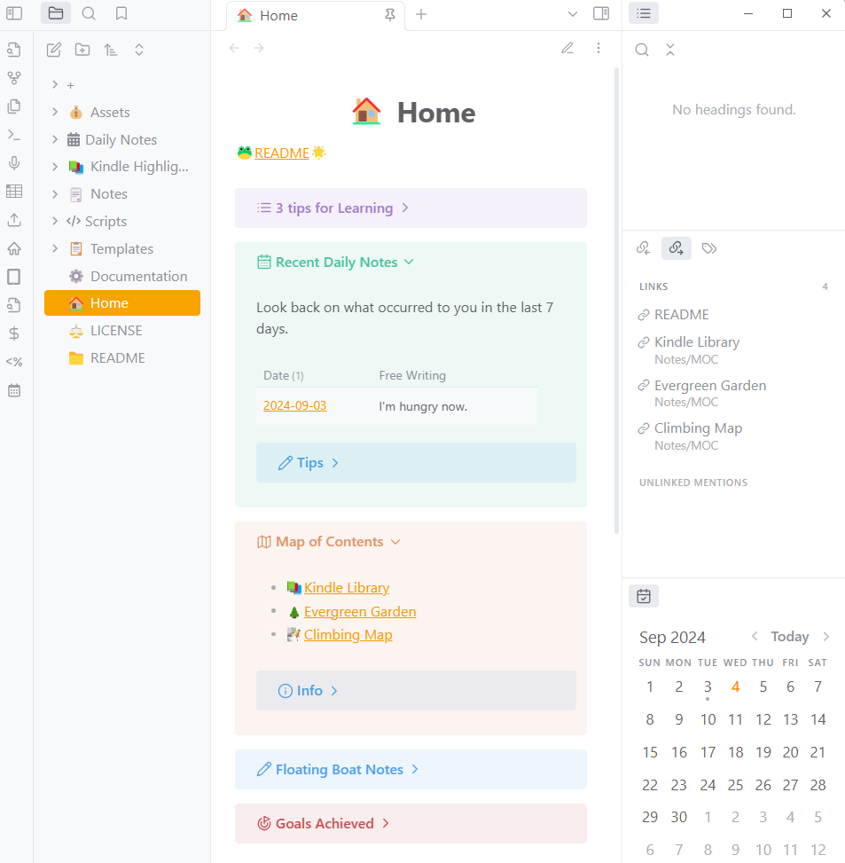

## 導入

> [!quote] ひと言
> — 2020年代の必需品: スマートフォン、人との繋がり、ナレッジベース

私は個人ナレッジベースとして[Obsidian](https://obsidian.md/)を愛用していて、日々得られた情報やデータは全てそちらで管理している。

今回、その普段使いしているナレッジベースをスターターキットとして公開した。 その名も、**「Nagi's Personal Knowledge Base(NPKB)」** である。

> [!warning]
> スターターキットと銘打ったが、実際のところはただ私用の Obsidian Vault を公開しただけに過ぎない。
> 今後頻繁にアップデートを行うかも不明なので、あくまで参考程度に活用されたし。

### 想定読者

フロントエンド開発の経験は無くても問題ないが、[Git](https://git-scm.com/)の基本的な操作は心得ているという想定だ。

- Obsidian を使ってナレッジベースを作りたいが、どこから始めたらいいかわからない
- Notion や Evernote 等のノートアプリから Obsidian に移行したいが、設定が多すぎて圧倒されている
- Obsidian の膨大な数の設定に頭を悩ませたくない

### 現時点での私の習熟度

記事執筆時点での私の習熟度は次の通り。

- ソフトウェアエンジニアとして計 3 年の経験あり(勤続ではない)
- JavaScript、CSS、Markdown の基本は理解している(つもり)
- Obsidian を 3 年ほど利用し続けている

## 本題


まず初めに、NPKB に適さない使い方を明記する。

- **スケジュール・タスク管理**
	- スマホやタブレットで管理する方がずっと便利
	- 昨今では便利なカレンダー・TODO アプリが沢山ある
- **マインドマップなどの視覚化**
	- 理由は同上 (例: iPad)
	- 個人的には、マインドマップなど、思考やアイデアを図式化をする際には iPad を好んで使っている
- **クイックノートの作成と管理**
	- PC 使用時であればすぐにメモを書き残すことができるが、そうでなければ面倒(例: 外を歩いているとき)
	- 恐らくスマホやタブレットを使った代替策を見つけた方がよい

それでは、結局どんな使い方に向いているのか？
基本的には、**我々が日ごろ集めている全ての情報やデータの最終目的地になる**。スマホやタブレット、紙のノートなど、バラバラな場所に書き留めたものが、最終的にはここに行き着くということだ。

ここでは触れないが、私はスマホ・タブレット・PC 間の連携でどこからでもナレッジベースにアクセスができ、ノートの編集が可能な環境を構築した。勿論データも同期される。詳細は下記の記事を参照されたし。

(🚧記事作成中)

NPKB に俄然興味が湧いたという方があれば下記リンクを参照されたし。

https://github.com/brklntmhwk/npkb

> [!note]+
> NPKB のバージョン管理には[Git](https://git-scm.com/)を使用している。
> 初めのセットアップを除き、基本的にはコマンドを直接入力する機会はないが、Gitの基本は押さえているのが好ましい。予期せぬエラーが起きた場合、修正するのにコマンド入力が必要になるから...。

### デモ

詳しい紹介の前に、NPKB のデモをご覧に入れる。

#### ホームページ



ホームページは、全ノートのハブ(中心地)というよりは始まりの場所のような位置づけになり、次のような重要な役割を果たす。

- ホームページの次に大きなノートへのアクセスポイントになる
  - 具体的には、デイリーノートや[MOC](#mocmap-of-content)のこと。それぞれカレンダーや「Recent Daily Notes」、そして「Map of Contents」からアクセスできる
- 放置されているノートの存在に気づかせてくれる
  - 「Floating Boat Notes」の表から放置され続けているノートの一覧が確認できる
  - ボートノートの意味については、[the evergreen ethos](#エバーグリーンの精神)を参照のこと
- 散らばったランダムな思考やアイデアをまとめて洗練させるのに役立つ
  - 「Recent Daily Notes」で過去 7 日間の「[自由帳](#デイリーノート)」データをまとめて確認できる

#### 新しいノートを作る

:::video[NPKB で新規ノートを作成する]
/videos/npkb-create-new-note.mp4
:::

NPKB では、新しいノートはプロンプトに答える形式で作る。回答に応じてテンプレートが決まり、それに基づいてノートが作成される仕組みである。

#### グラフビュー


これは Obsidian の重要な標準機能の 1 つだ。ビューモードをグラフビューに切り替えて全体像を一目で把握できる。ノードはリンクになっており、クリックすればそのページに飛べる。

#### デイリーノート


デイリーノートには次の 3 つの見出しがある。

- **本日の格言(Today's Quote):** https://api.quotable.io からランダムに取得した格言を引用する
- **本日のノート(Today's Notes):** 本日作成されたノートのデータテーブル
- **自由帳(Free Writing):** 自由記述エリア。ノートを取りたいことやふと思い浮かんだことなど何でも書いてよい

#### 長期的な目標の管理


日常のスケジュール・タスク管理はさておき、長期的な目標であれば 1 つのページで進捗管理できる。その名も「クライミングマップ」である。

目標達成までに以下 4 つの段階がある。

- **計画中(Planning):** 計画中のプロジェクト
- **進行中(Ongoing)** 進行中のプロジェクト
- **達成済み(Complete)** 既に達成済みのプロジェクト
- **一時休止中(On hiatus)** 始めたものの一時休止することにしたプロジェクト

フロントマターのデータを少しいじれば目標のステータスが変わる。達成済みが増えれば増えるほど、より気持ちの良い充実感に浸れるものだ。

### ディレクトリツリー

```Markdown
NPKB/
├── +/
├── Assets/
│   └── Images/
├── Daily Notes/
│   └── ...
├── Kindle Highlights/
│   └── ...
├── Notes/
│   ├── Concepts/
│   ├── Efforts/
│   ├── Gleanings/
│   └── MOC/
│       ├── Climbing Map
│       ├── Evergreen Garden
│       └── Kindle Library
├── Scripts/
│   └── ...
├── Templates/
│   └── ...
├── Documentation
├── Home
└── README
```

Obsidian では[相互リンク機能(Wikiリンクとも)](https://help.obsidian.md/Linking+notes+and+files/Internal+links)があって、 **階層的なディレクトリ構造はさほど重要でなく、横の繋がりが重視される。** その為、ディレクトリはあまり深く掘らず最小限に留めている。

### ノートの分類

#### Daily Notes

デイリーノートは同日に得られた情報やデータを一か所にまとめることができて非常に便利だ。そして、リソースと日付の間に強い関連性を生みだすという側面もある。


個人的には、日付を介してその日にやったこととノートの内容を無理矢理繋げ、記憶の引き出しを増やすよう心がけている。

#### Templates

テンプレートはこちらのディレクトリで管理する。

#### Notes

その他のノートは全てこちらに配置され、[エバーグリーンの成長過程](#エバーグリーンの精神)を経てゆくゆくは「エバーグリーンノート」へと育っていく。

##### メディア

新規ノートの入口として、まず「情報源はどこか？」に先述のプロンプト形式で答えていく。

- `📖` **書籍(Book):** 紙の書籍 (Kindle は除く)
- `🧠` **ChatGPT:** ChatGPT とのチャットデータ
- `🎧` **音楽(Music):** Spotify 等のストリーミングサービスの曲
- `📰` **文献(Paper):** 研究論文
- `📻` **ラジオ/ポッドキャスト(Radio/Podcast)**
- `🌐` **SNS:** YouTube、X、Instagram 等
- `🕸` **ウェブサイト(Website)**
- `❓` **その他(Others):**「Concepts」やその他イレギュラーなトピック

##### Concepts

より大きい抽象的な物事はこちらで取り扱う。乗っけからそういったトピックについてノートを作りたい場合は、こちらを選ぶとよい。

> [!info]
> NPKB では、基本的に上記の「[Notes](#notes)」のような具体的かつ小さいノートを出発地点とする。その方が、個人的に素早くノートを書き始められると感じるからだ。

##### Efforts

[長期的な目標](#長期的な目標の管理)に関するノートはこちら。

##### Gleanings

SNS など、外部の情報源からの情報に関するノートはこちら。

##### MOC(Map Of Content)

MOC はあるトピックに特化したノートの集まりである。そのトピックについて情報を書き足していきながら、関連するノートへのリンクを繋げていく、ただそれだけ。

MOC のメリットは次の通り。

- 1 つのカテゴリに分類できない、複数のジャンルにまたがっているような複雑なトピックも取り扱える
  - 例:「健康なレシピ」という MOC
    - 調理の過程でどうやったら栄養の流出を食い止められるか
    - 健康な野菜 10 選
    - ブロッコリー、人参、パクチーで作るヘルシーな味噌汁
- フォルダ構造などに左右されずに様々な視点から自由に作れる
- トピックに関連するノートを集める過程で点と点が繋がる感覚を得られる
  - トピックについてより深い理解が得られる

> [!info]+
> MOCには特別なルールはないが、一つ留意すべき点があるとすれば、**「ノートファースト、マップラスト」** の精神だ。
> ノート作成の流れは、個々のノートを末端、マップをその上に位置付けると「下から上へ」となる。つまり、ある程度個々のノートを増やしてはじめてマップの作成に取り掛かれるということである。(既存のMOCは例外)

### エバーグリーンの精神

ノートがどの程度育ったかの指標として、全ノートのフロントマターに以下のような絵文字を使用している。
これは「エバーグリーンノート」という概念で、[Andy Matuschak 氏](https://andymatuschak.org/)が提唱したものである。

- `⛵ Stage 1. ボートノート(Boat note):`できたばかりのノートでまだ他のノートとの繋がりがなく孤立している
- `🌱 Stage 2. 苗木(Seedling):`コンテンツが増え、他ノートとの繋がりも少しできたが、まだ成長過程
- `🌿 Stage 3. 萌芽(Budding):`コンテンツが充実してきて他ノートとの繋がりも沢山できているが、まだ成長の余地がありそう
- `🌲 Stage 4. エバーグリーンの森(Evergreen forest):`十分に成熟しきった、いわゆる「エバーグリーンノート」

私は、何か興味深いものを見つけたらとりあえずノートを作って、そのメディアへのリンクだけをとりあえず貼り付けている。そして後でコンテンツや Wiki リンクを追加するという流れだ。

このシステムのメリットは次の通り。

- ノートがどの程度育っているのかが一目でわかる
  - NPKB にはエバーグリーン用のデータテーブルがある
- ノートに優先順位がつけやすくなる
  - 例:「このボートノートはもう 100 日漂流してるから先に編集しよう！」
- ノート間のリンクをできる限り多く繋げようという意識づけになる

ちなみに、上記の分類は[Bryan Jenks 氏](https://notes.bryanjenks.dev/Z/HOME)を参考にした。

## 結び

数年使い続けた所感として、Obsidian はどちらかと言うと開発者向けのノートアプリだと感じる。
非常にカスタマイズ性に富んでいて、プラグインの組み合わせや使い手の腕次第で理想の環境を構築できる一方、開発経験のない初心者にとっては学習コストが高くてとっつきにくい感は拭えない。
もし使っていてしっくりこなければ、より一般に普及している [Notion](https://www.notion.so/ja) に乗り換えるというのも 1 つの手だろう。

NPKB は沢山の素晴らしいコミュニティプラグインに支えられて成り立っている。感謝の意を込めて、その中でも根幹を担う重要なプラグインたちをいくつか認めておく。

- [Dataview](https://blacksmithgu.github.io/obsidian-dataview/): データテーブルはすべてこのプラグインのおかげ
- [Templater](https://silentvoid13.github.io/Templater/introduction.html): ノート作成のプロンプト型ワークフローやテンプレート類の作成に欠かせない
- [Metadata Menu](https://mdelobelle.github.io/metadatamenu/): フロントマターのメタデータを取り扱うのに欠かせない(特にエバーグリーンのステータスやタグなど)

https://github.com/brklntmhwk/npkb

> [!warning]
> 2024年9月時点で英語版のみ入手可能。
> 利用の際は、必要に応じてドキュメントを自身の言語に翻訳されたし。
