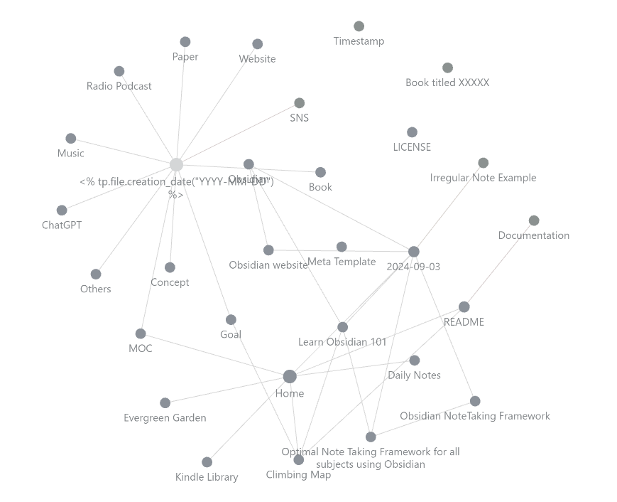
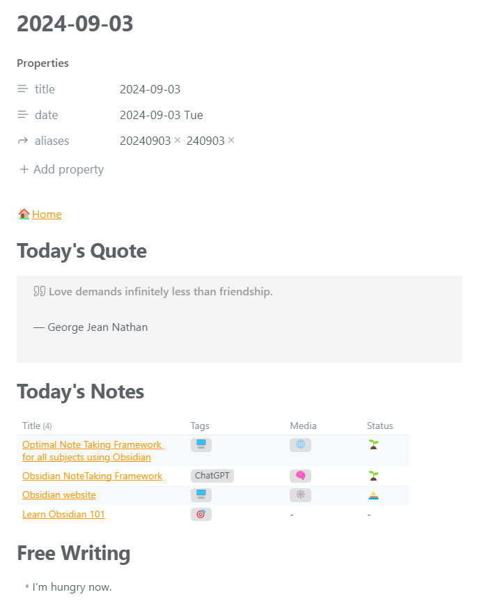

## 導入

> [!quote] One Phrase
> — You shape your tools, and they shape you

私はナレッジベースとして[Obsidian](https://obsidian.md/)を愛用していて、日々得られた情報やデータは全てそちらで管理しています。

今回、その普段使いしているナレッジベースをスターターキットとして公開しました。 その名も、**「Nagi's Personal Knowledge Base(NPKB)」** です。

### 想定読者

- Obsidian を使ってナレッジベースを作りたいが、どこから始めたらいいかわからない
- Notion や Evernote 等のノートアプリから Obsidian に移行したいが、設定が多すぎて圧倒されている
- Obsidian の膨大な数の設定に頭を悩ませたくない(ただ快適なナレッジベースがすぐに欲しいだけなんだ！)

### 現時点での私の習熟度

記事執筆時点での私の習熟度は次の通りです。

- ソフトウェアエンジニアとして計 3 年の経験あり(勤続ではない)
- JavaScript、CSS、Markdown の基本は理解している
- Obsidian を 3 年ほど利用し続けている

## 本題


まず初めに、NPKB に適さない使い方を明記します。

- **スケジュール・タスク管理**
	- スマホやタブレットで管理する方がずっと便利
	- 昨今では便利なカレンダー・TODO アプリが沢山ある
- **マインドマップなどの視覚化**
	- 理由は同上 (例: iPad)
	- 個人的には、マインドマップなど、思考やアイデアを図式化をする際には iPad を好んで使っている
- **クイックノートの作成と管理**
	- PC 使用時であればすぐにメモを書き残すことができるが、そうでなければ面倒(例: 外を歩いているとき)
	- 恐らくスマホやタブレットを使った代替策を見つけた方がよい

それでは、結局どんな使い方に向いているのでしょう？基本的には、**私たちが日ごろ集める全ての情報やデータの最終目的地になります**。スマホやタブレット、紙のノートなど、バラバラな場所に書き留めたものが、最終的にはここに行き着くということです。

ここでは触れませんが、私はスマホ・タブレット・PC 間の連携でどこからでもナレッジベースにアクセスができ、ノートの編集が可能な環境を構築しました。もちろんデータは同期されます。詳しくは下記の記事をご覧ください。

(🚧記事作成中)

NPKB に興味がある、試してみたいという方は下記リンクをご覧ください。

https://github.com/brklntmhwk/npkb

> [!note]+
> NPKB のバージョン管理には[Git](https://git-scm.com/)を使用しています。初めのセットアップを除いて、基本的にはコマンドを直接入力する機会はありませんが、Gitの基本は押さえているのが好ましいです。修正にコマンド入力が必要な予期せぬエラーに備えて..。

### デモ

詳しい紹介の前に、NPKB のデモをご覧に入れます。

#### ホームページ


ホームページは、全ノートのハブ(中心地)というよりは始まりの場所のような位置づけになります。そして次のような重要な役割を果たします。

- ホームページの次に大きなノートへのアクセスポイントになる
  - デイリーノートはカレンダーや「Recent Daily Notes」から、[MOC](#mocmap-of-content)は「Map of Contents」からそれぞれアクセスできる等
- 育成を待つノートたちの存在に気づかせてくれる
  - 「Floating Boat Notes」で作成されてから漂流し続けているノートの一覧が見られる
  - ボートノートの意味については、[the evergreen ethos](#エバーグリーンの精神)を参照のこと
- 散らばったランダムな思考やアイデアをまとめて洗練させるのに役立つ
  - 「Recent Daily Notes」で過去 7 日間の「[自由帳](#デイリーノート)」データをまとめて見られる

#### 新しいノートを作る


NPKB では、新しいノートはプロンプトに答える形式で作ります。回答に応じてテンプレートが決まり、それに基づいてノートが作成される仕組みです。

#### グラフビュー



これは Obsidian の重要な標準機能です。ビューモードをグラフビューに切り替えて全体像を一目で把握できます。ノードはリンクになっており、クリックすればそのページに飛べます。

#### デイリーノート



デイリーノートには次の 3 つの見出しがあります。

- **本日の格言(Today's Quote):** https://api.quotable.io からランダムに取得した格言を引用する
- **本日のノート(Today's Notes):** 本日作成されたノートのデータテーブル
- **自由帳(Free Writing):** 自由記述エリア。ノートを取りたいことやふと思い浮かんだことなど何でも書いてよい

#### 長期的な目標の管理


日常のスケジュール・タスク管理はさておき、長期的な目標であれば 1 つのページで進捗管理できます。その名も「クライミングマップ」です。

目標達成までに以下 4 つの段階があります。

- **計画中(Planning):** 計画中のプロジェクト
- **進行中(Ongoing)** 進行中のプロジェクト
- **達成済み(Complete)** 既に達成済みのプロジェクト
- **一時休止中(On hiatus)** 始めたものの一時休止することにしたプロジェクト

フロントマターのデータを少しいじれば目標のステータスが変わります。達成済みが増えれば増えるほど、より気持ちの良い充実感に浸れます。

### ディレクトリツリー

```Markdown
NPKB/
├── +/
├── Assets/
│   └── Images/
├── Daily Notes/
│   └── ...
├── Kindle Highlights/
│   └── ...
├── Notes/
│   ├── Concepts/
│   ├── Efforts/
│   ├── Gleanings/
│   └── MOC/
│       ├── Climbing Map
│       ├── Evergreen Garden
│       └── Kindle Library
├── Scripts/
│   └── ...
├── Templates/
│   └── ...
├── Documentation
├── Home
└── README
```

Obsidian では[相互リンク機能(Wikiリンクとも)](https://help.obsidian.md/Linking+notes+and+files/Internal+links)があって、 **階層的なディレクトリ構造はさほど重要でなく、横の繋がりが重視されます。** その為、ディレクトリはあまり深く掘らず最小限に留めています。

### ノートの分類

#### Daily Notes

デイリーノートは同日に得られた情報やデータを一か所にまとめることができて便利です。そして、リソースと日付の間に強い関連性を生みだします。


私の場合、日付を介してその日にやったこととノートの内容を無理矢理繋げたりして、記憶の引き出しを増やすよう心がけています。

#### Templates

テンプレートはこちらです。

#### Notes

その他のノートは全てこちらに配置され、[エバーグリーンの成長過程](#エバーグリーンの精神)を経てゆくゆくは「エバーグリーンノート」へと育っていきます。

##### メディア

新規ノートの入口として、まず「情報源はどこか？」に先述のプロンプト形式で答えていきます。

- `📖` **書籍(Book):** 紙の書籍 (Kindle は除く)
- `🧠` **ChatGPT:** ChatGPT とのチャットデータ
- `🎧` **音楽(Music):** Spotify 等のストリーミングサービスの曲
- `📰` **文献(Paper):** 研究論文
- `📻` **ラジオ/ポッドキャスト(Radio/Podcast)**
- `🌐` **SNS:** YouTube、X、Instagram 等
- `🕸` **ウェブサイト(Website)**
- `❓` **その他(Others):**「Concepts」やその他イレギュラーなトピック

##### Concepts

より大きい抽象的な物事はこちらです。乗っけからそういったトピックについてノートを作りたい場合は、こちらを選びます。

> [!info]
> NPKB では、基本的に上記の「[Notes](#notes)」のような具体的かつ小さいノートを出発地点とします。その方が、素早くノートを取ることができるような気がします。

##### Efforts

[長期的な目標](#長期的な目標の管理)に関するノートはこちらです。

##### Gleanings

SNS など、外部の情報源からの情報に関するノートはこちらです。

##### MOC(Map Of Content)

MOC はあるトピックに特化したノートの集まりです。そのトピックについて情報を書き足していきながら、関連するノートへのリンクを繋げていく、ただそれだけです。

MOC のメリットは次の通りです。

- 1 つのカテゴリに分類できない、複数のジャンルにまたがっているような複雑なトピックも取り扱える
  - 例:「健康なレシピ」という MOC
    - 調理の過程でどうやったら栄養の流出を食い止められるか
    - 健康な野菜 10 選
    - ブロッコリー、人参、パクチーで作るヘルシーな味噌汁
- フォルダ構造などに左右されずに様々な視点から作れる
- トピックに関連するノートを集める過程で点と点が繋がる感覚を得られる
  - トピックについてより深い理解が得られる

> [!info]+
> MOCには特別なルールはありませんが、一つ留意すべき点があるとすれば、**「ノートファースト、マップラスト」** の精神です。
> ノート作成の流れは、個々のノートを末端、マップをその上に位置付けると「下から上へ」です。つまりある程度個々のノートを増やしてはじめてマップの作成に取り掛かれるということです。(既存のMOCは例外)

### エバーグリーンの精神

ノートがどの程度育ったかの指標として、全ノートのフロントマターに以下のような絵文字を使用しています。これは「エバーグリーンノート」という概念で、[Andy Matuschak 氏](https://andymatuschak.org/)が提唱したものです。

- `⛵ Stage 1. ボートノート(Boat note):`できたばかりのノートでまだ他のノートとの繋がりがなく孤立している
- `🌱 Stage 2. 苗木(Seedling):`コンテンツが増え、他ノートとの繋がりも少しできたが、まだ成長過程
- `🌿 Stage 3. 萌芽(Budding):`コンテンツが充実してきて、他ノートとの繋がりも沢山できているが、まだ成長の余地がありそう
- `🌲 Stage 4. エバーグリーンの森(Evergreen forest):`十分に成熟しきった、いわゆる「エバーグリーンノート」

私は、何か興味深いものを見つけたらとりあえずノートを作って、そのメディアへのリンクだけひとまず貼り付けています。そして後でコンテンツや Wiki リンクを追加しています。

このシステムのメリットは次の通りです。

- ノートがどの程度育っているのかが一目でわかる
  - NPKB にはエバーグリーン用のデータテーブルがある
- ノートに優先順位がつけやすくなる
  - 例:「このボートノートと他のノートのリンクを優先しよう！」
- ノート間のリンクをできる限り多く繋げようという意識づけになる

ちなみに、上記の分類は[Bryan Jenks 氏](https://notes.bryanjenks.dev/Z/HOME)を参考にしました。

## 結び

NPKB は沢山の素晴らしいコミュニティプラグインに支えられて成り立っています。その中でも、本記事で触れた機能を実装するのに必要不可欠なプラグインたちをいくつか紹介します。

- [Dataview](https://blacksmithgu.github.io/obsidian-dataview/): データテーブルはすべてこのプラグインのおかげ
- [Templater](https://silentvoid13.github.io/Templater/introduction.html): ノート作成のプロンプト型ワークフローやテンプレート類の作成に欠かせない
- [Metadata Menu](https://mdelobelle.github.io/metadatamenu/): フロントマターのメタデータを取り扱うのに欠かせない(特にエバーグリーンのステータスやタグなど)

NPKB に興味が湧いた、試してみたいという方は下記リンクをご覧ください。

https://github.com/brklntmhwk/npkb

> [!warning]
> 2024年9月時点で、英語版のみ入手可能となっています。ご利用の際は必要に応じてドキュメントをご自身の言語に翻訳してください。
