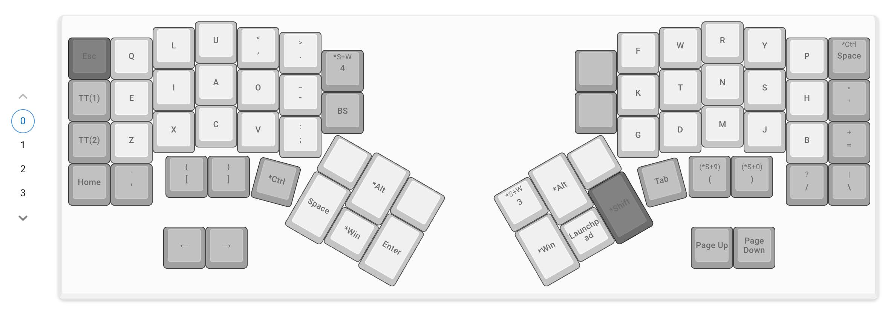
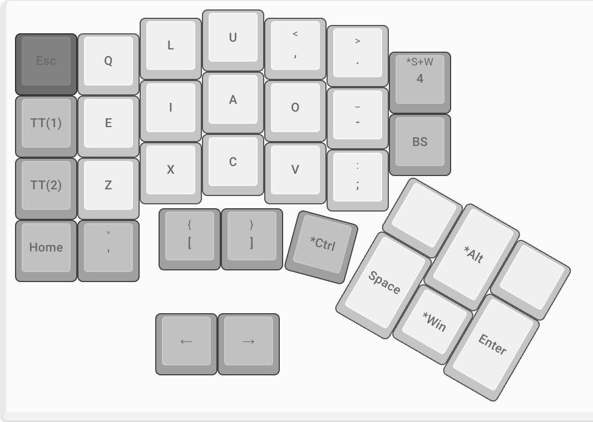
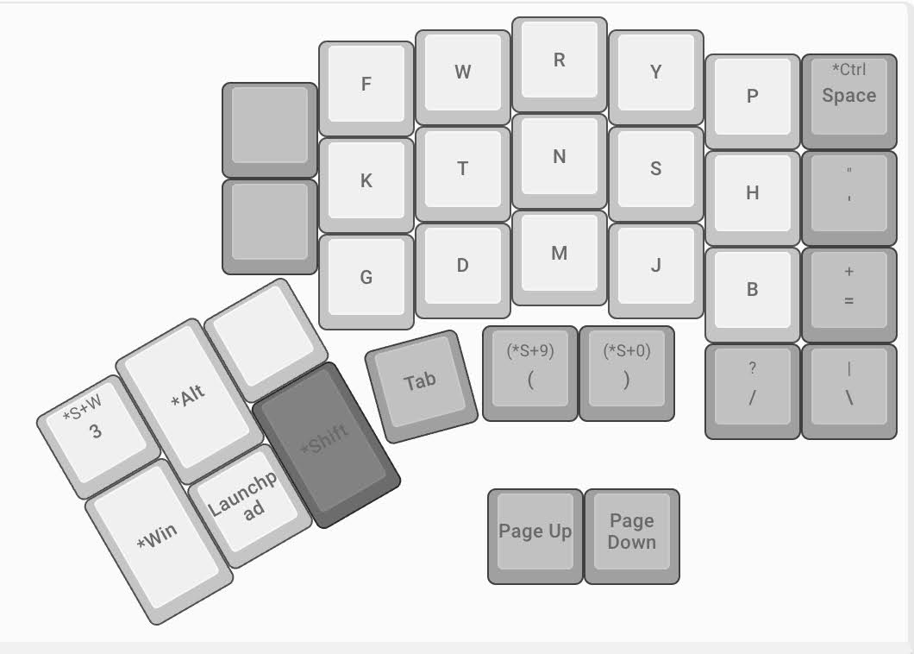

## 導入

先日、初めて自作キーボードキットをビルドした。『The Endpoint』という左右分割型のイカしたナイスガイである。

https://younagi.dev/ja/blog/split-keyboard-the-endpoint-build/

しかし人間(わたし)は欲深い生き物で、キーボードの自作が済んだら今度はキー配列までこねくり回したくなってしまった。

早速キー配列の沼に両足を突っ込んでみたところ、日本では「[大西配列](https://o24.works/layout/)」というキー配列が近年お熱らしく、開発者はあの大西琢磨氏だと言うではないか。[^1]

[^1]: TV で「ギフテッド」というレッテルを貼られて紹介されているのを観たことがあり、予め名前は知っていた。

同時に、「QWERTY(こ)の支配からの卒業」をモチベーションにしたキー配列が、他にも数多く存在していることを知った── そしてそのうえで、私は大西配列をパートナーに選んだ。
理由は後ほど、推しポイントとして漏れなく紹介するつもりだ。

### 想定読者

- 大西配列に興味があるが QWERTY から解脱できない
- 大西配列がプログラミング用途にどれ程耐えうるか知りたい
- 大西配列の使用感を知りたい

### 現時点での私の習熟度

記事執筆時点での私の習熟度は次の通り。

- 10 年間 QWERTY 配列で(盲目的に)ブラインドタッチを継続してきた
- 大西配列をはじめ、他のキー配列は試したことがない

## 本題

以降の話は、私が Mac & Linux ユーザである点を踏まえて読み進めて欲しい。

### キー配列の全体像

早速だが、キー配列の全体像はこのようになった。

大西配列が持ち込んだ"ルール"は全て遵守し、その他の部分で自分好みのカスタマイズを施した。「ルールは同棲生活の命運を左右するからね・・！」[^2]

[^2]: したことないけど！

#### キーカスタマイズの意図

「カスタマイズ」と銘打ってしまった以上、そこには何らかの意図が込められていて然るべきである── のだが、胸を張ってその意図を解説できるキーはあまり多くない。

以下はその希少な例である。

- **`Ctrl`と`Tab`:** 左手・右手側親指ホームポジションに配置
  - ブラウザのタブ移動が楽になる
- **`Space`:** 左手親指ポジションに配置
  - 文字入力時に最頻出するため、ほぼホームポジションに配置した
  - QWERTY 配列と同位置
- **`Cmd(Win)`:** 左手・右手親指ポジションに配置
  - これは本記事の主旨から逸れるが、キーボード右手のトラックボールを操作する際に右手親指で同時押しができると、ブラウザ上の「ページを別タブで開く」が楽になる
  - Mac を触っていると頻出するキーであるため、左手親指が届きやすい場所に配置
- **`Backspace`:** 左手人差し指に配置
  - QWERTY 時代に酷使した右手小指を労わるため
  - QWERTY 配列と同位置
- **`Esc`:** 左手左上端に配置
  - 生来、現実逃避をしがちな質であったため
  - QWERTY 配列と同位置

### 大西配列と過ごした濃密な一ヶ月

約一ヶ月、大西配列と同じ屋根の下生活を共にした。
ここではその同棲生活をあけすけに白状する。

#### 大西配列の推しポイント

恋は盲目── ひとたび恋に落ちればチョロい人間と化す私にとって、恋人の推しポイントを挙げることなど造作もなかった。

- **キー配列が覚えやすい**
  - `K`, `G`、`P`, `H`, `B`など子音の濁音・半濁音が清音の上下にある
  - ショートカットキーで頻出する`C`, `V`やその他`P`, `Q`などの配置が QWERTY 配列と同じ
    - QWERTY 配列からの移行が比較的容易
- **ローマ字入力が快適**
  - 母音が片手に集中し、主にローマ字入力で頻出する子音はもう一方の手のホームポジションにまとめられている
- **手の移動距離が激減することで疲労も軽減**
  - これは言うまでもないだろう

私にとって「キー配列が覚えやすい」点が最大の決め手となった。ベンチマークの観点からのみ言えば、大西配列よりも魅力的なキー配列は他に幾つかあったのだが、そのどれもが・・覚えづらかった。

対して、大西配列はベンチマーク上の数値、学習曲線、実際の使用感── これらの絶妙なバランスの上に成り立っている。
現に、既に手元を見ることなくボチボチ快適にタイピングができるようになった。付き合い始めてまだ一ヶ月だと言うのに。

#### ここが惜しいよ大西配列

恋は盲目── とはいえ、過去の失敗(意味深)から多くを学んだ私は、大西配列の残念なところも必死になって探してみた。

以下はその希少な例である。

- **やはり英語は若干打ちにくいことがある**
  - ベンチマークの数値から明らかなように、大西配列は英語入力があまり得意ではない[^3]
  - 個人的には、"can't", "list", "photo" などが同列運指上にある為、打ちづらいと感じた

[^3]: あくまで「ローマ字入力に比べると」「英語入力に特化した他のキー配列に比べると」などと相対的に見た場合である。決して苦手というレベルではなく、 QWERTY や一部のキー配列よりは遥かに得意である。

#### 大西配列 de プログラミング！

開☆発☆者(デベロッパ)として、大西配列がコーディング用途に耐えうるのか否かは是非とも確認しておきたいところだ。

・・とはいえ、大西配列ではカンマやピリオド、ダッシュなどの一部を除き、他の記号に関しては「どうぞよしなに」というスタンスをとっている。つまり、大西配列がコーディング用途に耐えうるかどうかは、ほとんどユーザの手にかかっているのだ。[^4]

[^4]: 後述するが、Vim(Neovim)使いは例外である。
QWERTY 配列で Vim(Neovim)のキーバインドに慣れ切ってしまった相当の手練れにとっては、この関係性は苦悩の連続であろう。

ここでもう一度、キー配列の全体像を確認しておこう。

コーディングで頻出する記号について、それぞれの配置は次のようになっている。

- `()`: 右手中指・薬指最下部に配置
  - 丸括弧はコーディングで再頻出であるため、QWERTY 配列と同じ指でタイプしたかった
- `[]` & `{}`: 左手中指・薬指最下部に配置
  - より頻出しそうな丸括弧を優先した
  - 覚えやすいように丸括弧に対応する左手の指に配置した
- `<>`: 置く場所が無かったため、後述の別レイヤーに配置
- `?` & `/`: 右手小指ホームポジションの下に配置
  - QWERTY 配列と同じ配置にし、学習コストを低減
- シングル・ダブルクォーテーション: 右手小指右端に配置
  - QWERTY 配列と似た配置にし、学習コストを低減
- バッククォーテーション & `~`: 左手小指最下部に設置
  - QWERTY 配列と似た配置にし、学習コストを低減

私がビルドした「[The Endpoint](https://younagi.dev/ja/blog/split-keyboard-the-endpoint-build/)」にはレイヤーが計 4 つあり、切り替え用のキーを用意すればレイヤー間を自由に行き来できる。
そこで、別レイヤーのホームポジションにも上記の括弧を配置し、より楽にタイピングができるように工夫を施してある。

## 結び

結論、私は今後も大西配列とお付き合いを続けていくつもりだ。しかし、その為には超えなければならない壁── Vim(NeoVim)との折り合い ──もまだある。より厳密には、彼ら特有のキーバインドとの折り合いである。

幸い、私は Vimmer としての年数が浅く、キーバインドのカスタマイズ等もまだまだこれからというフェーズである。故に、独自のクセが少なく、大西配列との折り合いをつけるのは比較的容易だと考えている。
この辺りが決着したら、その結果を改めて共有したいと思う。
