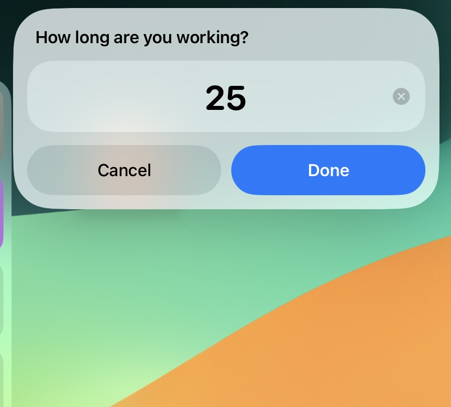
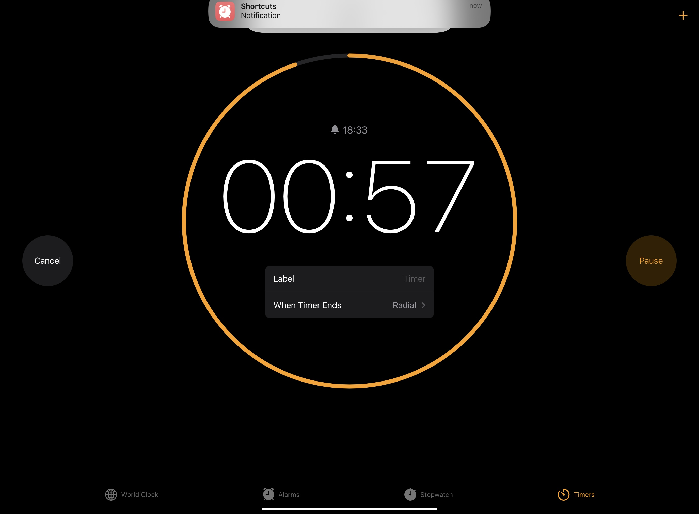

## 導入

> [!quote] ひと言
> — 一見非生産的に思えることはその逆にもなりえる

[ポモドーロテクニック(The Pomodoro® Technique)](https://www.pomodorotechnique.com/)は現代社会において人々の生産性を高める重要な役割を果たしています。そしてアプリ市場には数多のポモドーロタイマーアプリがあります。

しかし、私個人の要望をピッタリ満たしてくれるものは残念ながら見つかりませんでした。あるものは無料ユーザへの機能制限が厳しく、またあるものは「ポモドーロタイマーにそこまでは求めてない...」と思ってしまう程に機能が盛り沢山。
無いなら自分で作ろうということで、今回は Apple のショートカット機能を使って自作してみました。

> [!info]-ポモドーロテクニックとは？
> ポモドーロテクニックとは、物事に集中するのに決められたインターバルに時間を小分けし、短期間で集中・休憩を繰り返すというものです。大抵は25分間集中し、その後は小休憩をはさみます。このアプローチは常に能動的な思考を促し、特に先延ばし傾向を軽減したり深い集中に入りやすくするのに役立ちます。

### 想定読者

- 無料で便利なポモドーロタイマーが欲しい
- Apple のショートカット機能でポモドーロタイマーを作ってみたいが、サードパーティ製のアプリには頼りたくない

### 現時点での私の習熟度

記事執筆時点での私の習熟度は次の通りです。

- ソフトウェアエンジニアとして計 3 年の経験あり(勤続ではない)
- Apple ショートカット作成は 1 週間程度の経験のみ
- 5 つほどのショートカットを作成済み

## 本題

下記リンクから完成品をダウンロードできます。

https://www.icloud.com/shortcuts/b12a5c2e30484677b40a5f98b9e7774d

> [!warning]注意
> iOS/iPadOS/MacOS のユーザのみ利用可能です

### 設計コンセプト

- Apple 純正アプリ x ショートカット機能で作る
- 機能は最小限にとどめる
- ユーザ自身でカスタマイズ可能

### 使い方

ポモドーロタイマーの使用に際して、手順はこれだけです。

1. ショートカットのアイコンをタップかクリックして起動する(あらかじめホーム画面などに設置しておく)
2. 集中する時間を決める(デフォルトは 25 分)
3. 休憩する時間を決める(デフォルトは 5 分)

ここまでで、タイマーが画面表示されてカウントダウンが始まります。仕事(勉強)を始めましょう。

### ワークフロー

ポモドーロショートカットは裏で次のような流れに沿って動いています。仕組みに興味がなければ読み飛ばしても問題はありません。

**ショートカットはパラメータを受け取っているか？**

↪️はい。

- 連結文字列を分解してパラメータから集中＆休憩タイムをそれぞれ取り出す

> [!info]
> この処理については本章で後々説明があります

↪️いいえ。

- 集中タイムをユーザに聞く(分単位で)
- 休憩タイムをユーザに聞く(分単位で)

ここからは同じ流れに沿って動きます。

- 𝕏 集中＆休憩タイムを変数にセットする
- ✋数秒待つ
- ⏰時計アプリのタイマータブを開く
- 📢集中タイムが始まった旨をユーザに通知する
- 🔄集中＆休憩タイムに 60 を掛けて秒単位に変換する
- 𝕏 秒単位の集中タイムを変数にセットする
- ✋集中タイムの時間分待つ
- ⚠️続けるかどうか決定を促すアラートを表示する
  - キャンセルの場合ここで終了
- ⏰時計アプリのタイマータブを開く
- 📢休憩タイムが始まった旨をユーザに通知する
- 𝕏 秒単位の休憩タイムを変数にセットする
- ✋休憩タイムの時間分待つ
- ⚠️続けるかどうか決定を促すアラートを表示する
  - キャンセルの場合ここで終了
- 🔄分単位の集中＆休憩タイムを連結して文字列に変換する
- 𝕏 連結文字列を変数にセットする
- 🔛その変数を自身に渡してもう一度起動する

特筆すべきはこの再帰的とも言える構造とパラメータです。
ショートカットはパラメータを受け取ることができるので、そこで初回に設定した集中＆休憩タイムを渡してしまえば次回以降はわざわざ聞く必要もなくなるね、ということになります。
もしパラメータを受け取っていれば、文字列連結を分解してそこから集中＆休憩タイムを取り出しますが、無ければユーザに聞きます。
パラメータが渡らずにショートカットが起動するのは初回のみ、という想定です。

その他重要な点として、私の知る限りでは、Apple のショートカットには JavaScript の[async/await](https://developer.mozilla.org/en-US/docs/Web/JavaScript/Reference/Statements/async_function)のような機能がありません。その為、await の代わりに"xxx 待機"のブロックを使って、タイマーのカウントダウンとタイミングが合うようにしました。無理矢理な感じは否めません。

> [!question]+どうしてインターバルの時間を秒単位に直す必要があるの？
> "xxx 待機"のブロックが秒単位の数値しか受け付けないからです。

> [!question]+どうしてインターバルの時間を連結文字列にする必要があるの？
> "ショートカットを実行"のブロックは1つしかパラメータを受け付けないからです。なかなかの荒業ですね。

### 注意点

このショートカットを利用する際には、次の制限事項をご確認ください。

- Apple 純正の時計アプリと完全にシンクロしているわけではない
  - 先述のワークフローから逸脱したアクションはショートカットと時計アプリの同調を乱す原因になりえる
    - 例: アラートをボタン以外の箇所をタップして閉じる
      - ショートカットが止まり、時計アプリは動いたまま
    - 例: タイマーを直接時計アプリから調整する
      - 時計アプリに影響を及ぼすが、ショートカットは動いたまま

## 結び

ショートカットをインストールしたら、デフォルトの集中&休憩タイムなど、お好みでカスタマイズが可能です。

ちなみに、私はポモドーロショートカットをこのように愛用しています。

- iPhone & iPad のホーム画面からアイコンをタップして起動できる
- 勉強モードがオンになったら自動でタイマーを起動する
  - Apple ショートカットのオートメーションという機能で実装している

https://www.icloud.com/shortcuts/b12a5c2e30484677b40a5f98b9e7774d
