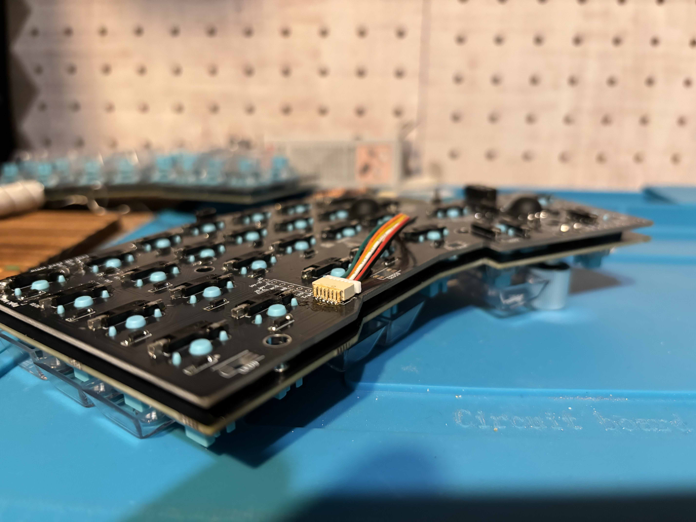
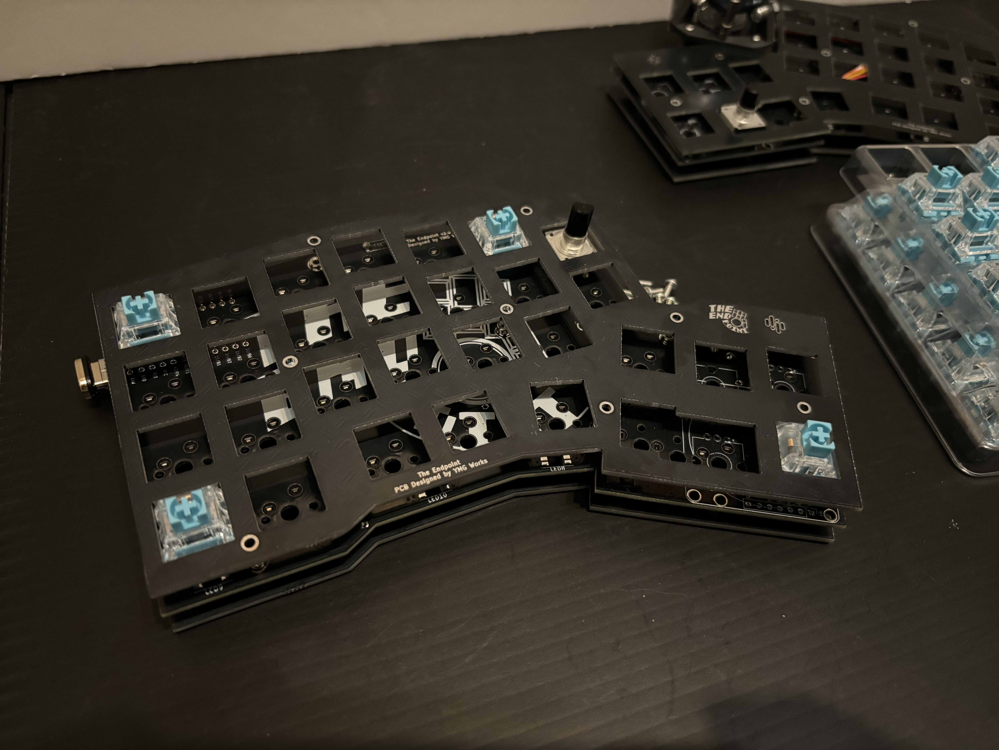

## 導入

2020 年に突入し、自作キーボード (略して「自キ」とも) 界隈に或る一大旋風が巻き起こっている。
その台風の目たる彼らは「左右分割型キーボード」を自称し、生産性・効率厨や、YouTube で突如としてデスクツアーを押っ始めてしまうようなデスクオタクらを中心にファンを獲得し続けているようだ。[^1]

[^1]: 私は 1 つのことをとことん突き詰められる彼らのような人たちを尊敬している。

彼らが他と明らかに異なるのは、文字通り左右が完全に分離している点である。これにより、ユーザは各々に合った肩幅でタイピングができるようになるのだ。「これぞ、エルゴノミクス・・！」

そして調査を続けるうち、いよいよお尻の辺りがムズムズして落ち着かなくなってしまった。そこで潜入捜査と称し、私も左右分割型キーボードに入門することと相成った。

ビルドしたのは「[The Endpoint](https://booth.pm/ja/items/5397024)」というキットで、作者は YMG WORKS さんという方だ。公式に分かり易いビルドガイドがあるので、組み立て方法はそちらを参照されたし。

https://note.com/underthrow_/n/n577c993cd733

https://note.com/underthrow_/n/n65385d90a76e

これ以降は、初心者による「The Endpoint」ビルド体験記を綴る。なお、ビルドの手順については上記公式ガイドが詳しいので、ここでは語らない。

### 想定読者

- 「The Endpoint」のビルドの様子を見てみたい
- 一般にキーボード自作キットのビルドにどんな手順をどのくらい踏まなくてはならないのか知りたい
- 電子工作一般に興味がある

### 現時点での私の習熟度

記事執筆時点での私の習熟度は次の通り。

- ビルドキットからのキーボード自作において完全な初心者
- これまでに 10 種類を超える既製品キーボードを使ってきた
- はんだ付けは小学校以来

## 本題

まず完成品はこちら。
キーキャップは透明にし、スイッチの色を活かす様式にした。

The Endpoint の素敵なところは、トラックボールの取り付け位置を左右それぞれの人差し指 or 親指ポジションの計 4 か所から選ぶことができる点である。更に、夢のデュアルトラックボール(両手にトラックボール)も実現可能とのこと。

私は、右手人差し指トラックボール、左手人差し指 & 右手親指ロータリーエンコーダーというオーダーでいくことにした。
なお LED は取り付けなかったが、キーボードレイヤー切り替えの目印にしたい気持ちが芽生えた為、今後追加で取り付けるかもしれない。[^2]

[^2]: 何かと理由をつけ、ただはんだ付けが恋しいだけである。

### 準備

キーボードの構成品として必要になったものは次の通りだ。

| 商品 | 価格(円) |
| --- | --- |
| The Endpoint ビルドキット | 25,000 |
| Pro Micro Type-C と 12ピンコンスルのセット x2 | 3,146 |
| トラックボール 34mm | 1,300 |
| ロータリーエンコーダー メタルつまみ x2 | 1,320 |
| ロータリーエンコーダープッシュスイッチ x2 | 660 |
| Type-C ケーブル | 2,580 |
| Type-C マグネットアダプタ L字型 | 1,988 |
| TRRS メタルケーブル | 1,100 |
| 遊舎工房 Fairy Silent Linear Switch x70 | 5,004 |
| Asimov Cherry Profile Transparent Keycaps Colorless | 9,350 |

その他、使用した工具類も認めておく。

- はんだごて
- はんだごで台
- はんだ吸い取り線
- プリント基板用はんだ 0.8mm
- フラックス液
- エポキシ樹脂接着剤
- 逆作用式ピンセット
- 精密ピンセット
- キーキャップ・キースイッチ用キープラー
- 紙やすり
- マスキングテープ
- 電子工作作業マット
- 小物ケース

キーキャップやキースイッチと併せると、優に 30,000 円を超えるシロモノであり、市販のキーボードと比べると決して安くはない。しかし、私は躊躇しなかった。そうして、理想郷への片道切符を手に、行き先の分からない電車へとせっせと乗り込んだ。

### ビルド開始

先述の通り、ここでは詳細なビルドガイドは掲載しない。代わりに、ビルド風景を軽く紹介しつつ、初心者として躓いたステップを時系列順で白状する。

::::card-grid
:::card

はんだ付け作業風景
:::
:::card

導通確認作業風景
:::
:::card

スイッチソケットはんだ付け作業
:::
::::

#### トラックボールユニットの組み立てが総じて大変

難しいというより大変な部類である。
本体のビルドが思いの外順調すぎるペースで進んでいたが、しっかりここでフラグが回収された。

どのように大変なのか、というとこのような感じだ。

- とにかくねじやナットの種類が多く、小さい
- 部品の取り付け向きが細かく決まっており、なかなかを神経を使う

#### トラックボールコネクタのはんだ付けが激ムズ

6 ピン SH コネクタを本体基盤にはんだ付けする作業があるのだが、これが非常に難しかった。
ここに至るまでに幾度となくはんだ付けをこなし、自身の華麗なはんだ捌きに酔いしれていた私の心は、見るもあっけなく打ち砕かれた。

最終的に 10 回ほどやり直しただろうか。はんだ吸い取り線はこの作業だけで 10cm 程費やしてしまった。

> [!info]
> トラックボールを動かしてもマウスカーソルがピクリとも動かない場合は、まずこのはんだ付けが上手くいっていないのだと疑おう。

#### プレートの取り付けが地味に大変

これが終われば、いよいよキースイッチやキャップの取り付けという一番ワクワクするフェーズに突入する──　のだが、人生そう甘くはなかった。
ゴールテープはもう目と鼻の先だったのだが、プレートの取り付けには想像以上に手こずった。

ビルドガイドにも書いてあるが、トッププレートを取り付ける際は、先に四隅だけでもキースイッチを差し込んでおくことが重要であった。[^3]
これは、何も考えずにそのままねじ締めを進めると、プレートが傾いてしまうからだ。
つまり、先にキャップで仮留めを行い、平衡感覚を保ったうえで、ねじをバランスよく締めていくという算段だ。

[^3]: 2024 年 11 月現在。今後、アップデートに伴い記載内容が変更される可能性は大いにある

> [!note]
> ねじ締めのコツは、ねじを一つずつ一気に締め上げるのではなく、各ねじを少しずつ締めて全体のバランスを確認しながら進めること。

### キーマップのカスタマイズ

The Endpoint のキーマップは [Remap](https://remap-keys.app/) でカスタマイズ可能だ。ブラウザ上で簡単に設定できて非常に有難い。

一点特筆すべきポイントとして、The Endpoint はマウスレイヤー自動切換えに標準対応している。[^4]
デフォルトではレイヤー3 が割り当てられており、トラックボールの動きを検知すると自動で切り替わり、止まると元のレイヤーに戻る。私は、レイヤー3 のホームポジション左手中指・人差し指のキーにそれぞれ左右クリックの任務を課している。

[^4]: 2024 年 11 月現在。

#### 新しいキー配列を試す

QWERTY 配列には幼少の頃からお世話になったが、別れを告げる時が来たのかもしれない。若干の寂寥感は拭えないが、最近何かとホットな「[大西配列](https://o24.works/layout/)」とお付き合いを始めた。

詳細は下記の記事を参照されたし。

https://younagi.dev/ja/blog/one-month-with-the-ohnishi-keyboard-layout-a-status-update/

## 結び

The Endpoint をビルドして 1 ~ 2 週間程使っているが、キーボードからマウスへの手の移動が無く、非常に快適だ。肩幅に合わせ自由にセッティングできるという、左右分割型キーボードの特権も存分に享受している。

一方で、トラックボールユニットにはカバーのようなものが付属しておらず、言わばお供え物状態である。キーボードを少し傾けるとトラックボールが勢いよく転がり落ちてしまう為、外出先で使用すればたちどころに迷子となること必至だ。
かく言う私も、はじめは自宅に据え置いて使うので問題ないと思っていたのだが、すぐに考えを改めた。
というのも、何かの拍子でキーボードを引っぱたいてしまった時、ボールがピンボールの如く空の彼方へ弾き出されてしまうのだ。[^5]

[^5]: 2 週間足らずで既に 3 回ピンボールをプレイし、いずれも思いがけない場所まで飛翔していた。

幸い、そして有難いことに、有志の方がカバーの 3D データを作成・公開してくれているので、このデータを拝借して 3D プリントをしようと画策中だ。

https://x.com/kepeoo/status/1787519812505407943

### 追記

2024 年 12 月下旬、先述のトラックボールカバーを作成し、取り付けまで完了した。

私は業者には発注せず、自前購入した 3D プリンタで作成した。丁度いいことに、「[Bambu Lab A1 mini](https://bambulab.com/ja-jp/a1-mini)」がセールで安くなっていたのだ。3D プリンタはいいぞ～。

### 謝辞

「The Endpoint」作者の YMG WORKS 様には、ビルドの際に何度も質問に答えていただくなど非常にお世話になった。初歩的な質問にも迅速かつ丁寧に回答いただいたこと、ここに感謝を申し上げたい。
