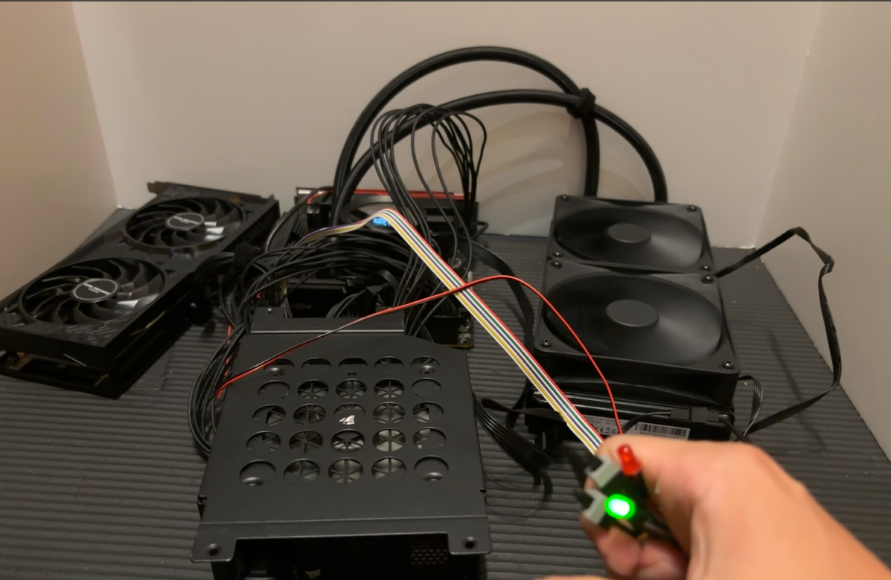

## 導入

> [!quote] ひと言
> — 私の日常: 自分の力を過信して難易度の高い目標を設定する、失敗する、後悔する、以下これを繰り返す

自作 PC についてはネット上に数多のチュートリアルや説明がありますが、その多くはその道の熟練者やエキスパートの視点からなされているように感じました。

完全な初心者として、始めての PC 自作にあたって道中苦戦したポイントをまとめました。遭遇したエラーについても言及しています。

### 想定読者

背景知識は特に必要ありません。PC を自作してみたいという熱意さえあれば・・！

- PC を自作してみたいが何をすればいいのか、何から始めたらいいのか分からない
- ちょうど今 PC を自作していてエラーに苦しんでいる
- Mini-ITX の PC を組み立てる様子が知りたい

### 現時点での私の習熟度

記事執筆時点での私の習熟度は次の通りです。

- PC 自作において完全な初心者
- PC は 10 年以上使い続けている

## 本題

パーツの選定から OS のインストールまで、およそ 1 ヶ月かかりました。こちらが詳細なスケジュールです。

1. **パーツ選定:** 1 週間
2. **パーツ調達:** 3~4 日間
3. **PC の組み立て:** 2 日間
4. **エラーの修正:** 2 週間
5. **OS のインストール:** 1 日

### PCのパーツ選定

私が選んだパーツの一覧はこちらです。初心者の方は、PC を組むのに必要なパーツの全体像としてご参考までに。

---
::::card-grid
:::card

**Lian Li A4-H2O**
PC ケース
:::
:::card

**AMD Ryzen™ 5 7600X**
CPU
:::
:::card

**玄人志向 GALAKURO GAMING NVIDIA GeForce RTX 4060ti**
GPU
:::
:::card

**ASRock B650E PG-ITX WiFi**
マザーボード
:::
:::card

**Corsair SF750**
電源ユニット
:::
:::card

**NZXT KRAKEN 240 RL-KN240-B1**
CPU クーラー
:::
:::card

**Crucial DDR5 Pro 16GB x 2**
メモリ
:::
:::card

**Crucial T500 500GB PCIe Gen4 NVMe M.2 SSD**
ストレージ
:::
::::
---

「Mini-ITX」というのはマザーボードの規格の一種です。一般的な選択肢の中では最小で、サイズの観点から組み立てが最も難しいと言われています。どのくらい小さいかというと、下図の通りです。

基本的に、パーツ選定の早い段階でまずマザーボードとその規格を決めます。その後、他の PC ケースや電源ユニットなどのパーツを順次決めていきます。これは、マザーボードの規格によって対応する他のパーツの選択肢が絞られるからです。

私は次のような順番でパーツを決めていきました。PC ケースを真っ先に選ぶのはあまり一般的でないかもしれません。[^1]

[^1]: 私の場合、PC の自作を決意したきっかけが PC ケースでした。YouTube で「Lian Li A4-H2O」のケースを使って自作 PC を組み立てる動画を視聴した時、その洗練されたデザインに一目ぼれしました。自作 PC といえば龍の目や巨大なゲーミング PC なんかを想像していたもので・・。

1. PC ケース
2. CPU、マザーボード
3. CPU クーラー、電源ユニット
4. GPU
5. メモリ、ストレージ

> [!warning]+
> 個人的な見解ですが、私のような初心者の方には Mini-ITX の PC はあまりお勧めしません。ケーブル配線まわりが結構大変だったからです。あとは種類が少なくニッチだからか、他のケースより割高だった気がします。(2024年9月現在)

#### 要件定義

今回の PC は開発用のワークステーションとして作りました。つまり、ゲーミング PC のように高負荷な用途では使用しないということです。これを踏まえ、次のように要件を定義しました。

- **コスト:** できる限り安く
  - CPU と GPU に関してはよりお手頃なものを選んだ
- **サイズ:** できる限りコンパクトに
  - Mini-ITX 以外考えられなかった
- **パフォーマンス:** コーディングやブラウジングが快適にできる
  - CPU と GPU はそれほど高性能でなくてもよい

### Mini-ITX PC を作ろう！

PC の組み立て自体は数日程度しかかかりませんでしたが、その道中やその後に多くの苦難が待ち受けていました。

> [!note]
> 組み立ての際は各パーツに付属している取扱説明書を熟読するべし！

#### トラブル其の一: ケーブル配線まわり

まず一番悩んだのがケーブル配線まわりです。最終的に配置を決定するまでに何度も組み立てたものを元に戻したり、解体したりしました。これは Mini-ITX に特に当てはまるかもしれません。

電源ケーブルが GPU のファンと接触しそうになったり、CPU クーラーの極太ケーブルの扱いに苦戦したり、電源ユニットから生えている無数のケーブルがただでさえ狭い Mini-ITX ケースを圧迫したり、等々。

ちなみに、ケーブル類をまとめるのにマジックテープの結束バンドがあると便利です。私は DAISO で購入しました。上記の写真から分かるように、とても汎用性が高いです。

> [!note] 教訓
> - ケーブル配線まわりはとても奥深い
> - マジックテープの結束バンドはケーブルをまとめるのに非常に役立つ

#### トラブル其の二: 真っ黒なモニター

ケーブル地獄を抜けて、何とか PC の電源を入れるところまで漕ぎつけました。CPU クーラーも問題なく動きました。ところが、モニターに何も映りません。数分待っても真っ黒な状態です。

テキストのエラーメッセージで状況を教えてくれる、何てことがあるはずもなく、どう修正したらいいか皆目見当もつかず。ここで、私のグーグル検索スキルが役に立ちました。沢山の有益な情報を基に、どうやらマザーボードに取り付ける検証用のブザースピーカーと LED ランプがあれば、エラーの原因を特定できるらしいことが分かりました。

早速ブザースピーカーと LED ランプのセットを追加購入し、マザーボードに取り付けてみました。

結果、エラーの原因はメモリにあることが判明しました。そこでメモリを数回抜き差ししましたが、解消せず。ここにきてメモリの販売店に問い合わせたところ、無償交換ができるとのこと。

> [!info]+
> 私の場合、ビープ音が3回鳴りましたが、これはメモリに問題があることを示唆しているようでした。ビープ音のパターンとエラー原因の関係性は、マザーボードが採用しているBIOSの種類によって異なります。

驚いたことに、メモリを交換しただけでエラーは解消され、無事に BIOS/UEFI メニューがモニターに表示されました。最初からいきなりはずれを引くという不運・・。

> [!note] 教訓
> - PCが動かない場合に備えて、マザーボードの検証用ブザースピーカーとLEDランプ、スイッチモジュールも持っておくとよい
> - PCのパーツにおいては今回のように不良品を引くということはざらにあるらしい
> - メーカーや販売店の保証期間内でかつ保証の範囲内であれば、パーツの無償交換などのサポートを受けられることを心得るべし
> - 保証書類は安全な場所に保管するべし

#### トラブル其の三: SSDが認識されない

やっとの思いで BIOS/UEFI メニューが映し出され、天にも昇れる気分でした。しかし一難去ってまた一難。

BIOS の設定を一通り眺め、OS インストール用のフラッシュメモリを用意し、ほとんど OS のインストールも終わりかけていた頃、こんなエラーが立ちはだかります。
"The installer failed to create a partition table on USB Flash Drive.(インストーラが USB フラッシュドライブへのパーティションテーブル作成に失敗しました。)"。

Linux OS のインストールも初めてだったからか、初めは自分のパーティショニングに問題があるのだろうと思っていました。しかし、それらは今回のエラーに何ら関係ないことが分かりました。 - 私は何かがおかしいことに気づきます。そもそも SSD が認識されていないじゃないか。

まとめると、私は次のような手順を踏む羽目になりました。

1. マザーボードと互換性のある SSD リストをたまたま見つけ、自分が買ったものはサポート外であることを知った
2. 互換性のある SSD を買いなおし、取り替えたものの解決せず・・
3. ASRock (マザーボードのメーカー) のサポートチームにアドバイスを求めた
4. 返事があり、その中で提案された 3 つの方法を試した
    1. CMOS クリア → 解消せず
    2. SSD を再度設置しなおす **→ 解消!**
    3. BIOS/UEFI アップデート → 解消せず
5. No.2 の手順を試し、SSD が無事認識された！

ところで、[この写真](#mini-itx-pc-を作ろう)に写っている SSD と[このパーツ一覧](#pcのパーツ選定)の SSD が違うことに気づいたでしょうか？(WD SN770 1TB vs. Crucial T500 500GB) これは盛大な伏線だったのです。

{/* textlint-disable ja-technical-writing/no-doubled-conjunctive-particle-ga */}
何にせよ、SSD をしっかり取り付けていなかったがために多大な時間を、マザーボードのサポートリストを見落としていたがためにお金を浪費するという下手をこいてしまいました・・。

> [!note] 教訓
> - SSDはスロットにしっかり入っているか注意深く確認すべし。他のパーツと違って正しく設置された時に音を立てたりしてはくれない
> - 購入したマザーボードとの対応が確認されているSSDやメモリ、CPUのサポートリストは必ず確認すべし

### Linux OS をインストールする

これで何とか OS のインストールも完了しました。私は純粋関数型 Linux ディストリビューションを謳っている[NixOS](https://nixos.org/)を選びました。詳しくは、以下の記事をご覧ください。

(🚧Coming soon...)

## 結び

### 初心者目線で厄介に感じたこと

熟練者が当たり前だと思うことは必ずしも初心者にとってそうではありません。私が PC 自作の初心者として厄介だと感じたことを幾つか挙げます。

- **メモリ & ストレージの互換性:**
  - たとえメモリや SSD の規格やインターフェイスにおいてマザーボードと互換性があったとしても、うまく動いてくれないものもある
    - 規格やインターフェイスの例: メモリだと「DDR4」や「DDR5」、ストレージだと「PCIe 第○○世代」「SATA」等
  - メーカーやその中の或る特定の製品によっても、マザーボードが対応しないこともある
  - メーカーの公式ウェブサイトを確認することを強くお勧めする
    - 大抵はメモリや SSD、CPU のサポートリストが掲載されている
    - 私の場合は、[こちらのページ](https://pg.asrock.com/mb/AMD/B650E%20PG-ITX%20WiFi/index.jp.asp#Support)
- **どうやってエラーの原因を特定するの？:**
  - コーディングと違い、PC 自作においてはテキストのエラーメッセージで親切に原因を教えてくれることはない
  - 結局、エラー解消の為に検証用のブザースピーカーと LED ランプを購入する必要性が生じた
    - この情報自体も、YouTube の有益な動画がなかったら辿り着けなかったかもしれない
- **CPUグリスはいずこへ？**:
  - CPU グリスは大抵 CPU クーラーに付属しているということは事前に調査済みだったが、見つけられず(私は探すのに箱をひっくり返しさえしました・・)
  - ズボンに白いものが付着していることに気づき、そこでようやくクーラーに直接塗布されていることに気が付いた！
  - 「付属」と聞いたら容器に入ってる様子を想像しませんか・・？

道中、私のように予期せぬエラーに遭遇するかもしれませんが、最後にはきっと何とかなります。上手くいっているときはその調子で、そうでないときは何とか堪えて完走してください！

BIOS/UEFI メニューがはじめてモニターに映し出された瞬間を私は忘れません。あの時の興奮は筆舌に尽くしがたいものがありました。
