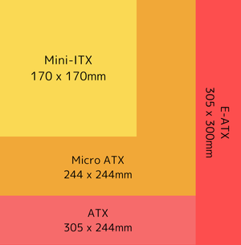

## 導入

> [!quote] ひと言
> — 私の日常: 自分の力を過信して難易度の高い目標を設定する、失敗する、後悔する、以下これを繰り返す

生来、自分の力を過信して身の丈に合わない高い目標を設定しがちな質であるが、今回もまたやってしまった。PC 自作の完全な初心者が、Mini-ITX の PC に手を出してしまったのだ。

これは、そんな向こう見ずのビギナーが無謀にも Mini-ITX PC 自作の登頂に挑むドキュメンタリーである。

### 想定読者

背景知識は特に必要ない。PC を自作してみたいという熱意さえあれば・・！

- PC を自作してみたいが何をすればいいのか、何から始めたらいいのか分からない
- ちょうど今 PC を自作していてエラーに苦しんでいる
- Mini-ITX の PC を組み立てる様子が知りたい

### 現時点での私の習熟度

記事執筆時点での私の習熟度は次の通り。

- PC 自作において完全な初心者
- PC の使用歴は 10 年以上

## 本題

パーツの選定から OS のインストールまで、およそ 1 ヶ月を要した。スケジュールはこのようになった。

1. **パーツ選定:** 1 週間
2. **パーツ調達:** 3~4 日間
3. **PC の組み立て:** 2 日間
4. **エラーの修正:** 2 週間
5. **OS のインストール:** 1 日

エラーの修正に 2 週間もの月日が流れている点から、何かを感じ取ってほしい。

### PCのパーツ選定

私が選んだパーツの一覧はこちら。PC を組むのに必要なパーツの全体像として参考になれば幸いだ。

---
::::card-grid
:::card

**Lian Li A4-H2O**
PC ケース
:::
:::card

**AMD Ryzen™ 5 7600X**
CPU
:::
:::card

**玄人志向 GALAKURO GAMING NVIDIA GeForce RTX 4060ti**
GPU
:::
:::card

**ASRock B650E PG-ITX WiFi**
マザーボード
:::
:::card

**Corsair SF750**
電源ユニット
:::
:::card

**NZXT KRAKEN 240 RL-KN240-B1**
CPU クーラー
:::
:::card

**Crucial DDR5 Pro 16GB x 2**
メモリ
:::
:::card

**Crucial T500 500GB PCIe Gen4 NVMe M.2 SSD**
ストレージ
:::
::::
---

ところで、「Mini-ITX」というのはマザーボードの規格の一種である。一般的な選択肢の中では最小で、サイズの観点から組み立てが最も難しいと言われている。どのくらい小さいかというと、下図の通りだ。

基本的に、パーツ選定の早い段階でまずマザーボードとその規格を決める。その後、他の PC ケースや電源ユニットなどのパーツを順次決めていくのが通例であるようだ。マザーボードの規格によって、対応する他のパーツの選択肢が絞られるからだ。

私は次のような順番でパーツを決めた。PC ケースを真っ先に選ぶのはあまり一般的でないと思われる。[^1]

[^1]: 私の場合、PC の自作を決意したきっかけが PC ケースだった為、パーツ選定のダイヤが一部乱れている。
YouTube で「Lian Li A4-H2O」のケースを使って自作 PC を組み立てる動画を視聴し、その洗練されたデザインに一目ぼれした。「自作 PC といえば龍の目じゃなかったのか・・！」と衝撃を受けたものだ。

1. PC ケース
2. CPU、マザーボード
3. CPU クーラー、電源ユニット
4. GPU
5. メモリ、ストレージ

> [!warning]+
> 個人的な見解だが、私のような初心者には Mini-ITX の PC はあまりお勧めしない。というのも、ケーブル配線まわりが結構大変であった。あとは種類が少なくニッチだからか、他のケースより割高だった気がする。(2024年9月現在)

#### 要件定義

今回の PC は開発用のワークステーションとして作った。つまり、ゲーミング PC のように高負荷な用途では使用しないということだ。これを踏まえ、次のように要件を定義した。

- **コスト:** できる限り安く
  - CPU と GPU に関してはよりお手頃なものを選んだ
- **サイズ:** できる限りコンパクトに
  - Mini-ITX 以外考えられなかった
- **パフォーマンス:** コーディングやブラウジングが快適にできる
  - CPU と GPU はそれほど高性能でなくてもよい

### Mini-ITX PC を作ろう！

PC の組み立て自体に要したのは数日程度であったが、その道中や道後に多くの苦難が待ち受けていた。

> [!note]
> 組み立ての際は各パーツに付属している取扱説明書を熟読するべし！

#### トラブル其の一: ケーブル配線まわり

まず一番悩んだのがケーブル配線まわりだ。最終的に配置を決定するまでに何度も組み立てたものを元に戻したり、解体したりした。これは Mini-ITX に特に当てはまる難所であろう。

電源ケーブルが GPU のファンと接触しそうになったり、CPU クーラーの極太ケーブルの扱いに苦戦したり、電源ユニットから生えている無数のケーブルがただでさえ狭い Mini-ITX ケースを圧迫したり、等々。

ちなみに、マジックテープの結束バンドはケーブル配線に革命をもたらすゲームチェンジャーである。[^2] 上記の写真から分かるように、非常に汎用性が高い。

[^2]: 私は DAISO で購入した。

> [!note] 教訓
> \> ケーブル配線まわりはとても奥深い
> \> マジックテープの結束バンドはケーブルをまとめるのに非常に役立つ

#### トラブル其の二: 真っ黒なモニター

ケーブル地獄を抜け、何とか PC の電源を入れるところまで漕ぎつけた。
CPU クーラーも問題なく動き、「7 合目に差し掛かったあたりかな？」と持ち前の楽観主義が頭をもたげてくる。ところが、モニターに何も映らない。数分待っても真っ黒な状態である。

何か分かり易いエラーメッセージが表示されるはずもなく、どう修正したらいいか皆目見当もつかず。立ち尽くしてしまう。
しかしどの山にも先人は居るもので、ネット上の潤沢な情報資源を基に、検証用のブザースピーカーと LED ランプがあればエラーの原因を特定できるらしいことが判明した。まことに、少しのことにも、先達はあらまほしきことなり。

早速ブザースピーカーと LED ランプのセットを追加購入し、マザーボードに取り付けてみた。

結果、エラーの原因はメモリにあることが判明。そこでメモリを数回抜き差ししてみたが、解消せず。ここにきてメモリの販売店に問い合わせたところ、無償交換ができるとのこと。

> [!info]+
> 私の場合、ビープ音が3回鳴ったが、これはメモリに問題があることを示唆しているようだ。尚、ビープ音のパターンとエラー原因の関係性は、マザーボードが採用しているBIOSの種類によって異なる。

驚いたことに、メモリを交換しただけでエラーは解消され、無事に BIOS/UEFI メニューがモニターに表示された。最初からいきなりはずれを引くとは、ビギナーズラックという言葉は存在しなかったのか・・。

> [!note] 教訓
> \> PCが動かない場合に備えて、マザーボードの検証用ブザースピーカーとLEDランプ、スイッチモジュールも持っておくとよい
> \> PCのパーツにおいては今回のように不良品を引くということはざらにあるらしい
> \> メーカーや販売店の保証期間内でかつ保証の範囲内であれば、パーツの無償交換などのサポートを受けられることを心得るべし
> \> 保証書類は安全な場所に保管するべし

#### トラブル其の三: SSDが認識されない

やっとこさ BIOS/UEFI メニューが映し出され、天にも昇れる気分に浸る。「よし、頂上が見えてきたぞ・・！」しかし一難去ってまた一難。

BIOS の設定を一通り眺め、OS インストール用のフラッシュメモリを用意し、ほとんど OS のインストールも終わりかけていた頃、こんなエラーが立ちはだかった。

> [!quote]
> "The installer failed to create a partition table on USB Flash Drive.(インストーラが USB フラッシュドライブへのパーティションテーブル作成に失敗しました。)"。

Linux OS のインストールも初めてだったからか、初めは自分のパーティショニングに問題があるのだろうと思っていた。しかし、それは全くの見当違いであった。ー 私はその違和感の正体に気づいた。「・・そもそも SSD が認識されていないじゃないの」

まとめると、私は次のような手順を踏む羽目に陥った。

1. マザーボードと互換性のある SSD リストをたまたま見つけ、自分が買ったものはサポート外であることを知った
2. 互換性のある SSD を買いなおし、取り替えたものの解決せず・・
3. ASRock (マザーボードのメーカー) のサポートチームにアドバイスを求めた
4. 返事があり、その中で提案された 3 つの方法を試した
    1. CMOS クリア → 解消せず
    2. SSD を再度設置しなおす **→ 解消!**
    3. BIOS/UEFI アップデート → 解消せず
5. No.2 の手順を試し、SSD が無事認識された！

ところで、[この写真](#mini-itx-pc-を作ろう)に写っている SSD と[このパーツ一覧](#pcのパーツ選定)の SSD が違うことにお気づきだろうか？(WD SN770 1TB vs. Crucial T500 500GB) これは盛大な伏線だったのだ。

ちなみに、SSD の取り付けに問題があるという心当たりは薄っすらとあった。取扱説明書を頼りに取り付けてみたものの、何か拭いきれない違和感が纏わりついて離れなかった。あれは取り付けに少々コツが要るよなあ。

{/* textlint-disable ja-technical-writing/no-doubled-conjunctive-particle-ga */}
何にせよ、SSD をしっかり取り付けていなかったがために多大な時間を、マザーボードのサポートリストを見落としていたがためにお金を浪費するという下手をこいてしまった。弾丸登山は危険なので止めましょう。

> [!note] 教訓
> \> SSD はスロットにしっかり入っているか注意深く確認すべし。他のパーツと違い、正しく取り付けた時に「カチッ」などと音を立てたりしない
> \> SSD 取り付けのコツは、SSD に 20~30° 程角度を付けて何度かスロットに先端を出し入れしながら正しいポジションを探ること
> \> 購入したマザーボードとの対応が確認されているSSDやメモリ、CPUのサポートリストは必ず確認すべし

### Linux OS をインストールする

これで何とか OS のインストールも完了。OS には、純粋関数型 Linux ディストリビューションを謳っている[NixOS](https://nixos.org/)を採用。詳しくは、以下の記事を参照されたし。

(🚧Coming soon...)

## 結び

{/* textlint-disable ja-technical-writing/no-doubled-joshi */}
頂上が見えたあの瞬間 ー BIOS/UEFI メニューが初めてモニターに映し出された瞬間 ー の興奮は筆舌に尽くしがたい。

この登頂記録が誰かの役に立つことを願っている。

### 初心者目線で厄介に感じたこと

熟練者目線では語れない、初心者だからこそ気づける事もある。私が PC 自作の初心者の目線から厄介だと感じたことを幾つか挙げておく。

- **メモリ & ストレージの互換性:**
  - たとえメモリや SSD の規格やインターフェイスにおいてマザーボードと互換性があったとしても、うまく動いてくれないものもある
    - 規格やインターフェイスの例: メモリだと「DDR4」や「DDR5」、ストレージだと「PCIe 第○○世代」「SATA」等
  - メーカーやその中の或る特定の製品によっても、マザーボードが対応しないこともある
  - メーカーの公式ウェブサイトを確認することを強くお勧めする
    - 大抵はメモリや SSD、CPU のサポートリストが掲載されている
    - 私の場合は、[こちらのページ](https://pg.asrock.com/mb/AMD/B650E%20PG-ITX%20WiFi/index.jp.asp#Support)
- **どうやってエラーの原因を特定するのだろう？:**
  - コーディングと違い、PC 自作においてはエラーメッセージが親切に原因を教えてくれることはない
  - 結局、エラー解消の為に検証用のブザースピーカーと LED ランプを購入する必要性が生じた
    - 熟練者には常識かもしれないが、少なくとも私は戸惑った
- **CPUグリスはいずこへ？**:
  - CPU グリスは大抵 CPU クーラーに付属しているということは事前に調査済みだったが、見つけられず [^3]
  - ズボンに白いものが付着していることに気づき、そこでようやくクーラーに直接塗布されていることに気が付く
  - 「付属」と聞いて、てっきり容器に入ってるものと決めつけていた

[^3]: 私は探すのに、豪快に箱をひっくり返しさえした。何ともお恥ずかしい話である。
