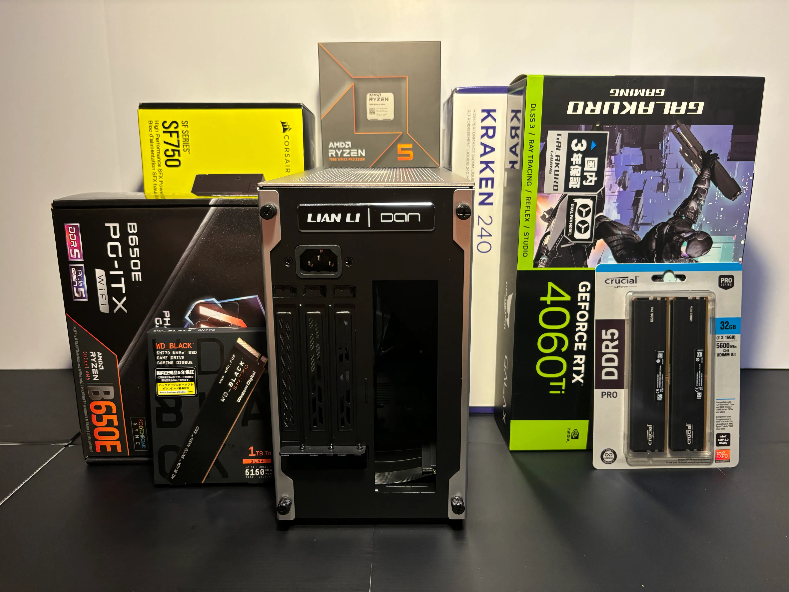

## The gist

- Built a PC from parts selection and it took me almost a month
- Tweaked around this website fixing bugs, adding new features, posting articles
- Bought a Mac Studio M2 MAX

## My Homebuilt PC

Since this August, I started planning to build my homebuilt PC from scratch. As a total newbie, I finally managed to get it done after a lot of twists and turns. It took me almost a month from planning to the OS installation.

1. **Select parts:** 1 week
2. **Procure parts:** 3~4 days
3. **Build the PC:** 2 days
4. **Fix errors:** 2 weeks
5. **install the OS:** 1 day

https://younagi.dev/blog/total-newbie-builds-mini-itx-linux-pc/

## This Website Improved

Since [the first news](https://younagi.dev/news/created-my-personal-website/) posted, I've been tweaking around this website on a daily basis. Here are some of the outcomes.

- New articles published
  - 5 articles in total as of Sep 11 2024
- The card layout component created
  - See [this page](https://younagi.dev/tools/) for example
- The five star rating component created
  - See articles categorized as "Learning"
  - The easy-to-hard level rating is it

## Mac Studio M2 Arrives

I bought a Mac Studio M2 MAX. When it comes to the Studio Display, I'm going to buy if the price goes down to ~~a decent~~ an affordable level, maybe.

For the time being, I'm going to use the M2 Mac Studio for creative work and the homebuilt PC for coding respectively.
