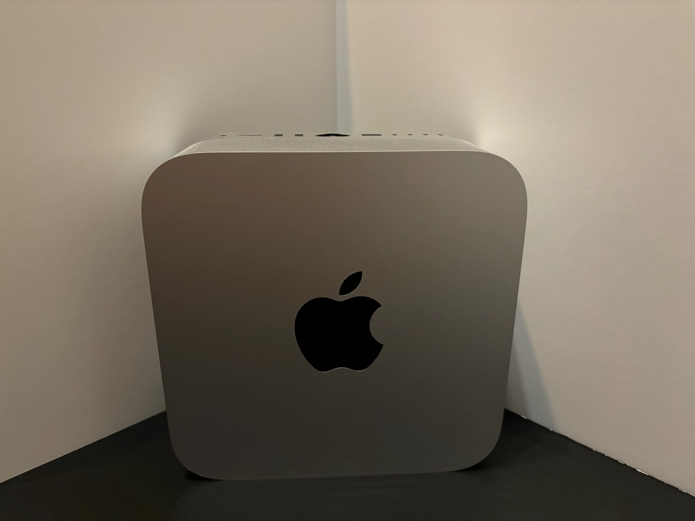

## 概要

- パーツ選定から始めて自作 PC を完成させたがおよそ 1 ヶ月かかった
- バグ修正や新機能、記事の投稿などで当サイトをテコ入れしていた
- Mac Studio M2 MAX を買った

## 自作PC

今年 8 月に、ゼロからの自作 PC 製作に取り掛かりました。初心者なりに紆余曲折ありましたが何とか完成しました。計画から OS のインストールが済むまでにおよそ 1 ヶ月。

1. **パーツ選定:** 1 週間
2. **パーツ調達:** 3～4 日
3. **PC組み立て:** 2 日
4. **エラー修正:** 2 週間
5. **OSのインストール:** 1 日

## 当サイトの改善

[最初のニュース記事](https://younagi.dev/news/created-my-personal-website/)が投稿されてからというもの、日に日に当サイトのテコ入れをしていました。これらがその成果の一部です。

- 新記事が投稿された
  - 2024 年 9 月 11 日時点で 5 記事
- カードレイアウトのコンポーネントが作成された
  - 例: [愛用ツール一覧ページ](https://younagi.dev/tools/)
- 5 つ星評価コンポーネントが作成された
  - 「学び」カテゴリの記事を参照のこと
  - 「易しい～難しい」の難易度表記

## Mac Studio M2 が到着

Mac Studio M2 MAX を購入しました！Studio Display も買ったのかって？...いつかもう少しまともな値段になったら買います多分...。(見た目の感じはとても好みなんですがね)

当面は M2 Mac Studio を創作活動に、自作 PC をコーディング用途に充てる予定です。
