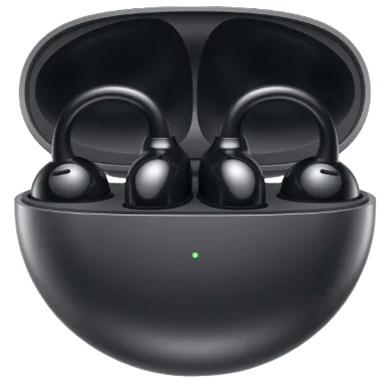
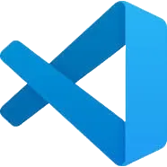
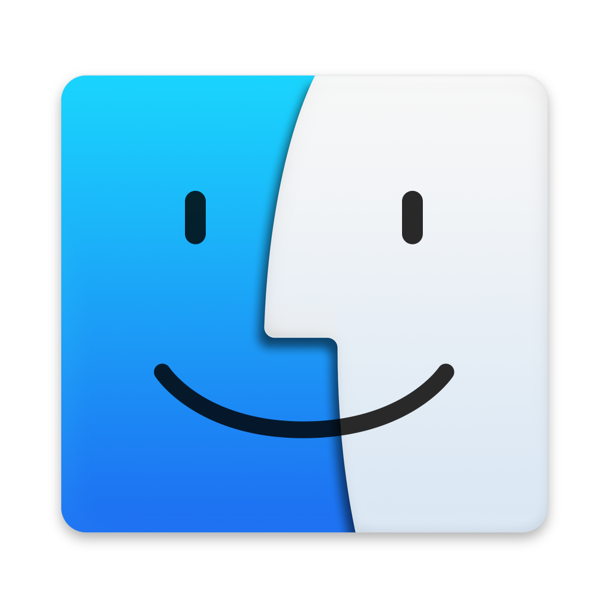
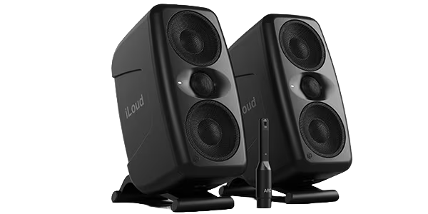
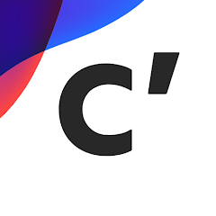
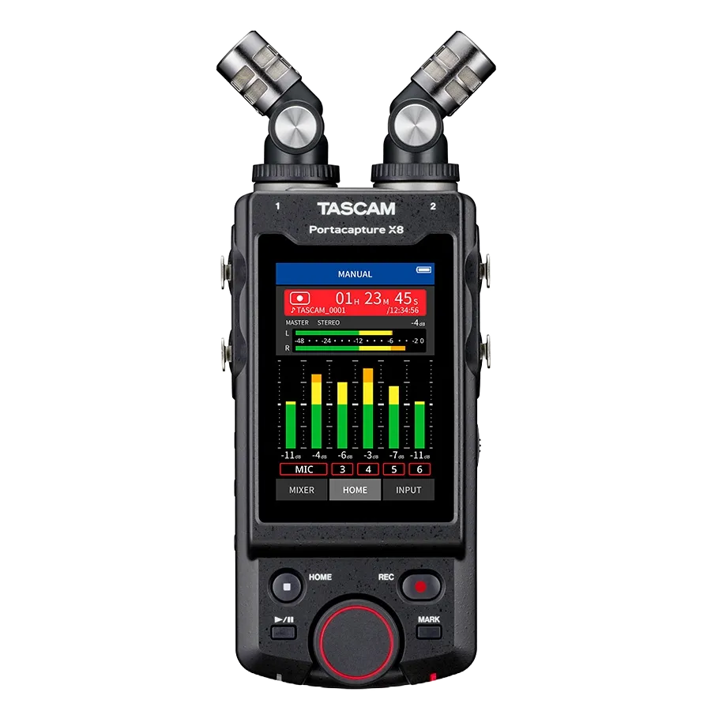

## Daily Use

::::card-grid
:::card

**iPhone 15 Black**
:::
:::card

**iPad Pro Gen7(M4) 13inch Space Black**
:::
:::card

**Mac Studio Gen2(M2 Max)**
:::
:::card

**HUAWEI FreeClip Black**
Bluetooth Earphones
:::
:::card

**Kindle Oasis 2019**
E-book Reader
:::
:::card

**The Endpoint**
A split keyboard
:::
::::

---

::::card-grid
:::card

**Obsidian**
Personal Knowledge Base
:::
:::card

**GoodNotes**
Tablet Note App
:::
:::card

**Anki**
Spaced Repetition Learning
:::
:::card

**Drafts**
Quick-memo App
:::
:::card

**Kindle**
E-book Reader App
:::
:::card

**Spotify**
Music Streaming Service
:::
::::

### My Homebuilt PC

It's mainly used for coding. (Built in Aug 2024)

::::card-grid
:::card

**Lian Li A4-H2O**
PC case
:::
:::card

**AMD Ryzen™ 5 7600X**
CPU
:::
:::card

**玄人志向 GALAKURO GAMING NVIDIA GeForce RTX 4060ti**
GPU
:::
:::card

**ASRock B650E PG-ITX WiFi**
Motherboard
:::
:::card

**Corsair SF750**
Power Supply
:::
:::card

**NZXT KRAKEN 240 RL-KN240-B1**
CPU Cooler
:::
:::card

**Crucial DDR5 Pro 16GB x 2**
Memory
:::
:::card

**Crucial T500 500GB PCIe Gen4 NVMe M.2 SSD**
Storage
:::
::::

## Development

:::card

**NixOS x Home Manager**
Purely functional Linux Distro
:::

---

::::card-grid
:::card

**Cloudflare**
DNS, Hosting Service, Cyber Security, and More
:::
:::card

**Docker**
Platform for Containerized Apps
:::
::::

---

::::card-grid
:::card

**Visual Studio Code**
Code Editor
:::
:::card

**Neovim**
Text Editor
:::
::::

## Arts

:::card

**MacOS**
:::

### Music

::::card-grid
:::card

**RME Babyface Pro FS**
Audio Interface
:::
:::card

**audio-technica ATH-R70x**
Open-ear Headphones
:::
:::card

**IK Multimedia iLoud MTM MKII**
Monitor Speaker Pair
:::
:::card

**Native Instruments KONTROL S49 MK3**
MIDI Keyboard
:::
:::card

**Native Instruments MASCHINE MK3**
Hard-sampler
:::
::::

---

::::card-grid
:::card

**MOTU Digital Performer 11**
DAW Software
:::
:::card

**RME TotalMix FX**
Mixing Software
:::
:::card

**Native Instruments KOMPLETE 15 Collector's Edition**
Mega-bundle of Virtual Instruments, Effects, Sound Libraries, etc.
:::
::::

### Photo & Videography

::::card-grid
:::card

**SONY α6700 ILCE-6700**
MILC Camera
:::
:::card

**SIGMA 18-50mm F2.8 DC DN Contemporary SONY E-mount**
Lens
:::
::::

---

::::card-grid
:::card

**DaVinci Resolve**
Video Editing Software
:::
:::card

**SONY Creator's App**
Media Data Transferring among Devices
:::
::::

### Field Recording

::::card-grid
:::card

**TASCAM Portacapture X8**
32bit float Linear PCM Recorder
:::
::::
