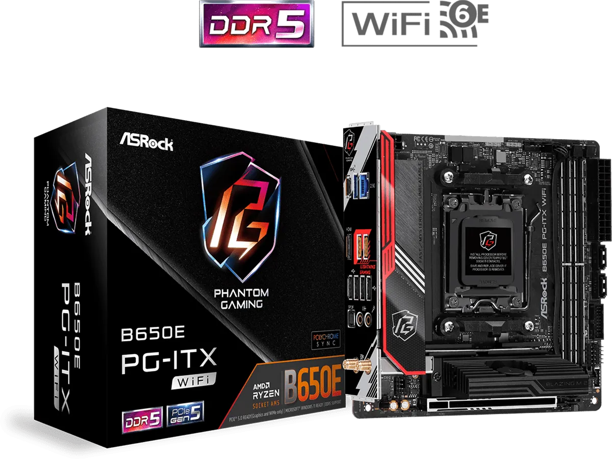
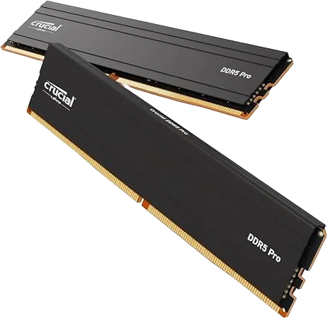

## Daily Use

- @= iPhone 15 Black
  - 
  - **iPhone 15 Black**
- @= iPad Pro Gen7(M4) 13inch Space Black
  - 
  - **iPad Pro Gen7(M4) 13inch Space Black**
- @= Mac Studio Gen2(M2 Max)
  - 
  - **Mac Studio Gen2(M2 Max)**
- @= HUAWEI FreeClip Black
  - 
  - **HUAWEI FreeClip Black**
  - Bluetooth Earphones
- @= Kindle Oasis 2019
  - 
  - **Kindle Oasis 2019**
  - E-book Reader
---
- @= Obsidian
  - 
  - **Obsidian**
  - Personal Knowledge Base
- @= GoodNotes
  - 
  - **GoodNotes**
  - Tablet Note App
- @= Anki
  - 
  - **Anki**
  - Spaced Repetition Learning
- @= Drafts
  - 
  - **Drafts**
  - Quick-memo App
- @= Kindle
  - 
  - **Kindle**
  - E-book Reader App
- @= Spotify
  - 
  - **Spotify**
  - Music Streaming Service

### My Homebuilt PC

It's mainly used for coding. (Built in Aug 2024)

- @= Lian Li A4-H2O
  - 
  - **Lian Li A4-H2O**
  - PC case
- @= AMD Ryzen™ 5 7600X
  - 
  - **AMD Ryzen™ 5 7600X**
  - CPU
- @= 玄人志向 GALAKURO GAMING NVIDIA GeForce RTX 4060ti
  - 
  - **玄人志向 GALAKURO GAMING NVIDIA GeForce RTX 4060ti**
  - GPU
- @= ASRock B650E PG-ITX WiFi
  - 
  - **ASRock B650E PG-ITX WiFi**
  - Motherboard
- @= Corsair SF750
  - 
  - **Corsair SF750**
  - Power Supply
- @= NZXT KRAKEN 240 RL-KN240-B1
  - 
  - **NZXT KRAKEN 240 RL-KN240-B1**
  - CPU Cooler
- @= Crucial DDR5 Pro 16GB x 2
  - 
  - **Crucial DDR5 Pro 16GB x 2**
  - Memory
- @= Crucial T500 500GB PCIe Gen4 NVMe M.2 SSD
  - 
  - **Crucial T500 500GB PCIe Gen4 NVMe M.2 SSD**
  - Storage

## Development

- @= NixOS
  - 
  - **NixOS**
  - Purely functional Linux Distro
---
- @= Cloudflare
  - 
  - **Cloudflare**
  - DNS, Hosting Service, Cyber Security, and More
- @= Docker
  - 
  - **Docker**
  - Platform for Containerized Apps
---
- @= Visual Studio Code
  - 
  - **Visual Studio Code**
  - Code Editor
- @= Neovim
  - 
  - **Neovim**
  - Text Editor

## Arts

- @= MacOS
  - 
  - **MacOS**

### Music

- @= RME Babyface Pro FS
  - 
  - **RME Babyface Pro FS**
  - Audio Interface
- @= audio-technica ATH-R70x
  - 
  - **audio-technica ATH-R70x**
  - Open-ear Headphones
- @= Native Instruments KONTROL S49 MK3
  - 
  - **Native Instruments KONTROL S49 MK3**
  - MIDI Keyboard
- @= Native Instruments MASCHINE MK3
  - 
  - **Native Instruments MASCHINE MK3**
  - Hard-sampler
---
- @= MOTU Digital Performer 11
  - 
  - **MOTU Digital Performer 11**
  - DAW Software
- @= RME TotalMix FX
  - 
  - **RME TotalMix FX**
  - Mixing Software
- @= Native Instruments KOMPLETE 15 Collector's Edition
  - 
  - **Native Instruments KOMPLETE 15 Collector's Edition**
  - Mega-bundle of Virtual Instruments, Effects, Sound Libraries, etc.

### Photo & Videography

- @= SONY α6700 ILCE-6700
  - 
  - **SONY α6700 ILCE-6700**
  - MILC Camera
- @= SIGMA 18-50mm F2.8 DC DN Contemporary SONY E-mount
  - 
  - **SIGMA 18-50mm F2.8 DC DN Contemporary SONY E-mount**
  - Lens
- @= TASCAM Portacapture X8
  - 
  - **TASCAM Portacapture X8**
  - 32bit float Linear PCM Recorder
- @= TASCAM DR-10L Pro
  - 
  - **TASCAM DR-10L Pro**
  - Lavalier Microphone & Field Recorder
---
- @= DaVinci Resolve
  - 
  - **DaVinci Resolve**
  - Video Editing Software
- @= SONY Creator's App
  - 
  - **SONY Creator's App**
  - Media Data Transferring among Devices
