## 普段使い

- @= iPhone 15 ブラック
  - [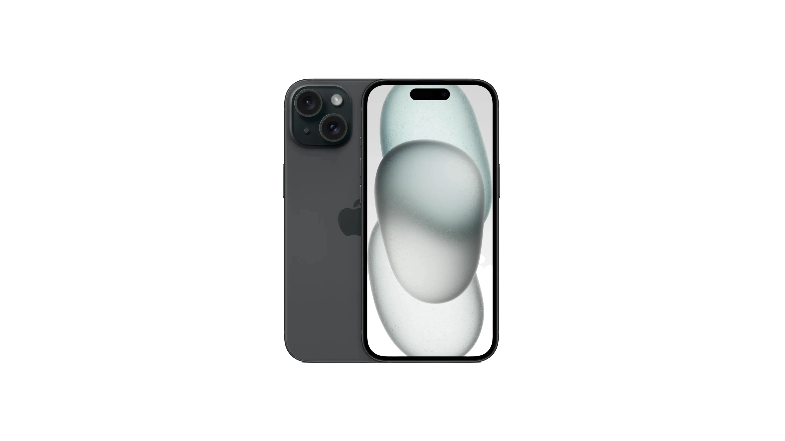](https://www.apple.com/jp/shop/buy-iphone/iphone-15)
  - iPhone 15 ブラック
- @= iPad Pro 第 7 世代(M4) 13 インチ スペースブラック
  - [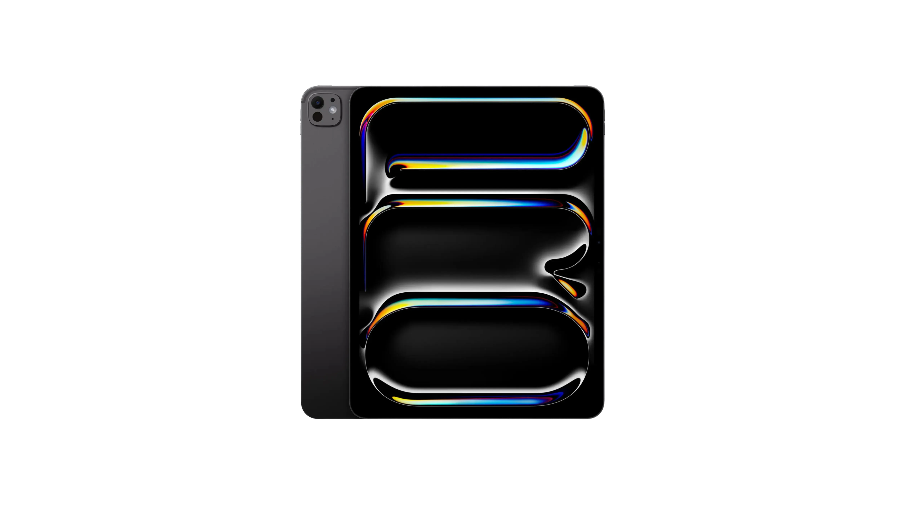](https://www.apple.com/jp/ipad-pro/)
  - iPad Pro 第 7 世代(M4) 13 インチ スペースブラック
- @= Mac Studio 第 2 世代(M2 Max)
  - [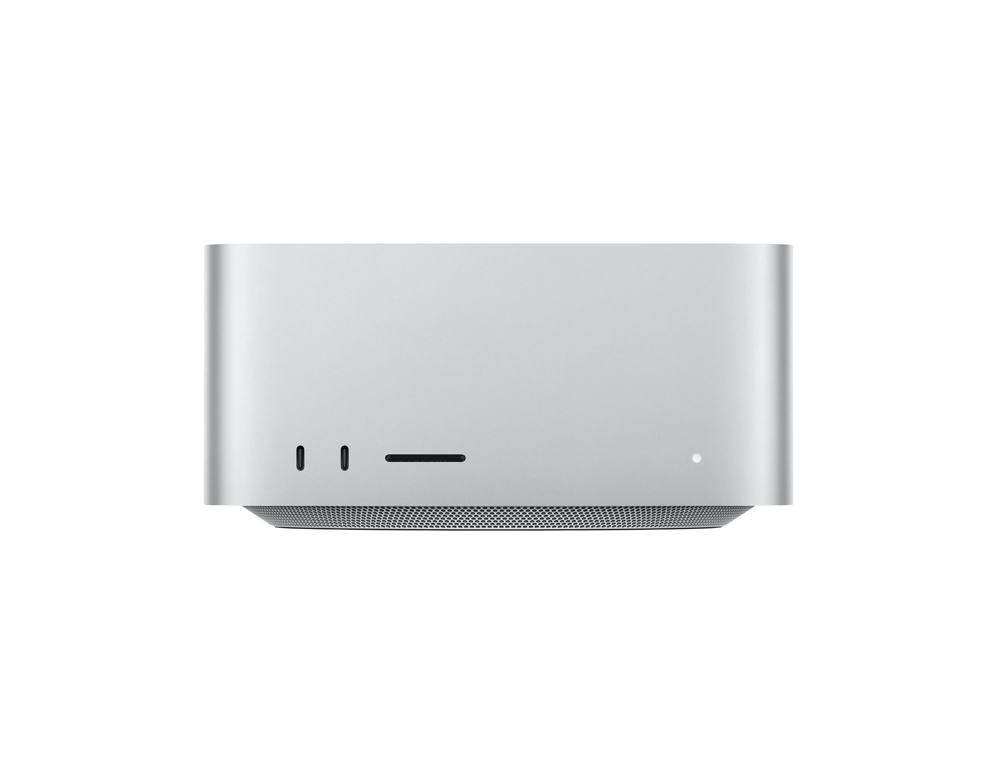](https://www.apple.com/jp/mac-studio/)
  - Mac Studio 第 2 世代(M2 Max)
---
- @= Obsidian
  - 
  - Obsidian
- @= GoodNotes
  - 
  - GoodNotes
- @= Anki
  - 
  - Anki
- @= Drafts
  - 
  - Drafts
- @= Kindle
  - 
  - Kindle
- @= Spotify
  - 
  - Spotify

### 自作PC

主にコーディングに使用しています。

- @= Lian Li A4-H2O
  - [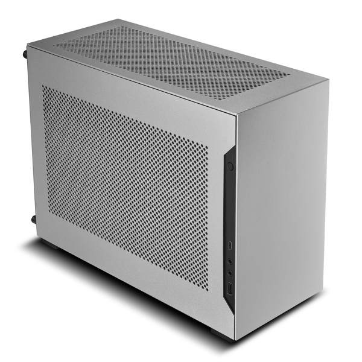](https://lian-li.com/ja/product/a4h2o/?cn-reloaded=1)
  - Lian Li A4-H2O
- @= AMD Ryzen™ 5 7600X
  - 
  - AMD Ryzen™ 5 7600X
- @= 玄人志向 GALAKURO GAMING NVIDIA GeForce RTX 4060 Ti
  - 
  - 玄人志向 GALAKURO GAMING NVIDIA GeForce RTX 4060 Ti
- @= ASRock B650E PG-ITX WiFi
  - 
  - ASRock B650E PG-ITX WiFi
- @= Corsair SF750
  - 
  - Corsair SF750
- @= NZXT KRAKEN 240 RL-KN240-B1
  - 
  - NZXT KRAKEN 240 RL-KN240-B1
- @= Crucial DDR5 Pro 16GB x 2
  - [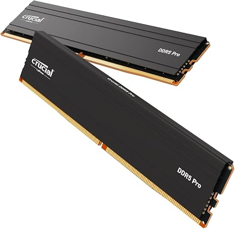](https://www.crucial.com/memory/ddr5/cp2k16g56c46u5)
  - Crucial DDR5 Pro  16GB x 2
- @= KIOXIA EXCERIA Plus G3 1TB
  - [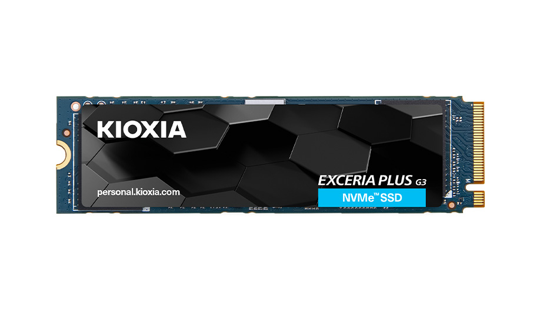](https://www.kioxia.com/ja-jp/personal/ssd.html#EXCERIAPLUSG3)
  - KIOXIA EXCERIA Plus G3 1TB

## 開発

- @= NixOS
  - 
  - NixOS
---
- @= Cloudflare
  - 
  - Cloudflare
- @= Docker
  - 
  - Docker
---
- @= Visual Studio Code
  - 
  - Visual Studio Code
- @= Neovim
  - 
  - Neovim

## アート

### 音楽

- @= RME Babyface Pro FS
  - [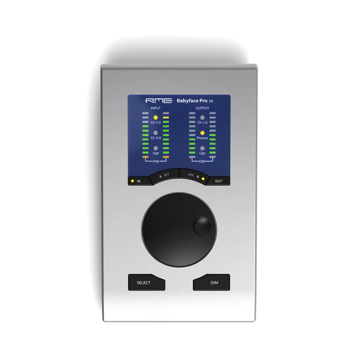](https://synthax.jp/babyface-pro-fs.html)
  - RME Babyface Pro FS
- @= audio-technica ATH-R70x
  - [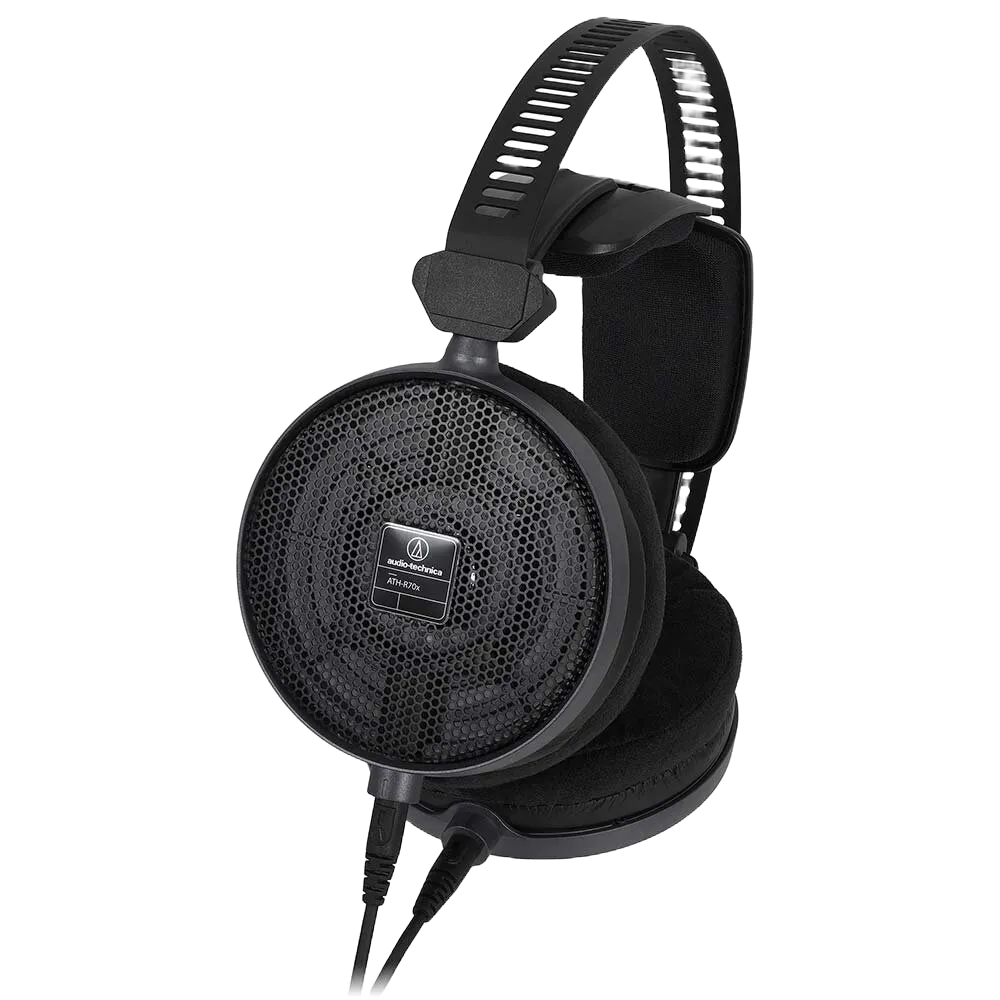](https://www.audio-technica.co.jp/product/ATH-R70x?srsltid=AfmBOorXxQEzMYddDoDzfjSaT2bvyxwxa9GGJ8_6uAUcM46nGRhKQLoV)
  - audio-technica ATH-R70x
- @= Native Instruments MASCHINE MK3
  - [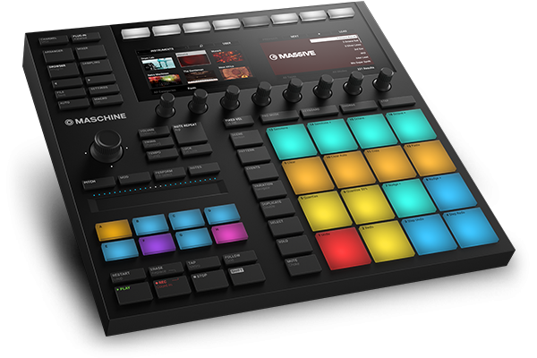](https://www.native-instruments.com/jp/products/maschine/production-systems/maschine/whats-new-in-mk3/?srsltid=AfmBOoryQwBPYY3OzXm82Xx0pn7dpBM4fhF3EAXXc-VrDTiUmsHIWUnG)
  - Native Instruments MASCHINE MK3
---
- @= MOTU Digital Performer 11
  - [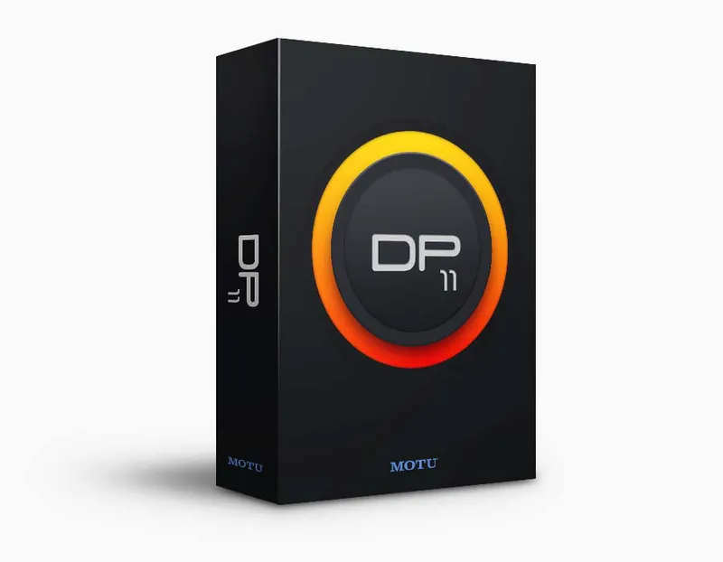](https://h-resolution.com/product/digital-performer/)
  - MOTU Digital Performer 11
- @= RME TotalMix FX
  - [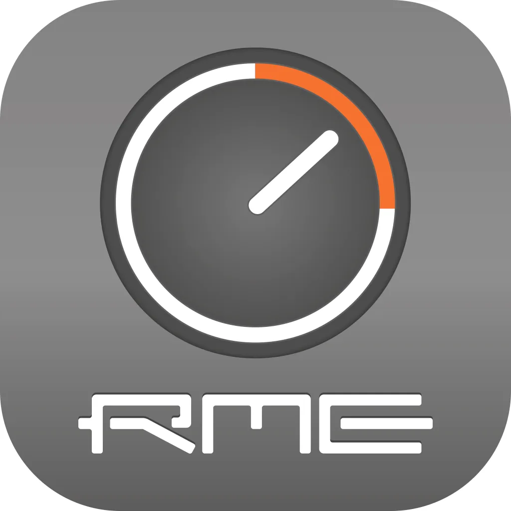](https://rme-audio.de/totalmix-fx.html)
  - RME TotalMix FX

### 写真&動画撮影

- @= SONY α6700 ILCE-6700
  - [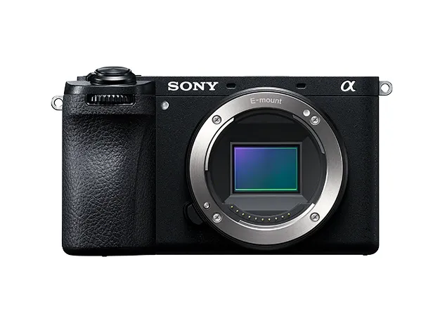](https://www.sony.jp/ichigan/a-universe/special_ILCE-6700/?srsltid=AfmBOopW5UyEBpbMy8T9nVbXWQqON4WNw_K3-VQRwTZAwtoeJA6sxPcU)
  - SONY α6700 ILCE-6700
- @= SIGMA 18-50mm F2.8 DC DN Contemporary SONY E-mount
  - [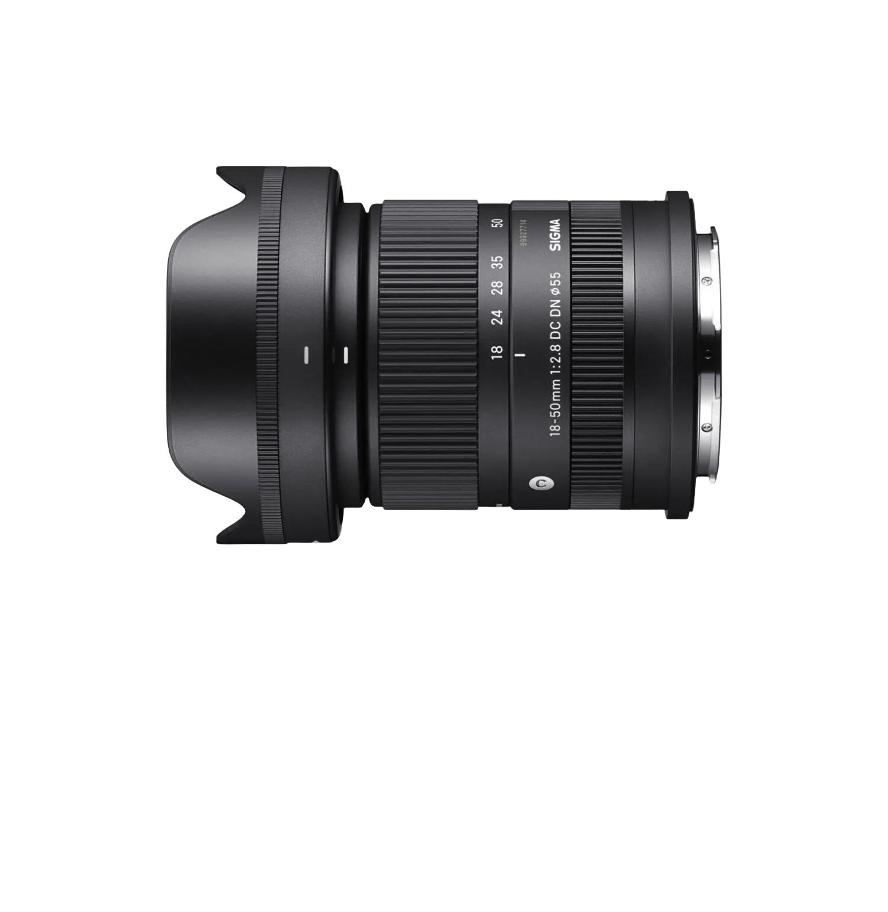](https://www.sigma-global.com/jp/lenses/c021_18_50_28/)
  - SIGMA 18-50mm F2.8 DC DN Contemporary SONY E-mount
- @= TASCAM Portacapture X8
  - [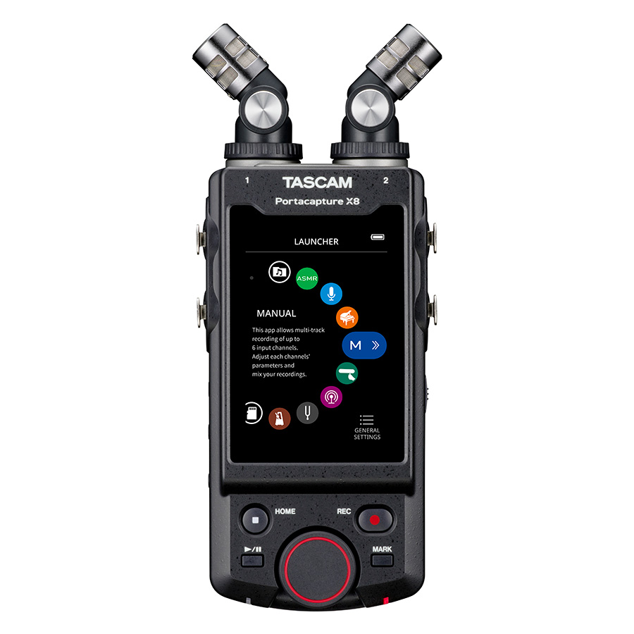](https://tascam.jp/us/product/portacapture_x8/top)
  - TASCAM Portacapture X8
- @= TASCAM DR-10L Pro
  - [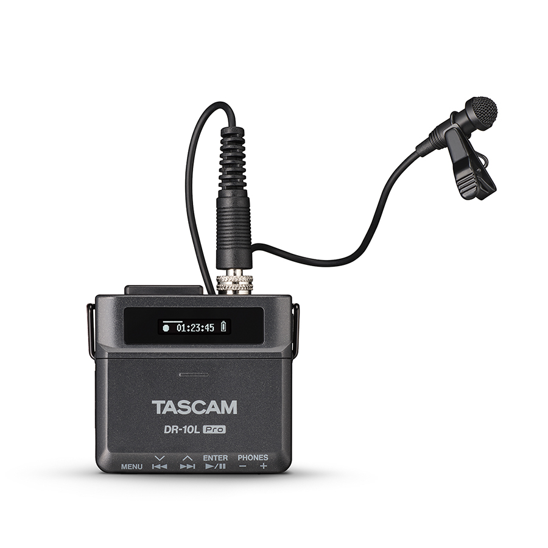](https://tascam.jp/us/product/dr-10l_pro/top)
  - TASCAM DR-10L Pro
---
- @= DaVinci Resolve
  - [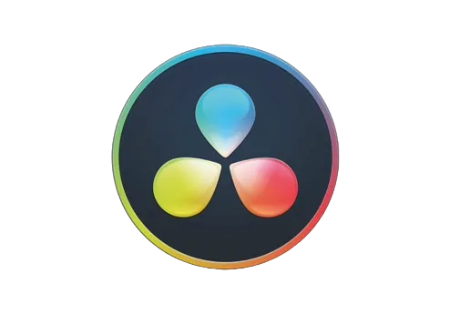](https://www.blackmagicdesign.com/products/davinciresolve)
  - DaVinci Resolve
