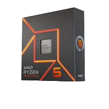
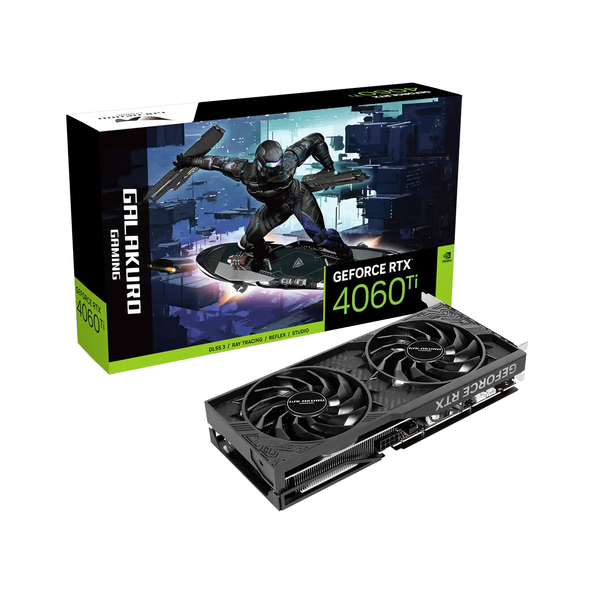
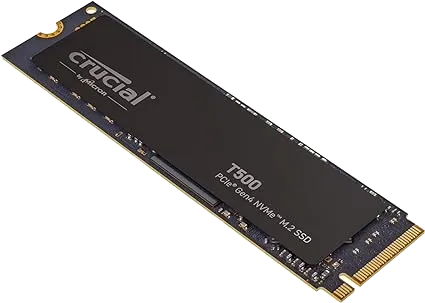

## 普段使い

::::card-grid
:::card

**iPhone 15 ブラック**
:::
:::card

**iPad Pro 第 7 世代(M4) 13 インチ スペースブラック**
:::
:::card

**Mac Studio 第 2 世代(M2 Max)**
:::
:::card

**HUAWEI FreeClip ブラック**
Bluetooth 接続イヤホン
:::
:::card

**Kindle Oasis 2019**
電子書籍リーダ
:::
:::card

**The Endpoint**
左右分割型キーボード
:::
::::

---

::::card-grid
:::card

**Obsidian**
個人ナレッジベース
:::
:::card

**GoodNotes**
タブレット特化のノートアプリ
:::
:::card

**Anki**
間隔反復学習
:::
:::card

**Drafts**
クイックメモアプリ
:::
:::card

**Kindle**
電子書籍リーダアプリ
:::
:::card

**Spotify**
音楽ストリーミングサービス
:::
::::

### 自作PC

主にコーディング用途で使用。(2024 年 8 月に作成)

::::card-grid
:::card

**Lian Li A4-H2O**
PC ケース
:::
:::card

**AMD Ryzen™ 5 7600X**
CPU
:::
:::card

**玄人志向 GALAKURO GAMING NVIDIA GeForce RTX 4060ti**
GPU
:::
:::card

**ASRock B650E PG-ITX WiFi**
マザーボード
:::
:::card

**Corsair SF750**
電源ユニット
:::
:::card

**NZXT KRAKEN 240 RL-KN240-B1**
CPU クーラー
:::
:::card

**Crucial DDR5 Pro 16GB x 2**
メモリ
:::
:::card

**Crucial T500 500GB PCIe Gen4 NVMe M.2 SSD**
ストレージ
:::
::::

## 開発

:::card

**NixOS x Home Manager**
純粋関数型 Linux ディストロ
:::

---

::::card-grid
:::card

**Cloudflare**
DNS、ホスティングサービス、サーバーセキュリティ等
:::
:::card

**Docker**
コンテナ環境作成プラットフォーム
:::
::::

---

::::card-grid
:::card

**Visual Studio Code**
コードエディタ
:::
:::card

**Neovim**
テキストエディタ
:::
::::

## アート

:::card

**MacOS**
:::

### 音楽

::::card-grid
:::card

**RME Babyface Pro FS**
オーディオインターフェイス
:::
:::card

**audio-technica ATH-R70x**
開放型ヘッドホン
:::
:::card

**IK Multimedia iLoud MTM MKII**
モニタースピーカーペア
:::
:::card

**Native Instruments KONTROL S49 MK3**
MIDI キーボード
:::
:::card

**Native Instruments MASCHINE MK3**
ハードサンプラー
:::
::::

---

::::card-grid
:::card

**MOTU Digital Performer 11**
DAW ソフト
:::
:::card

**RME TotalMix FX**
ミックスソフト
:::
:::card

**Native Instruments KOMPLETE 15 Collector's Edition**
バーチャル楽器、エフェクト、サウンドライブラリ等を含む巨大バンドル
:::
::::

### 写真&動画撮影

::::card-grid
:::card

**SONY α6700 ILCE-6700**
ミラーレス一眼カメラ
:::
:::card

**SIGMA 18-50mm F2.8 DC DN Contemporary SONY E-mount**
レンズ
:::
::::

---

::::card-grid
:::card

**DaVinci Resolve**
動画編集ソフト
:::
:::card

**SONY Creator's App**
メディアデータのデバイス間連携
:::
::::

### フィールドレコーディング

::::card-grid
:::card

**TASCAM Portacapture X8**
32 ビットフロートリニア PCM レコーダー
:::
:::card

**TASCAM DR-10L Pro**
ラべリアマイク&フィールドレコーダー
:::
::::
